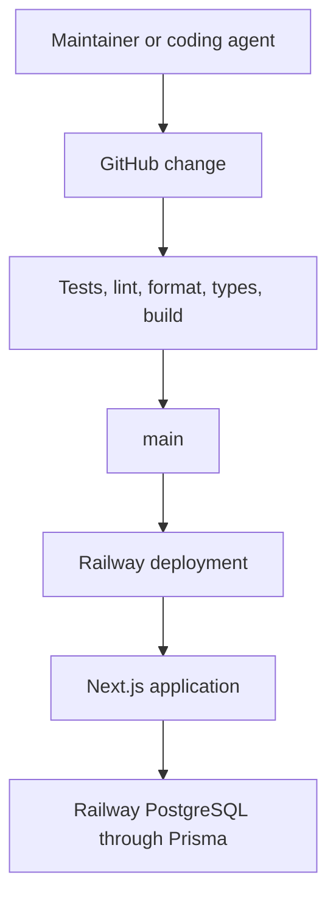
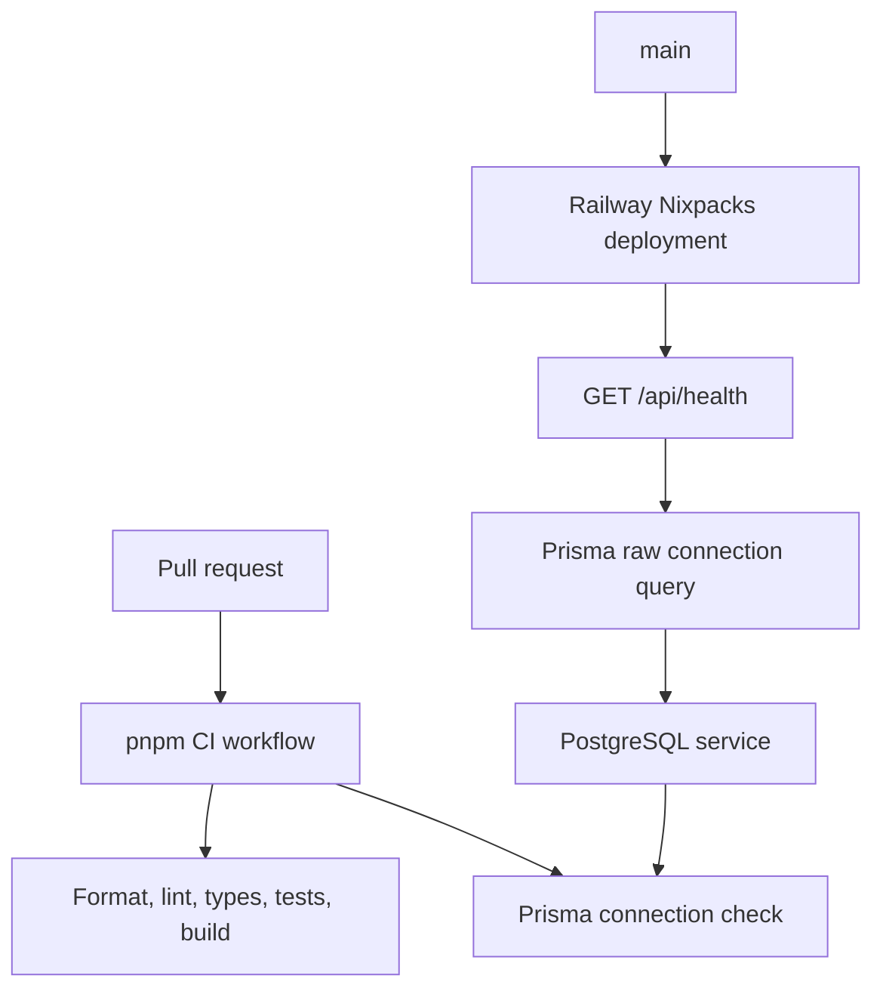

# Day of Prayer Application Foundation - Plan

## Goal Capsule

- **Objective:** Strengthen the existing `JesusFilm/dop` Next.js and PostgreSQL scaffold with pnpm, Prisma connectivity, automated quality gates, Railway TOML configuration, and Compound Engineering instructions.
- **Product authority:** The existing `CONTEXT.md`, locked prayer-activity spec, and ADRs remain authoritative. This plan changes foundation tooling only and must preserve the current application, database-backed health contract, repo-local agent skills, and prayer-domain decisions.
- **Open blockers:** Live Railway verification requires access to the existing Railway project and PostgreSQL service.

---

## Product Contract

### Summary

Extend the existing `JesusFilm/dop` scaffold so pnpm is the sole package manager, Prisma proves the established PostgreSQL path, CI enforces engineering checks, Railway deployment is expressed in TOML, and repository instructions add Compound Engineering without replacing local project skills.

### Problem Frame

Tandem Ministries runs a Day of Prayer event each quarter for approximately 30 to 50 attendees.
The digital team intends to add an interactive experience alongside the existing printed prayer booklet, but the colleague managing the prayer time will define that experience.
The immediate need is a dependable technical foundation that can be handed over without embedding unvalidated prayer-domain choices.

### Key Decisions

- **Build a foundation rather than a feature starter.** (session-settled: user-directed — chosen over an initial prayer schema: the colleague leading the prayer experience will define the product.) Governs R1, R10, R11.
- **Prove database connectivity without defining domain data.** (session-settled: user-directed — chosen over omitting persistence entirely: the handoff should verify the delivery foundation while avoiding speculative models.) Governs R7, R8.
- **Use Compound Engineering as the repository's agent workflow.** (session-settled: user-directed — chosen over generic contribution guidance: agents should follow explicit engineering practices.) Governs R12, R13.

### Actors

- A1. **Foundation maintainer:** Creates and verifies the initial repository, delivery path, and engineering controls.
- A2. **Prayer-experience developer:** Receives the foundation and implements the Day of Prayer product in later work.
- A3. **Coding agent:** Changes the repository while following its Compound Engineering instructions.
- A4. **GitHub:** Hosts `jesusfilm/dop` and runs change validation.
- A5. **Railway:** deploys the application from `main` and supplies the runtime environment.
- A6. **PostgreSQL:** provides persistence for future product work.

### Requirements

**Application foundation**

- R1. The repository must contain a working Next.js application managed exclusively with pnpm.
- R2. The initial web surface must render a neutral Day of Prayer placeholder that confirms the application is running without implying a final participant experience.
- R3. The repository must define supported runtime and package-manager expectations so local development, CI, and Railway use compatible versions.

**Engineering safeguards**

- R4. The repository must provide repeatable commands for development, production builds, automated tests, linting, formatting checks, and type checking.
- R5. The initial shell must include meaningful automated tests for its own behavior and configuration boundaries.
- R6. GitHub must validate the required quality commands for proposed changes before they reach `main`.

**Persistence readiness**

- R7. Prisma must be configured against PostgreSQL and capable of establishing a real database connection in a configured environment.
- R8. The foundation must provide a repeatable database-connectivity verification that fails clearly when configuration or connectivity is invalid.
- R9. Database secrets and environment-specific values must stay outside version control, with required variables documented through safe examples.

**Handoff boundary**

- R10. The foundation must not define prayer requests, prayer lists, praise points, devotionals, reflections, participants, or other prayer-domain models.
- R11. The initial interface must remain a handoff-ready shell rather than a designed event workflow.

**Agent engineering workflow**

- R12. Repository-level agent instructions must direct agents to use the appropriate Compound Engineering workflow for planning, implementation, debugging, testing, review, and shipping.
- R13. Agent instructions must require verification proportional to the change, preservation of user work, documented scope boundaries, and review before delivery.
- R14. The repository must not vendor the Compound Engineering plugin; the instructions may require it as an agent-environment capability.

**Deployment**

- R15. Railway deployment must be represented as version-controlled TOML configuration rather than dashboard-only knowledge.
- R16. A successful change on `main` must be deployable as a production Next.js service using the repository's declared build and start behavior.
- R17. The deployed application must expose enough observable behavior to distinguish a healthy application from a failed start or unavailable required dependency.

The delivery relationship is:

### Key Flows

- F1. **Validate a proposed change**
  - **Trigger:** A maintainer or coding agent proposes repository changes.
  - **Actors:** A1 or A3, A4
  - **Steps:** The contributor runs the documented local checks; GitHub repeats the required checks; failures prevent the change from being treated as ready.
  - **Outcome:** The repository has a repeatable quality gate before changes reach `main`.
  - **Covered by:** R4, R5, R6, R12, R13

- F2. **Deploy from the source of truth**
  - **Trigger:** A validated change reaches `main`.
  - **Actors:** A4, A5
  - **Steps:** Railway uses the committed deployment configuration and declared pnpm commands to build and start the application.
  - **Outcome:** The deployed service reflects `main` without an undocumented manual build path.
  - **Covered by:** R3, R15, R16, R17

- F3. **Verify persistence readiness**
  - **Trigger:** The application is given a valid PostgreSQL connection in a configured environment.
  - **Actors:** A1 or A2, A5, A6
  - **Steps:** The documented connectivity verification initializes Prisma and checks the database without relying on prayer-domain tables.
  - **Outcome:** The next developer can trust the persistence path before designing domain data.
  - **Covered by:** R7, R8, R9, R10

### Acceptance Examples

- AE1. **A pull request introduces a lint failure**
  - **Covers:** R4, R6
  - **Given:** A proposed change violates the repository's lint rules.
  - **When:** GitHub runs the required validation.
  - **Then:** The validation fails with an actionable lint result and the change is not considered ready for `main`.

- AE2. **Railway receives a valid database environment**
  - **Covers:** R7, R8, R16
  - **Given:** Railway supplies the documented PostgreSQL connection value.
  - **When:** The connectivity verification runs against the deployed environment.
  - **Then:** Prisma establishes a connection without requiring any prayer-domain model.

- AE3. **Database configuration is absent**
  - **Covers:** R8, R9, R17
  - **Given:** A required database connection value is missing or invalid.
  - **When:** The relevant verification or runtime health behavior runs.
  - **Then:** It reports a clear failure without exposing credentials.

- AE4. **A coding agent begins feature work**
  - **Covers:** R12, R13, R14
  - **Given:** An agent with the Compound Engineering plugin available is asked to change the repository.
  - **When:** It reads the repository instructions.
  - **Then:** It can identify the required Compound Engineering workflow and quality expectations without relying on session history.

### Scope Boundaries

- Participant-facing prayer experiences, facilitator flows, customized prayer lists, submissions, devotionals, and reflections are deferred to later product work.
- Prayer-domain database models and migrations are deferred until the prayer-experience developer defines the product contract.
- Branding, polished visual design, authentication, authorization, moderation, notifications, analytics, and content administration are outside this foundation.
- Operational practices beyond the initial GitHub-to-Railway application delivery path are outside this foundation.

### Dependencies and Assumptions

- The implementer can create or configure the `jesusfilm/dop` GitHub repository.
- The implementer can create or configure the Railway project and PostgreSQL service.
- Railway remains the deployment platform and `main` remains the production source branch.
- The agent environment provides the Compound Engineering plugin when repository instructions require its workflows.

---

## Planning Contract

**Product Contract preservation:** Product scope is unchanged. Existing code and repository decisions discovered on `origin/main` replace greenfield assumptions without changing the agreed foundation outcome.

### Key Technical Decisions

- KTD1. **Preserve Next.js 15 and Node.js 22 while converting npm to pnpm.** This avoids an unrelated framework upgrade and makes the package-manager request the only toolchain migration. Governs R1, R3.
- KTD2. **Replace the raw health-check pool with model-free Prisma 7 connectivity.** Prisma uses its PostgreSQL adapter and generated client, while schema models and migrations remain deferred. (session-settled: user-directed — chosen over omitting persistence entirely: the foundation must prove Prisma/PostgreSQL without inventing prayer-domain data.) Governs R7, R8, R10.
- KTD3. **Preserve the existing database-backed Railway health contract.** `/api/health` continues to return 200 only when PostgreSQL answers and 503 otherwise. Governs R8, R17.
- KTD4. **Add one GitHub Actions workflow for the full pnpm quality gate.** It uses a PostgreSQL service container so the live Prisma path is exercised. Governs R4, R5, R6.
- KTD5. **Translate `railway.json` to `railway.toml` without changing deployment behavior.** Nixpacks, the health path, timeout, and restart policy remain intact while commands move from npm to pnpm. Governs R15, R16, R17.
- KTD6. **Extend the existing agent system rather than replace it.** `AGENTS.md` keeps repo-local skills and domain-document authority, then adds Compound Engineering routing and verification expectations. (session-settled: user-directed — chosen over generic contribution guidance: coding agents must follow Compound Engineering practices.) Governs R12, R13, R14.

### High-Level Technical Design

### Risks and Dependencies

- The live `main` scaffold arrived after the initial requirements plan. Existing `CONTEXT.md`, ADRs, application code, and local skills are preserved as higher-fidelity implementation context.
- Prisma 7 requires a generated client and a compatible Node.js 22 patch release. CI and `package.json` must express that compatibility.
- Live Railway verification depends on access to the existing service and attached PostgreSQL database.
- Converting package managers removes `package-lock.json`; `pnpm-lock.yaml` becomes the sole dependency authority.

### Sources and Research

- Existing authority: `CONTEXT.md`, `docs/prayer-activity-spec.md`, `docs/adr/0001-nextjs-on-railway.md`
- Prisma client generation: `https://www.prisma.io/docs/orm/prisma-client/setup-and-configuration/generating-prisma-client`
- Prisma database connections: `https://docs.prisma.io/docs/orm/prisma-client/setup-and-configuration/databases-connections`
- Railway configuration as code: `https://docs.railway.com/config-as-code`
- GitHub Actions PostgreSQL services: `https://docs.github.com/en/actions/tutorials/use-containerized-services/create-postgresql-service-containers`

---

## Implementation Units

### U1. Convert the existing scaffold to pnpm

**Goal:** Make pnpm the repository's only package manager without upgrading the application stack.

**Requirements:** R1, R3, R4

**Dependencies:** None

**Files:** `package.json`, `pnpm-lock.yaml`, `package-lock.json`, `.gitignore`

**Approach:** Pin pnpm, preserve compatible application versions, replace npm scripts and documentation, and remove the npm lockfile after the pnpm lockfile is reproducible.

**Test scenarios:**

1. A frozen pnpm install succeeds from the committed lockfile.
2. No npm or Yarn lockfile remains.
3. Existing tests and the Next.js production build still pass.

**Verification:** pnpm installs, tests, type-checks, and builds the unchanged scaffold.

### U2. Route PostgreSQL checks through Prisma

**Goal:** Configure Prisma without domain models and preserve the existing health behavior.

**Requirements:** R7, R8, R9, R10; F3; AE2, AE3

**Dependencies:** U1

**Files:** `prisma/schema.prisma`, `prisma.config.ts`, `src/lib/db.ts`, `src/lib/db.test.ts`, `scripts/check-database.ts`, `.env.example`, `.gitignore`, `package.json`, `pnpm-lock.yaml`, `docs/adr/0001-nextjs-on-railway.md`

**Approach:** Use Prisma's PostgreSQL driver adapter and generated client for raw connection-only queries, keep the schema model-free, and update the ADR to record that the connection layer is chosen while domain models and migrations remain deferred.

**Execution note:** Preserve the existing health tests as characterization, then add configuration and live-connection evidence before replacing the raw pool.

**Test scenarios:**

1. Missing `DATABASE_URL` fails clearly without leaking a connection string.
2. Private-network and public-TLS environment settings produce the intended adapter configuration.
3. The existing health report stays 200/ok on a successful ping and 503/degraded on failure.
4. Prisma validates and generates with no domain models or migrations.
5. A connection-only check succeeds against real PostgreSQL without creating tables.

**Verification:** Existing health behavior is unchanged and Prisma proves PostgreSQL connectivity.

### U3. Add pnpm quality gates

**Goal:** Add linting, formatting, and one CI workflow around the existing test and build checks.

**Requirements:** R4, R5, R6; F1; AE1

**Dependencies:** U1, U2

**Files:** `eslint.config.mjs`, `prettier.config.mjs`, `.prettierignore`, `.github/workflows/ci.yml`, `package.json`, `pnpm-lock.yaml`

**Approach:** Add ESLint and Prettier scripts plus a single aggregate verification command; run the same gates in GitHub Actions with PostgreSQL.

**Test scenarios:**

1. A lint violation fails the lint command.
2. An unformatted tracked file fails the format check.
3. CI-equivalent verification passes with PostgreSQL available.
4. Frozen installation detects lockfile drift.

**Verification:** The aggregate pnpm verification command passes locally and is represented in CI.

### U4. Translate Railway configuration to TOML

**Goal:** Make `railway.toml` the deployment authority while preserving the current runtime contract.

**Requirements:** R15, R16, R17; F2

**Dependencies:** U1, U2, U3

**Files:** `railway.toml`, `railway.json`, `README.md`, `docs/adr/0001-nextjs-on-railway.md`

**Approach:** Translate the existing Nixpacks, pnpm start, database-backed health check, timeout, and restart settings into TOML and update references.

**Test scenarios:**

1. The TOML configuration parses and contains every prior deployment setting.
2. The production server honors Railway's `PORT`.
3. `/api/health` returns 200 with PostgreSQL available and 503 when it is unavailable.

**Verification:** The repository has one Railway config file and its settings match the established deployment contract.

### U5. Add Compound Engineering guidance

**Goal:** Extend existing agent instructions with Compound Engineering and accurate repository verification commands.

**Requirements:** R12, R13, R14; AE4

**Dependencies:** U1, U2, U3, U4

**Files:** `AGENTS.md`, `README.md`

**Approach:** Preserve repo-local skills, issue-tracker guidance, `CONTEXT.md`, and ADR authority; add task-to-`ce-*` routing, scope discipline, and required pnpm verification.

**Test scenarios:**

1. A cold agent can identify both local skills and the correct Compound Engineering workflow.
2. Instructions reference commands that exist in `package.json`.
3. No plugin source or generated plugin state is committed.

**Verification:** Agent and human handoff documentation matches the actual repository.

---

## Verification Contract

| Gate                   | Required outcome                                                                 |
| ---------------------- | -------------------------------------------------------------------------------- |
| Frozen pnpm install    | Dependencies reproduce from `pnpm-lock.yaml`                                     |
| Format and lint        | Prettier and ESLint report no changes or errors                                  |
| Type and unit tests    | TypeScript and existing/new Vitest coverage pass                                 |
| Prisma validation      | Model-free schema validates and client generation succeeds                       |
| PostgreSQL integration | Prisma connection-only query succeeds against real PostgreSQL                    |
| Production build       | Existing Next.js 15 application builds successfully                              |
| Runtime smoke          | Server honors `PORT`; database-backed health returns the expected 200/503 states |

---

## Definition of Done

- U1–U5 satisfy their verification outcomes without replacing existing product behavior, specs, ADR authority, or local agent skills.
- pnpm is the sole package manager and CI uses its frozen lockfile.
- Prisma owns PostgreSQL connectivity without adding prayer-domain models or migrations.
- `railway.toml` is the only Railway configuration file and preserves the existing health contract.
- Compound Engineering guidance is additive and names the repository's real commands.
- No credentials, generated Prisma output, vendored plugin code, dead-end scaffold files, or temporary integration artifacts are committed.
- The feature branch is proposed through a pull request and CI reaches a decided state.
