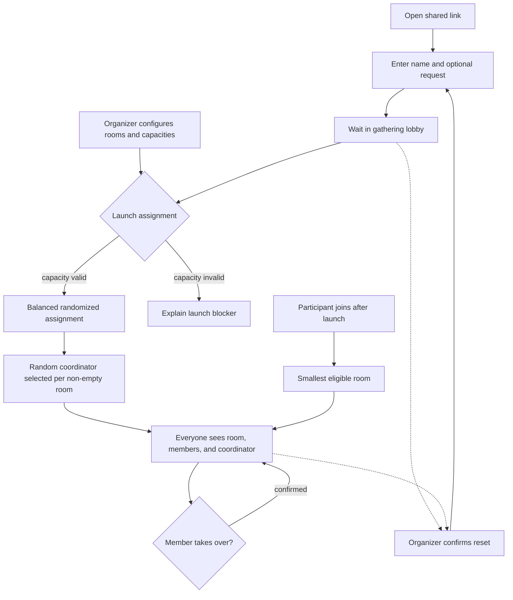
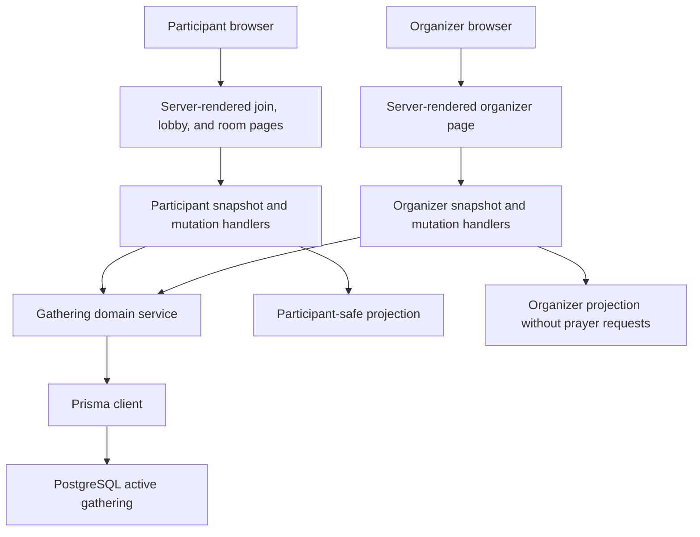
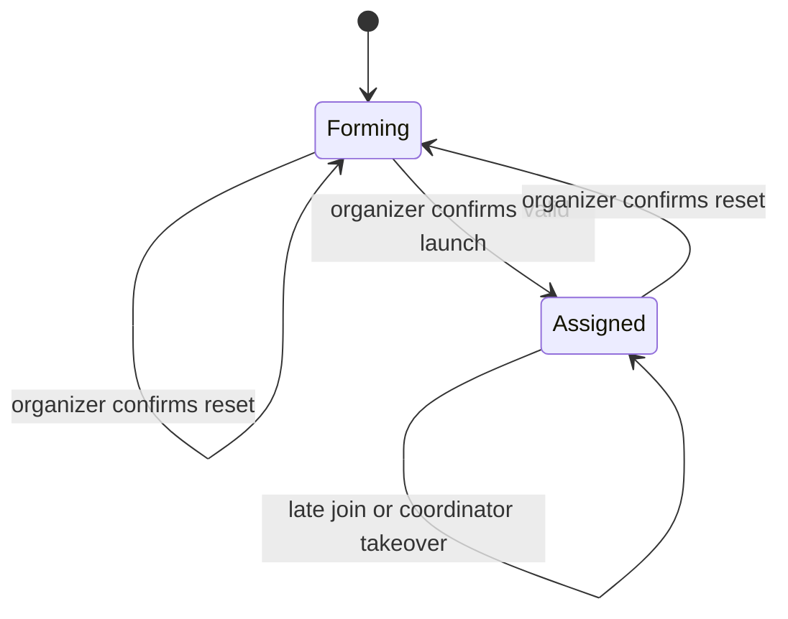

# Participant Room Handoff - Plan

## Goal Capsule

- **Objective:** Build the production participant arrival, lobby, room assignment, and room-handoff experience for one in-person Day of Prayer gathering.
- **Product authority:** This plan records the room-based direction confirmed by the product owner. It supersedes the incompatible pair-matching behavior in `CONTEXT.md` and `docs/prayer-activity-spec.md` for this work while preserving the platform decision in `docs/adr/0001-nextjs-on-railway.md`.
- **Active boundary:** This work ends when each participant knows their room, fellow group members, and current room coordinator.
- **Open blockers:** None.
- **Execution profile:** Deep software feature spanning persistent state, concurrent mutations, participant identity, and synchronized participant and organizer surfaces.
- **Stop conditions:** Stop if implementation evidence invalidates a session-settled product decision or if prayer requests would cross into an organizer-visible response.
- **Tail ownership:** LFG owns implementation, review, browser acceptance, PR creation, and CI follow-through.

---

## Product Contract

### Summary

Create one live Day of Prayer gathering where participants join by name, wait together, and receive a synchronized room assignment when the organizer launches.
Each room has a randomly selected coordinator, while the organizer can monitor the gathering and reset it for another run.

### Problem Frame

The Day of Prayer gathering is a greenfield team-run experience rather than a replacement for an existing manual process.
The transition from one large gathering into smaller prayer rooms needs to feel intentional, personal, and dependable for 30–50 people using their own phones.
The Stitch output establishes the visual direction, but the application now needs production behavior for shared state, re-entry, assignment, privacy, and event-day operation.

### Key Decisions

- **Use one live gathering with same-device participant continuity.** (session-settled: user-directed — chosen over accounts or recovery codes: device changes can be handled manually for this event.) Governs R1, R4, R5.
- **Keep the organizer route open.** (session-settled: user-directed — chosen over authentication or a PIN: the team accepts the access risk for this controlled gathering.) Governs R17, R18, R24.
- **Make launch final.** (session-settled: user-directed — chosen over organizer corrections after assignment: late arrivals can be placed automatically and manual intervention is unnecessary.) Governs R15, R16, R19.
- **Balance across every configured room while respecting optional capacities.** (session-settled: user-directed — chosen over unconstrained random grouping: room sizes should be as even as the configured limits allow.) Governs R10, R12, R13, R16.
- **Select one coordinator randomly per room.** (session-settled: user-directed — chosen over a preassigned facilitator or informal volunteer: the application should distribute responsibility.) Governs R14.
- **Allow immediate coordinator takeover.** (session-settled: user-directed — chosen over coordinator approval or group confirmation: an unavailable coordinator must not block the room.) Governs R20, R21.
- **Collect personal prayer requests before the room experience exists.** (session-settled: user-directed — chosen over deferring collection: requests should be retained privately for the later experience.) Governs R2, R3, R18, R25.
- **Reset the gathering without rebuilding room setup.** (session-settled: user-directed — chosen over a single-use gathering: the team expects to run load tests and reuse the configured rooms.) Governs R24, R25, R26.
- **Prove the release with 50 concurrent participants.** (session-settled: user-directed — chosen over larger speculative scale targets: 50 matches the expected event size.) Governs R27.

<!-- ce-section: work-relationships -->

### How This Work Fits Together

This plan owns the participant journey from opening the shared link through reaching an assigned physical room.
The following breakdown is the current understanding, not a committed roadmap:

- **Guided room experience**
  - **Depends on** this work for stable room membership, coordinator identity, and retained personal prayer requests.
  - **Still to decide:** prayer stages, request presentation, timing, and completion.
- **Corporate and ministry prayer-request management**
  - **Can proceed independently of** the room handoff.
  - **Enables** the later room experience by supplying requests for distribution among rooms.
- **Synchronized room progression**
  - **Depends on** the future guided room experience.
  - **Carries forward** the direction that every member sees the same current screen while only the coordinator advances it.

### Actors

- A1. **Participant:** Joins from a personal device, waits for assignment, travels to the assigned room, and may take over as coordinator.
- A2. **Room coordinator:** A participant selected at random whose current identity is shared with every member of the room.
- A3. **Organizer:** Configures physical rooms, monitors arrivals, launches assignment, reviews room rosters, and resets the gathering.

### Requirements

**Joining, privacy, and continuity**

- R1. A participant can join the active gathering from one shared mobile-friendly link without creating an account.
- R2. Joining requires a display name and accepts an optional personal prayer request.
- R3. A personal prayer request is retained for the later room experience, remains invisible to the organizer, and is cleared only when the gathering is reset.
- R4. The participant's browser remembers their identity on that device and returns them to the active lobby or assigned room after an ordinary reload or reconnect.
- R5. Cross-device identity recovery is not provided; a participant joining from another device enters as a new participant.

**Lobby and synchronization**

- R6. After joining, the participant enters a lobby that confirms their place and shows the live joined count without revealing a room assignment early.
- R7. The lobby and room-handoff screens update automatically when the shared gathering state changes.
- R8. Participant and gathering state survives ordinary page reloads and transient connection loss.

**Room setup**

- R9. Before launch, the organizer can add, remove, rename, and describe the physical rooms available for the gathering.
- R10. Each room can have an optional maximum capacity, and any non-empty room configuration must retain at least one room without a maximum.
- R11. Before launch, the organizer can see the joined participant count, room configuration, and capacity status before confirming launch.

**Launch and assignment**

- R12. Launch is blocked when no rooms are configured or the configured capacity cannot hold every joined participant, with the shortfall explained to the organizer.
- R13. Launch assigns every waiting participant exactly once, randomizes membership, and makes room sizes as even as possible without exceeding any room maximum.
- R14. Each non-empty room receives one coordinator chosen randomly from its assigned participants.
- R15. Launch makes room membership final and locks room configuration for the active gathering.
- R16. A participant who joins after launch is assigned automatically to a currently smallest eligible room without changing that room's coordinator.

**Organizer operation**

- R17. The organizer experience is available at `/organizer` without authentication or a PIN.
- R18. After launch, the organizer can expand each room to see member display names and the current coordinator but cannot see prayer requests.
- R19. The organizer cannot remove participants, move participants between rooms, or correct assignments before or after launch.

**Coordinator resilience and room handoff**

- R20. Every room member sees the current coordinator's name on the room-handoff screen.
- R21. Any room member can take over as coordinator after confirming the action, and the new coordinator becomes visible to every room member without approval from the previous coordinator.
- R22. After assignment, each participant sees the room name, wayfinding description, fellow members, coordinator, and a clear instruction to gather there.
- R23. The participant experience stops at room handoff and does not present prayer requests or the guided prayer journey.

**Reset and event readiness**

- R24. The organizer can reset the gathering after a standard confirmation dialog.
- R25. Reset preserves room names, descriptions, and capacities while clearing participants, prayer requests, assignments, coordinators, and launch state.
- R26. Connected participant screens return to the join state after reset.
- R27. The complete join-through-handoff experience remains usable and synchronized with 50 concurrent participants.

### Experience Flow

### Key Flows

- F1. Participant joins or returns on the same device
  - **Trigger:** A participant opens the shared event link.
  - **Actors:** A1
  - **Steps:** A new participant enters a name and optional request, while a remembered participant returns to their current gathering state.
  - **Outcome:** The participant reaches the lobby or assigned room without an account.
  - **Covers:** R1, R2, R3, R4, R5, R6, R8.

- F2. Organizer prepares and launches the gathering
  - **Trigger:** The organizer opens `/organizer` before assignment.
  - **Actors:** A3
  - **Steps:** The organizer configures rooms and capacities, reviews the joined count, and confirms launch.
  - **Outcome:** Every waiting participant receives one valid room and every non-empty room receives one coordinator.
  - **Covers:** R9, R10, R11, R12, R13, R14, R15, R17.

- F3. Participant receives the room handoff
  - **Trigger:** Assignment becomes available.
  - **Actors:** A1, A2
  - **Steps:** The lobby transitions to the room-handoff screen, where each member sees the same room identity, membership, coordinator, and directions.
  - **Outcome:** Participants can find the room and recognize their group without organizer intervention.
  - **Covers:** R7, R20, R22, R23.

- F4. Late participant joins
  - **Trigger:** A new participant submits the join form after launch.
  - **Actors:** A1
  - **Steps:** The gathering selects a currently smallest room with remaining capacity and assigns the participant.
  - **Outcome:** The participant receives a room immediately without changing any existing assignment or coordinator.
  - **Covers:** R13, R15, R16.

- F5. A member takes over coordination
  - **Trigger:** The selected coordinator is unavailable or another member needs to lead.
  - **Actors:** A1, A2
  - **Steps:** A member chooses to take over and confirms the action.
  - **Outcome:** The member becomes coordinator and every room member sees the updated identity.
  - **Covers:** R20, R21.

- F6. Organizer monitors or resets the gathering
  - **Trigger:** Assignment has launched or the team needs a fresh run.
  - **Actors:** A3
  - **Steps:** The organizer reviews expandable room rosters or confirms reset through a standard dialog.
  - **Outcome:** Monitoring exposes no prayer requests, while reset retains room setup and returns participants to joining.
  - **Covers:** R3, R18, R19, R24, R25, R26.

### Acceptance Examples

- AE1. Participant returns during the lobby
  - **Covers:** R4, R6, R8.
  - **Given:** A participant has joined on a device and assignment has not launched.
  - **When:** They reload the page or reopen the shared link on that device.
  - **Then:** They return to the lobby as the same participant without entering their name again.

- AE2. Organizer assigns 37 participants across six unlimited rooms
  - **Covers:** R11, R13, R14.
  - **Given:** Thirty-seven participants are waiting and six rooms are configured without maximum capacities.
  - **When:** The organizer launches assignment.
  - **Then:** Every participant receives exactly one room, room sizes differ by no more than one, and every non-empty room receives exactly one coordinator.

- AE3. A room maximum constrains balancing
  - **Covers:** R10, R13.
  - **Given:** Twelve participants are waiting across three rooms, one room has a maximum of two, and two rooms are unlimited.
  - **When:** The organizer launches assignment.
  - **Then:** The capped room receives two participants and the other rooms receive five participants each.

- AE4. Participant joins after launch
  - **Covers:** R15, R16.
  - **Given:** Assignment has launched and at least one room can accept another participant.
  - **When:** A new participant joins.
  - **Then:** They enter a currently smallest eligible room without moving another participant or replacing its coordinator.

- AE5. Coordinator does not arrive
  - **Covers:** R20, R21.
  - **Given:** The randomly selected coordinator is unavailable.
  - **When:** Another member confirms coordinator takeover.
  - **Then:** That member becomes coordinator and every room member sees the updated name.

- AE6. Organizer reviews rooms after launch
  - **Covers:** R3, R18, R19.
  - **Given:** Participants have been assigned and some submitted prayer requests.
  - **When:** The organizer expands a room.
  - **Then:** They see participant names and the current coordinator but no prayer-request content or assignment controls.

- AE7. Organizer resets after a load test
  - **Covers:** R24, R25, R26.
  - **Given:** A launched gathering has configured rooms, joined participants, requests, assignments, and coordinators.
  - **When:** The organizer accepts the standard reset confirmation.
  - **Then:** Room configuration remains, all gathering data is cleared, and connected participant screens return to joining.

### Success Criteria

- A first-time participant can understand whether to join, wait, or move to a room from the primary message and action on each screen.
- Every joined participant has exactly one room, no room exceeds its maximum, and unconstrained room sizes differ by no more than one.
- Organizer, lobby, and room-handoff views converge on the current gathering state without participants manually refreshing.
- Same-device participants recover their current state after an ordinary reload or transient disconnect.
- A 50-participant load run completes joining, launch, room reveal, coordinator takeover, late arrival, and reset without lost or contradictory state.
- Personal prayer requests never appear in the organizer experience.

### Scope Boundaries

- The guided room prayer experience begins after this work and is deferred per R23.
- Presentation and allocation of personal, corporate, and ministry prayer requests inside rooms are deferred.
- Synchronized prayer stages and coordinator-only progression controls are deferred.
- Organizer authentication and access control are intentionally outside this release.
- Participant accounts, cross-device recovery, participant removal, manual room moves, and post-launch assignment correction are outside this release.
- Multiple simultaneous gatherings, event history, messaging, notifications, analytics, and post-event follow-up are outside this release.
- Room setup is operational configuration rather than a general venue-management product.

### Dependencies and Assumptions

- Participants have access to a modern mobile browser and remain within reasonable network coverage at the venue.
- The organizer knows the available room names, wayfinding descriptions, and any capacity limits before launch.
- One shared event link is distributed through an out-of-band channel such as a message or projected QR code.
- The team accepts that anyone who discovers `/organizer` can view names, launch assignment, or reset the gathering.
- Duplicate or accidental joins remain in the assignment pool until the organizer resets the entire gathering.
- At least one configured room always remains unlimited, so a valid late arrival has an eligible room.
- Planning will reconcile `CONTEXT.md` and `docs/prayer-activity-spec.md` with this confirmed product direction before implementation.

### Sources and Research

- `CONTEXT.md` and `docs/prayer-activity-spec.md` document the superseded pair-matching direction and terminology conflict.
- `docs/adr/0001-nextjs-on-railway.md` remains the platform authority.
- The product owner's Stitch export is the visual authority for the participant and organizer surfaces; this contract supplies the production behavior it did not define.

---

## Planning Contract

**Product Contract preservation:** Product Contract unchanged.

### Key Technical Decisions

- KTD1. **Store one active gathering in PostgreSQL through Prisma.** A singleton gathering state owns the forming/assigned phase and revision, rooms persist as reusable configuration, and participants carry per-run state. This extends the model-free connection established in `src/lib/db.ts` and `prisma/schema.prisma`. Governs R3, R8, R9, R10, R15, R25.
- KTD2. **Use App Router Route Handlers as the browser mutation and snapshot boundary.** Server-rendered pages provide the initial state, while no-store audience-specific handlers support joins, polling, room management, launch, takeover, and reset without introducing a second service. Same-origin checks protect state-changing requests from cross-site submission. (session-settled: user-directed — chosen over treating the Stitch export as a client-only prototype: the user asked for a production Next.js App Router implementation.) Governs R1, R7, R17, R24.
- KTD3. **Represent same-device identity with an opaque HttpOnly cookie.** The browser holds a high-entropy token while PostgreSQL stores only its digest, so URLs and client-visible data do not become participant credentials. (session-settled: user-directed — chosen over accounts or recovery codes: device changes can be handled manually for this event.) Governs R1, R4, R5.
- KTD4. **Synchronize by polling authoritative snapshots rather than keeping process-local live state.** A shared client hook polls every second while the page is visible, backs off after failures, and redirects when the gathering phase or participant assignment changes. This remains correct across Railway restarts and avoids a premature WebSocket or pub/sub dependency for the room-handoff boundary and 50-participant target; transport for a later guided room experience remains a separate decision. Governs R6, R7, R8, R16, R18, R20, R21, R26, R27.
- KTD5. **Serialize lifecycle mutations in PostgreSQL.** Launch, late joins, takeover, room edits, and reset run through a domain service using atomic transactions under a row lock on the active gathering, with bounded retry for database write conflicts, so concurrent requests converge on one assignment and coordinator state. Governs R10, R12, R13, R14, R15, R16, R19, R21, R24, R25.
- KTD6. **Build separate participant and organizer projections.** Shared domain state is mapped through explicit response serializers, organizer queries never select prayer-request content, and request values are excluded from application logs and error details. Governs R3, R18, R22, R23.
- KTD7. **Retain the Stitch composition through shared Tailwind components.** Existing participant and organizer surfaces become data-driven while common status, room, member, modal, and action primitives prevent repeated page-specific behavior. (session-settled: user-directed — chosen over duplicating the exported screens page by page: the user asked for DRY components and Tailwind.) Governs R6, R11, R18, R20, R22, R23.
- KTD8. **Prove event scale through a repeatable HTTP load scenario.** A guarded script exercises 50 concurrent joins, launch, room reveal, takeover, late arrival, and reset against a dedicated test deployment or local server. Governs R27.
- KTD9. **Apply committed migrations in Railway's pre-deploy phase.** `prisma migrate deploy` runs with the deployed image and private-network database variables before a new application instance starts, so an unapplied schema blocks deployment instead of failing live requests. Governs R8.
- KTD10. **Separate fast tests from PostgreSQL integration tests.** Vitest keeps node and browser-component projects in the normal verification path, while explicitly named integration tests run after migrations against PostgreSQL in CI and local database verification. This preserves a useful local `pnpm verify` while still proving transaction behavior. Governs R8, R27.
- KTD11. **Encrypt personal prayer requests before persistence.** An authenticated-encryption helper uses an environment-provided key, stores only ciphertext and its encryption metadata, and decrypts only through the future participant-room projection boundary. Submitting a request fails safely when the key is unavailable, while participants without a request can still join. Governs R2, R3.

### High-Level Technical Design

### Sequencing

1. Align domain authority and establish the persistent lifecycle model.
2. Implement transactional gathering behavior before exposing HTTP mutations.
3. Add audience-specific Route Handlers and participant identity.
4. Replace demo participant surfaces with persistent synchronized state.
5. Replace demo organizer state with production setup, launch, monitoring, and reset.
6. Prove the complete system with database, browser, and 50-participant load checks.

### System-Wide Impact

- **Data lifecycle:** Personal prayer requests persist until reset, then are deleted with the participant run while room configuration remains.
- **Privacy:** Participant identity is device-bound and prayer requests are excluded from organizer reads, logs, browser URLs, and load-test output.
- **Concurrency:** Every assignment-affecting mutation shares one serialized lifecycle boundary rather than relying on React or process memory.
- **Deployment:** The existing single Next.js Railway service and PostgreSQL plugin remain sufficient; no new hosted service is introduced.
- **Operations:** `/organizer` stays intentionally open, so the UI must make launch and reset consequences clear without implying access control.

### Risks and Dependencies

- **Concurrent writes:** Unit tests cannot prove PostgreSQL serialization, so U2 includes real-database launch and late-join tests with bounded retry assertions.
- **Polling load:** Hidden-page pausing, failure backoff, and the 50-participant run bound query volume while preserving automatic convergence.
- **Prototype residue:** U4 and U5 remove hard-coded sample data and query-string identity while component/browser tests pin the accepted Stitch composition.
- **Conflicting authority:** U1 updates `CONTEXT.md` and records the superseding decision in an ADR before the new behavior becomes implementation authority.
- **Destructive testing:** U6 requires an explicit target and reset opt-in, and refuses the production origin by default.
- **Migration failure:** KTD9 makes a failed migration stop Railway before the new instance starts; the first migration is additive because the current schema has no domain tables.
- **Backup retention:** Reset deletes live application rows, but provider backups may follow a separate retention policy; operational documentation must not promise immediate backup erasure.
- **Encryption-key loss or rotation:** Prayer requests cannot be recovered without the configured key, so U1 documents generation and rotation constraints and keeps ciphertext unreadable on decryption failure.

### Sources and Research

- Repository patterns: `src/lib/db.ts`, `src/app/api/health/route.ts`, `src/components/ui/action-button.tsx`, `src/components/ui/modal.tsx`
- Platform authority: `docs/adr/0001-nextjs-on-railway.md`
- Visual authority: the product owner's Stitch export, reflected by the current Tailwind surfaces under `src/app/` and `src/components/`
- Next.js App Router cookies and dynamic request state: `https://nextjs.org/docs/app/api-reference/functions/cookies`
- Next.js 15 caching and dynamic rendering: `https://nextjs.org/docs/15/app/guides/caching`
- Prisma transactions and serializable retry guidance: `https://www.prisma.io/docs/orm/prisma-client/queries/transactions`
- Tailwind CSS v4 source detection: `https://tailwindcss.com/docs/detecting-classes-in-source-files`
- Railway pre-deploy command: `https://docs.railway.com/deployments/pre-deploy-command`
- Prisma production migration deployment: `https://docs.prisma.io/docs/cli/migrate/deploy`

---

## Implementation Units

### U1. Establish the gathering persistence model and domain authority

**Goal:** Introduce the persistent entities and documentation needed for one reusable room-handoff gathering.

**Requirements:** R2, R3, R8, R9, R10, R15, R25; KTD1, KTD11

**Dependencies:** None

**Files:** `prisma/schema.prisma`, `prisma/migrations/*/migration.sql`, `CONTEXT.md`, `docs/prayer-activity-spec.md`, `docs/adr/0002-room-handoff-gathering.md`, `src/lib/db.ts`, `src/lib/gathering/types.ts`, `src/lib/gathering/constants.ts`, `src/lib/gathering/prayer-request-crypto.ts`, `src/lib/gathering/prayer-request-crypto.test.ts`, `src/lib/gathering/persistence.test.ts`

**Approach:**

1. Model the active gathering phase and revision, reusable room configuration, per-run participants, assignments, and current room coordinator.
2. Preserve optional personal requests as encrypted server-only participant data and define reset-compatible foreign-key behavior.
3. Update the root domain context and add an ADR that names the room-handoff contract as the current authority over the historical pair-matching specification.

**Execution note:** Apply the migration to PostgreSQL and capture connection/migration evidence before building feature behavior on top of it.

**Patterns to follow:** Reuse the Prisma 7 adapter and shared-client lifecycle in `src/lib/db.ts`; preserve the ADR format in `docs/adr/0001-nextjs-on-railway.md`.

**Test scenarios:**

1. A fresh database accepts the migration and can create the active gathering plus rooms and participants.
2. Deleting a participant cannot leave an invalid coordinator reference.
3. Clearing per-run participant data leaves room names, descriptions, and capacities intact.
4. A participant row can hold an optional prayer request without any organizer projection being defined in the persistence layer.
5. Prayer-request encryption round-trips with the configured key, rejects tampered ciphertext, and fails without exposing plaintext when the key is missing or wrong.

**Verification:** Prisma validates and generates, the migration applies to PostgreSQL, and persistence tests prove reset-compatible relationships.

### U2. Implement assignment and gathering lifecycle behavior

**Goal:** Make join, room configuration, launch, late arrival, coordinator takeover, and reset one transactional domain.

**Requirements:** R2, R9, R10, R11, R12, R13, R14, R15, R16, R19, R21, R24, R25; F2, F4, F5, F6; AE2, AE3, AE4, AE5, AE7; KTD5

**Dependencies:** U1

**Files:** `src/lib/gathering/assignment.ts`, `src/lib/gathering/assignment.test.ts`, `src/lib/gathering/service.ts`, `src/lib/gathering/service.test.ts`, `src/lib/gathering/service.integration.test.ts`, `src/lib/gathering/errors.ts`

**Approach:**

1. Keep the capacity-aware balancing algorithm pure and inject its random ordering so edge cases remain deterministic in tests.
2. Put lifecycle reads and writes behind one service that locks the active gathering, validates its phase, commits atomically, increments the revision, and retries bounded database write conflicts.
3. Treat launch as final, late arrivals as new assignments into a smallest eligible room, and takeover as replacement of the room's single coordinator.

**Execution note:** Start with failing domain tests for AE2, AE3, AE4, AE5, and AE7, then add PostgreSQL-backed concurrency coverage.

**Patterns to follow:** Keep pure helpers independent of React and Route Handlers; use `getDatabase()` from `src/lib/db.ts` for persistence.

**Test scenarios:**

1. Covers AE2. Thirty-seven participants across six unlimited rooms produce sizes that differ by no more than one and one coordinator per non-empty room.
2. Covers AE3. Twelve participants with capacities two, unlimited, and unlimited produce room sizes two, five, and five.
3. Launch with no rooms or insufficient total capacity returns a domain error without assigning any participant.
4. Two concurrent launch attempts produce one committed assignment set.
5. Covers AE4. Concurrent late joins each receive one eligible room without moving existing members or replacing a coordinator.
6. Covers AE5. A member of the room can become its sole coordinator, while a participant from another room is rejected.
7. Covers AE7. Reset clears run data and returns the gathering to forming while preserving room configuration.
8. Room edits are rejected after launch, and the service exposes no participant-removal operation.

**Verification:** Pure tests prove balancing, PostgreSQL-backed service tests prove atomic lifecycle transitions, and every committed mutation advances the shared revision.

### U3. Add audience-safe App Router interfaces and participant identity

**Goal:** Expose the domain through typed, privacy-preserving browser contracts and same-device identity.

**Requirements:** R1, R3, R4, R5, R7, R17, R18, R20, R24; F1, F6; AE1, AE6; KTD2, KTD3, KTD6

**Dependencies:** U2

**Files:** `src/lib/gathering/session.ts`, `src/lib/gathering/session.test.ts`, `src/lib/gathering/projections.ts`, `src/lib/gathering/projections.test.ts`, `src/lib/gathering/http.ts`, `src/app/api/participant/route.ts`, `src/app/api/coordinator/route.ts`, `src/app/api/organizer/route.ts`, `src/app/api/organizer/rooms/route.ts`, `src/app/api/organizer/launch/route.ts`, `src/app/api/organizer/reset/route.ts`, `src/app/api/gathering-routes.test.ts`, `src/test/setup.ts`, `vitest.config.ts`, `package.json`, `pnpm-lock.yaml`

**Approach:**

1. Create and resolve a high-entropy participant token through an HttpOnly, same-site cookie while storing only its digest.
2. Return participant and organizer snapshots through separate projection functions, with prayer-request fields absent from organizer selects, response types, and diagnostic output.
3. Validate expected input and same-origin mutations in shared HTTP helpers, then map domain errors to stable user-facing responses.
4. Extend Vitest with a browser-like component project while keeping PostgreSQL integration tests behind an explicit database-backed command.

**Execution note:** Add response-contract tests before wiring the UI, including negative assertions that organizer payloads cannot contain prayer-request keys or values.

**Patterns to follow:** Use App Router Route Handlers under `src/app/api/`, async `cookies()` semantics, and Web Request/Response objects rather than Pages Router APIs.

**Test scenarios:**

1. Covers AE1. Joining sets an opaque HttpOnly cookie and a subsequent request with that cookie returns the same participant.
2. A missing or stale cookie receives join-state guidance without exposing another participant.
3. A name containing only whitespace is rejected, while internal whitespace is normalized.
4. Empty, malformed, and oversized payloads are rejected without changing gathering state.
5. A cross-origin mutation request is rejected without changing gathering state.
6. Covers AE6. Organizer snapshots include names, rooms, counts, and coordinator identity but contain no prayer-request key or submitted request value.
7. Participant snapshots expose only the viewer's current lobby or room-handoff data.
8. Domain conflicts and validation failures return expected errors without credentials, raw database details, or prayer content.
9. Server logs and structured errors contain no prayer-request values or participant session tokens.
10. Snapshot responses opt out of browser and framework caching.

**Verification:** Route tests cover every handler, privacy tests inspect serialized payloads, and cookies remain out of URLs and client storage.

### U4. Connect the Stitch participant journey to live gathering state

**Goal:** Replace demo participant data with server-rendered initial snapshots and resilient live updates while preserving the accepted visual experience.

**Requirements:** R1, R2, R4, R6, R7, R8, R20, R21, R22, R23, R26; F1, F3, F5; AE1, AE5; KTD4, KTD7

**Dependencies:** U3

**Files:** `src/app/page.tsx`, `src/app/lobby/page.tsx`, `src/app/lobby/loading.tsx`, `src/app/room/page.tsx`, `src/components/participant/join-form.tsx`, `src/components/participant/lobby-status.tsx`, `src/components/participant/room-assignment.tsx`, `src/components/participant/participant-experience.tsx`, `src/components/participant/participant-experience.test.tsx`, `src/hooks/use-gathering-snapshot.ts`, `src/hooks/use-gathering-snapshot.test.ts`, `src/lib/demo-gathering.ts`, `src/lib/demo-gathering.test.ts`

**Approach:**

1. Resolve the participant cookie in Server Components and render the correct initial join, lobby, or room state without query-string identity.
2. Centralize visible-page polling, retry, revision comparison, and reset/launch navigation in one reusable hook.
3. Keep the Stitch-derived join, lobby, room reveal, roster, coordinator label, and takeover confirmation composition while replacing sample data with typed snapshots.
4. Remove development preview links and the demo gathering module once production paths cover each screen.

**Execution note:** Characterize the existing visible labels and accessibility behavior before replacing data flow, then add interaction coverage for automatic state transitions.

**Patterns to follow:** Preserve shared UI primitives in `src/components/ui/`, Tailwind tokens in `src/app/globals.css`, and Server Component pages with narrow client interaction islands.

**Test scenarios:**

1. A new device sees the join form and can submit a normalized name with or without a prayer request.
2. Covers AE1. A remembered participant returns directly to their current lobby or assigned room.
3. The lobby displays the live joined count and moves to the room handoff after launch without manual refresh.
4. The room handoff displays the assigned room, directions, complete roster, and current coordinator without prayer content or guided-stage controls.
5. Covers AE5. Confirming takeover updates the current coordinator for all polling room members.
6. After reset, a connected lobby or room screen returns to the join state.
7. Polling pauses while the document is hidden, retries after a transient failure, and resumes with the latest revision.
8. During a transient polling failure, the participant keeps the last valid screen and sees a non-blocking reconnecting status.

**Verification:** Participant component tests pass, browser acceptance covers join through room handoff on mobile dimensions, and no production route contains preview navigation.

### U5. Connect the Stitch organizer experience to live operations

**Goal:** Replace the organizer demo with room configuration, capacity validation, launch, roster monitoring, and reset against the shared gathering.

**Requirements:** R9, R10, R11, R12, R15, R17, R18, R19, R24, R25, R27; F2, F6; AE2, AE3, AE6, AE7; KTD4, KTD7

**Dependencies:** U3

**Files:** `src/app/organizer/page.tsx`, `src/components/organizer/organizer-dashboard.tsx`, `src/components/organizer/room-editor.tsx`, `src/components/organizer/room-roster.tsx`, `src/components/organizer/organizer-dashboard.test.tsx`, `src/hooks/use-gathering-snapshot.ts`

**Approach:**

1. Server-render the initial organizer snapshot and reuse the shared polling hook for joined count, launch, takeover, late-arrival, and reset changes.
2. Make room name, directions, and optional maximum editable only while forming, while preserving one unlimited room.
3. Replace launch controls with expandable room rosters after assignment and expose no move, removal, or prayer-request affordance.
4. Add a standard reset confirmation that preserves room configuration and announces the destructive run-data effect.

**Execution note:** Protect the organizer response shape and disabled-state rules with component tests before integrating browser mutations.

**Patterns to follow:** Reuse `ActionButton`, `Modal`, shared room/member components, and the existing responsive organizer layout rather than rebuilding the Stitch composition.

**Test scenarios:**

1. The forming organizer can add, rename, describe, cap, uncap, and remove rooms while any non-empty configuration retains at least one unlimited room.
2. Launch is disabled with no rooms or insufficient capacity and explains the blocking condition.
3. Covers AE2 and AE3. A valid launch confirmation produces balanced room counts and coordinator labels.
4. Covers AE6. Assigned room cards expand to show display names and current coordinator without prayer content or assignment controls.
5. Late arrivals and coordinator takeover appear through polling without a page reload.
6. Covers AE7. Standard reset confirmation clears run data, retains room setup, and returns the dashboard to forming.
7. No organizer credential, PIN, participant removal, or room-move control is rendered.
8. Empty-room, validation-error, mutation-failure, and reconnecting states preserve the organizer's last valid snapshot and explain the available recovery action.

**Verification:** Organizer component tests and desktop/tablet browser acceptance cover setup, launch, monitoring, and reset.

### U6. Prove database, load, and deployment readiness

**Goal:** Add repeatable evidence that the production-shaped experience works with PostgreSQL and 50 concurrent participants.

**Requirements:** R3, R8, R27; all Success Criteria; KTD8, KTD9, KTD10, KTD11

**Dependencies:** U4, U5

**Files:** `scripts/load-test.ts`, `scripts/check-database.ts`, `src/lib/gathering/load-test.test.ts`, `.github/workflows/ci.yml`, `package.json`, `.env.example`, `README.md`, `railway.toml`

**Approach:**

1. Add a guarded load script that requires an explicit base URL and destructive-reset opt-in.
2. Drive 50 independent cookie jars through join, launch, room-state convergence, takeover, late arrival, and reset while recording failures without prayer content.
3. Run migrations and PostgreSQL integration tests in CI before the production build is treated as ready.
4. Configure Railway to apply committed Prisma migrations during pre-deploy without changing the current start or health-check contract.
5. Document local PostgreSQL migration, encryption-key setup, verification, event setup, load-test, reset retention limits, and Railway environment expectations.

**Execution note:** Run the load scenario only against a dedicated local or test environment and capture the result alongside `pnpm verify` and `pnpm db:check`.

**Patterns to follow:** Extend the existing pnpm script surface and Railway configuration rather than introducing another runner or deployment service.

**Test scenarios:**

1. The script refuses to start without an explicit target and destructive-reset opt-in.
2. Fifty concurrent joins receive distinct participant cookies and all appear in the organizer count.
3. Launch converges every participant on exactly one valid room with one coordinator per non-empty room.
4. Takeover, one late join, and reset converge across participant and organizer snapshots.
5. Script logs contain no prayer-request values or participant session tokens.
6. Build and database checks pass against the migrated schema.
7. A failed pre-deploy migration prevents the new Railway instance from starting.

**Verification:** The guarded 50-participant scenario passes, PostgreSQL checks pass, and the Railway standalone build remains healthy.

---

## Verification Contract

| Gate                              | Applies to | Required outcome                                                                                            |
| --------------------------------- | ---------- | ----------------------------------------------------------------------------------------------------------- |
| `pnpm exec prisma migrate deploy` | U1, U2     | The domain migration applies cleanly to PostgreSQL.                                                         |
| `pnpm db:check`                   | U1, U2, U6 | Prisma connects to the configured PostgreSQL database after migration.                                      |
| `pnpm test`                       | U1–U6      | Pure domain, route, hook, component, privacy, and guard tests pass without requiring PostgreSQL.            |
| `pnpm test:integration`           | U1, U2, U6 | Migrated PostgreSQL passes lifecycle and concurrency integration tests.                                     |
| `pnpm verify`                     | U1–U6      | Formatting, lint, types, fast tests, Prisma validation, and production build all pass.                      |
| Guarded 50-participant load run   | U2–U6      | Join, launch, reveal, takeover, late arrival, and reset converge without lost or contradictory state.       |
| Browser acceptance                | U4, U5     | Mobile participant and desktop/tablet organizer flows match the Stitch composition and production behavior. |

---

## Definition of Done

- U1 is done when the migration and updated domain authorities establish one active gathering with reusable room configuration and reset-safe participant relationships.
- U2 is done when transactional tests cover launch, capacity balancing, late arrival, takeover, phase locks, and reset under concurrent requests.
- U3 is done when same-device identity works through an opaque cookie and no organizer response can contain prayer-request data.
- U4 is done when the participant journey uses live persistent state, automatically transitions, preserves the Stitch experience, and contains no demo/query-string identity path.
- U5 is done when `/organizer` performs the confirmed setup, launch, roster, and reset behavior without authentication, participant edits, or prayer visibility.
- U6 is done when the guarded 50-participant scenario, PostgreSQL checks, browser acceptance, and `pnpm verify` pass.
- The plan is complete only when every applicable R/F/AE/KTD is covered by an implementation unit and verification evidence.
- Abandoned prototype branches, duplicated demo state, unused helpers, and experimental code are removed from the final diff.
- Domain documentation, environment examples, and event-operation instructions describe the shipped behavior.
