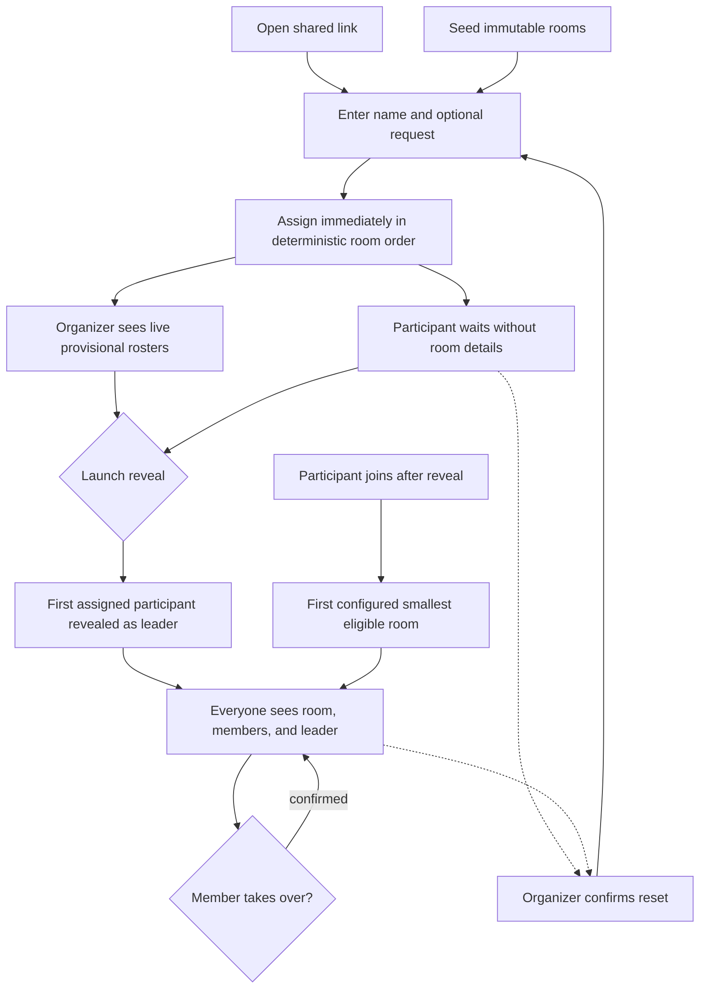
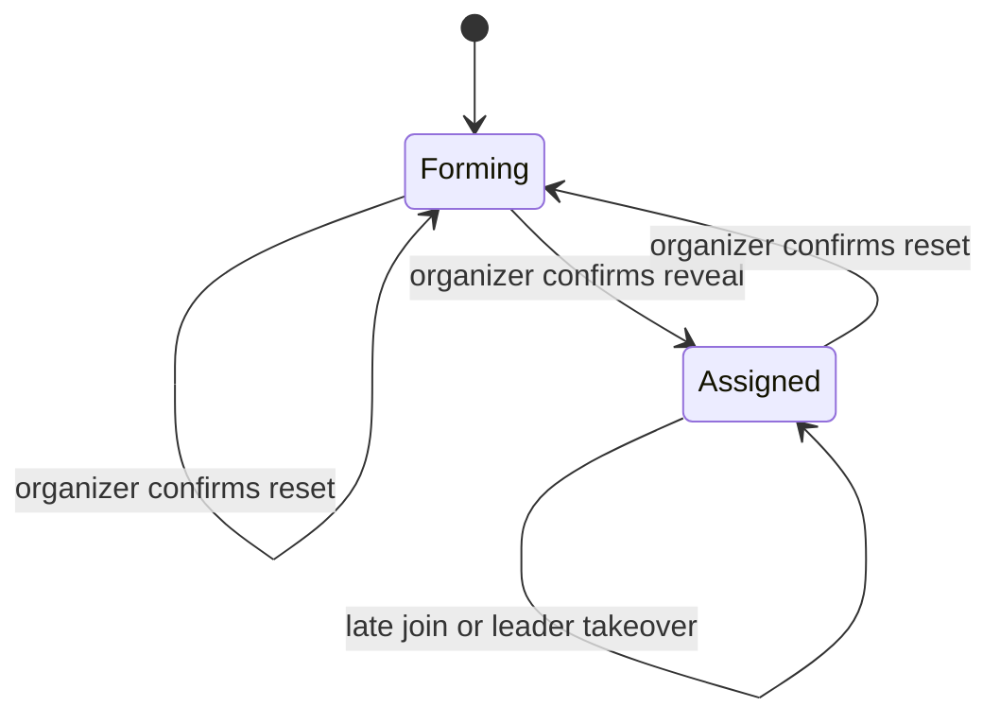

# Participant Room Handoff - Plan

## Goal Capsule

- **Objective:** Refine the production participant arrival, hidden assignment, organizer monitoring, reveal, and room-handoff experience for one in-person Day of Prayer gathering.
- **Product authority:** This plan records the room-based direction confirmed by the product owner. It supersedes the incompatible pair-matching behavior in `CONTEXT.md` and `docs/prayer-activity-spec.md` for this work while preserving the platform decision in `docs/adr/0001-nextjs-on-railway.md`.
- **Active boundary:** This work ends when each participant knows their room, fellow group members, and current room leader.
- **Open blockers:** None.
- **Execution profile:** Deep software feature spanning persistent state, concurrent mutations, participant identity, and synchronized participant and organizer surfaces.
- **Stop conditions:** Stop if implementation evidence invalidates a session-settled product decision or if prayer requests would cross into an organizer-visible response.
- **Tail ownership:** LFG owns implementation, review, browser acceptance, PR creation, and CI follow-through.

---

## Product Contract

### Summary

Create one live Day of Prayer gathering where participants join by name, receive a hidden deterministic room assignment immediately, wait together, and see that assignment when the organizer launches the reveal.
The first participant assigned to each room becomes its leader, while the organizer can monitor live provisional rosters and reset the gathering for another run.

### Problem Frame

The Day of Prayer gathering is a greenfield team-run experience rather than a replacement for an existing manual process.
The transition from one large gathering into smaller prayer rooms needs to feel intentional, personal, and dependable for 30–50 people using their own phones.
Assignments must favor viable groups of at least two before distributing additional participants, remain deterministic from join order and seeded room order, and stay hidden from participants until the shared reveal.
The Stitch output establishes the visual direction, but the application now needs production behavior for shared state, re-entry, assignment, privacy, and event-day operation.

### Key Decisions

- **Use one live gathering with same-device participant continuity.** (session-settled: user-directed — chosen over accounts or recovery codes: device changes can be handled manually for this event.) Governs R1, R4, R5.
- **Keep the organizer experience open at `/admin`.** (session-settled: user-directed — chosen over authentication or a PIN: the team accepts the access risk for this controlled gathering.) Governs R17, R18, R24.
- **Make launch final.** (session-settled: user-directed — chosen over organizer corrections after assignment: late arrivals can be placed automatically and manual intervention is unnecessary.) Governs R15, R16, R19.
- **Assign deterministically as participants join.** (session-settled: user-directed — chosen over randomized launch-time balancing: join order and seeded room order should fully determine placement.) Governs R7, R11, R13, R15, R16.
- **Seed each room with two participants before ordinary round robin.** (session-settled: user-directed — chosen over one-at-a-time balancing from the start: viable two-person groups should form before the algorithm advances.) Governs R10, R13.
- **Keep seeded rooms immutable in the application.** (session-settled: user-directed — chosen over organizer room creation, editing, and deletion: room configuration is controlled outside the event-day interface.) Governs R9, R10, R11, R19, R25.
- **Use launch only to reveal and finalize hidden assignments.** (session-settled: user-directed — chosen over assigning the waiting roster at launch: the organizer should see assignments as participants arrive while participants wait for a shared reveal.) Governs R6, R11, R14, R15, R18.
- **Make the first participant assigned to a room its leader.** (session-settled: user-directed — chosen over random selection at reveal: leader responsibility should follow join order.) Governs R14.
- **Allow immediate leader takeover.** (session-settled: user-directed — chosen over leader approval or group confirmation: an unavailable leader must not block the room.) Governs R20, R21.
- **Collect personal prayer requests before the room experience exists.** (session-settled: user-directed — chosen over deferring collection: requests should be retained privately for the later experience.) Governs R2, R3, R18, R25.
- **Reset the gathering without rebuilding room setup.** (session-settled: user-directed — chosen over a single-use gathering: the team expects to run load tests and reuse the configured rooms.) Governs R24, R25, R26.
- **Prove the release with 50 concurrent participants.** (session-settled: user-directed — chosen over larger speculative scale targets: 50 matches the expected event size.) Governs R27.

<!-- ce-section: work-relationships -->

### How This Work Fits Together

This plan owns the participant journey from opening the shared link through reaching an assigned physical room.
The following breakdown is the current understanding, not a committed roadmap:

- **Guided room experience**
  - **Depends on** this work for stable room membership, leader identity, and retained personal prayer requests.
  - **Still to decide:** prayer stages, request presentation, timing, and completion.
- **Corporate and ministry prayer-request management**
  - **Can proceed independently of** the room handoff.
  - **Enables** the later room experience by supplying requests for distribution among rooms.
- **Synchronized room progression**
  - **Depends on** the future guided room experience.
  - **Carries forward** the direction that every member sees the same current screen while only the leader advances it.

### Actors

- A1. **Participant:** Joins from a personal device, waits for the assignment reveal, travels to the assigned room, and may take over as leader.
- A2. **Room leader:** The first participant assigned to a room, whose current identity is shared with every member after reveal.
- A3. **Organizer:** Monitors arrivals and provisional rosters, launches the shared reveal, reviews leaders, and resets the gathering.

### Requirements

**Joining, privacy, and continuity**

- R1. A participant can join the active gathering from one shared mobile-friendly link without creating an account.
- R2. Joining requires a display name and accepts an optional personal prayer request.
- R3. A personal prayer request is retained for the later room experience, remains invisible to the organizer, and is cleared only when the gathering is reset.
- R4. The participant's browser remembers their identity on that device and returns them to the active lobby or assigned room after an ordinary reload or reconnect.
- R5. Cross-device identity recovery is not provided; a participant joining from another device enters as a new participant.

**Lobby and synchronization**

- R6. After joining, the participant enters a lobby that confirms their place and shows the live joined count without revealing their already-recorded room assignment.
- R7. Joining assigns the participant immediately, while the lobby and room-handoff screens update automatically when the shared gathering state changes.
- R8. Participant and gathering state survives ordinary page reloads and transient connection loss.

**Room setup**

- R9. Physical rooms are seeded outside the event-day application and are read-only in the organizer experience.
- R10. A seeded room can be unlimited or have a maximum capacity of at least two, and the configuration always contains at least one unlimited room.
- R11. Before reveal, the organizer can see the joined participant count, read-only room configuration, and live provisional roster for every room.

**Launch and assignment**

- R12. Joining is blocked with a configuration error only when the seeded room invariant is broken; a valid configuration can always accept another participant because at least one room is unlimited.
- R13. Assignment follows participant join order and seeded room order: place two participants into a room before advancing to the next room, then continue one participant per eligible room in round-robin order, dropping each finite room once it reaches capacity.
- R14. The first participant assigned to each non-empty room becomes its leader; the organizer sees that identity immediately while participants see it only after reveal.
- R15. Launch reveals hidden assignments and makes every existing participant's room final without recalculating the waiting roster.
- R16. A participant who joins after launch is assigned automatically to the first configured room among the currently smallest eligible rooms. Existing leaders are preserved; if the selected room is empty, the late participant becomes its leader.

**Organizer operation**

- R17. The organizer experience is available at `/admin` without authentication or a PIN; `/organizer` is not retained as a compatibility route.
- R18. Before and after reveal, the organizer can inspect live provisional rosters and see each current leader; neither view exposes prayer requests.
- R19. The organizer cannot create, edit, or delete rooms, remove participants, move participants between rooms, or correct assignments before or after reveal.

**Leader resilience and room handoff**

- R20. Every room member sees the current leader's name on the room-handoff screen.
- R21. Any room member can take over as leader after confirming the action, and the new leader becomes visible to every room member without approval from the previous leader.
- R22. After reveal, each participant sees the room name, wayfinding description, fellow members, leader, and a clear instruction to gather there.
- R23. The participant experience stops at room handoff and does not present prayer requests or the guided prayer journey.

**Reset and event readiness**

- R24. The organizer can reset the gathering after a standard confirmation dialog.
- R25. Reset preserves room names, descriptions, and capacities while clearing participants, prayer requests, assignments, leaders, and launch state.
- R26. Connected participant screens return to the join state after reset.
- R27. The complete join-through-handoff experience remains usable and synchronized with 50 concurrent participants.

### Experience Flow

### Key Flows

- F1. Participant joins or returns on the same device
  - **Trigger:** A participant opens the shared event link.
  - **Actors:** A1
  - **Steps:** A new participant enters a name and optional request, while a remembered participant returns to their current gathering state.
  - **Outcome:** The participant reaches the lobby or assigned room without an account.
  - **Covers:** R1, R2, R3, R4, R5, R6, R7, R8, R13.

- F2. Organizer monitors and reveals the gathering
  - **Trigger:** The organizer opens `/admin` while participants are joining.
  - **Actors:** A3
  - **Steps:** The organizer reviews read-only room configuration and live provisional rosters, then confirms reveal.
  - **Outcome:** Existing room membership is revealed unchanged with the first assigned participant as each non-empty room's leader.
  - **Covers:** R9, R10, R11, R12, R13, R14, R15, R17.

- F3. Participant receives the room handoff
  - **Trigger:** The organizer launches the reveal.
  - **Actors:** A1, A2
  - **Steps:** The lobby transitions to the room-handoff screen, where each member sees the same room identity, membership, leader, and directions.
  - **Outcome:** Participants can find the room and recognize their group without organizer intervention.
  - **Covers:** R7, R20, R22, R23.

- F4. Late participant joins
  - **Trigger:** A new participant submits the join form after launch.
  - **Actors:** A1
  - **Steps:** The gathering selects the first configured room among the currently smallest rooms with remaining capacity and assigns the participant, making them leader only when that room was empty.
  - **Outcome:** The participant receives a room immediately without changing any existing assignment or existing leader.
  - **Covers:** R13, R15, R16.

- F5. A member takes over coordination
  - **Trigger:** The selected leader is unavailable or another member needs to lead.
  - **Actors:** A1, A2
  - **Steps:** A member chooses to take over and confirms the action.
  - **Outcome:** The member becomes leader and every room member sees the updated identity.
  - **Covers:** R20, R21.

- F6. Organizer monitors or resets the gathering
  - **Trigger:** Participants are joining, assignments have been revealed, or the team needs a fresh run.
  - **Actors:** A3
  - **Steps:** The organizer reviews expandable room rosters or confirms reset through a standard dialog.
  - **Outcome:** Monitoring exposes no prayer requests, while reset retains room setup and returns participants to joining.
  - **Covers:** R3, R18, R19, R24, R25, R26.

### Acceptance Examples

- AE1. Participant returns during the lobby
  - **Covers:** R4, R6, R8.
  - **Given:** A participant has joined, received a hidden assignment, and the reveal has not launched.
  - **When:** They reload the page or reopen the shared link on that device.
  - **Then:** They return to the lobby as the same participant without entering their name again.

- AE2. Thirty-seven participants are assigned before reveal
  - **Covers:** R11, R13, R14.
  - **Given:** Six seeded rooms are unlimited.
  - **When:** Thirty-seven participants join in sequence.
  - **Then:** Every participant immediately receives exactly one hidden room, the organizer sees sizes seven, six, six, six, six, and six in configured order, and participants remain in the lobby until reveal.
  - **When:** The organizer launches the reveal.
  - **Then:** Membership remains unchanged, participants see their rooms, and each room’s first assigned participant is revealed as its leader.

- AE3. A finite room falls out of round robin
  - **Covers:** R10, R13.
  - **Given:** Three rooms are seeded in order with capacities two, unlimited, and unlimited.
  - **When:** Twelve participants join in sequence.
  - **Then:** The capped room receives the first two participants and then falls out, while the other rooms receive five participants each.

- AE4. Participant joins after launch
  - **Covers:** R15, R16.
  - **Given:** Assignments have been revealed and the seeded configuration includes an unlimited room.
  - **When:** A new participant joins.
  - **Then:** They enter the first configured room among the currently smallest eligible rooms without moving another participant or replacing an existing leader; if that room was empty, they become its leader.

- AE5. Leader does not arrive
  - **Covers:** R20, R21.
  - **Given:** The first participant assigned as leader is unavailable.
  - **When:** Another member confirms leader takeover.
  - **Then:** That member becomes leader and every room member sees the updated name.

- AE6. Organizer reviews rooms before and after reveal
  - **Covers:** R3, R18, R19.
  - **Given:** Participants have been assigned and some submitted prayer requests.
  - **When:** The organizer expands a room before reveal.
  - **Then:** They see provisionally assigned participant names and the current leader, but no prayer-request content or assignment controls.
  - **When:** The organizer expands the same room after reveal.
  - **Then:** The same leader remains visible without any room or participant mutation controls.

- AE7. Organizer resets after a load test
  - **Covers:** R24, R25, R26.
  - **Given:** A launched gathering has configured rooms, joined participants, requests, assignments, and leaders.
  - **When:** The organizer accepts the standard reset confirmation.
  - **Then:** Room configuration remains, all gathering data is cleared, and connected participant screens return to joining.

### Success Criteria

- A first-time participant can understand whether to join, wait, or move to a room from the primary message and action on each screen.
- Every joined participant immediately has exactly one hidden room, the first two seats of each room fill in configured order, and no room exceeds its maximum.
- Organizer, lobby, and room-handoff views converge on the current gathering state without participants manually refreshing.
- Same-device participants recover their current state after an ordinary reload or transient disconnect.
- A 50-participant load run completes joining, launch, room reveal, leader takeover, late arrival, and reset without lost or contradictory state.
- Personal prayer requests never appear in the organizer experience.

### Scope Boundaries

- The guided room prayer experience begins after this work and is deferred per R23.
- Presentation and allocation of personal, corporate, and ministry prayer requests inside rooms are deferred.
- Synchronized prayer stages and leader-only progression controls are deferred.
- Organizer authentication and access control are intentionally outside this release.
- Participant accounts, cross-device recovery, participant removal, manual room moves, and post-launch assignment correction are outside this release.
- Multiple simultaneous gatherings, event history, messaging, notifications, analytics, and post-event follow-up are outside this release.
- Room setup is seed-controlled operational configuration rather than a general venue-management product.

### Dependencies and Assumptions

- Participants have access to a modern mobile browser and remain within reasonable network coverage at the venue.
- Seeded room data supplies the available names, wayfinding descriptions, and capacities before participants join.
- One shared event link is distributed through an out-of-band channel such as a message or projected QR code.
- The team accepts that anyone who discovers `/admin` can view names, reveal assignments, or reset the gathering.
- Duplicate or accidental joins remain in the assignment pool until the organizer resets the entire gathering.
- At least one configured room always remains unlimited, so a valid late arrival has an eligible room.
- Planning will reconcile `CONTEXT.md` and `docs/prayer-activity-spec.md` with this confirmed product direction before implementation.

### Sources and Research

- `CONTEXT.md` and `docs/prayer-activity-spec.md` document the superseded pair-matching direction and terminology conflict.
- `docs/adr/0001-nextjs-on-railway.md` remains the platform authority.
- The product owner's Stitch export is the visual authority for the participant and organizer surfaces; this contract supplies the production behavior it did not define.

---

## Planning Contract

**Product Contract preservation:** changed R6–R19 and related flows and acceptance examples to capture immediate hidden assignment, deterministic two-seat seeding followed by round robin, immutable seeded rooms, live organizer rosters, reveal-only launch, and the `/admin` route.

### Key Technical Decisions

- KTD1. **Store one active gathering in PostgreSQL through Prisma.** A singleton gathering state owns the forming/assigned phase and revision, seeded rooms persist as immutable reusable configuration, and participants carry hidden per-run assignments. This extends the existing room-handoff schema in `prisma/schema.prisma`. Governs R3, R7, R8, R9, R10, R15, R25.
- KTD2. **Use App Router Route Handlers as the browser mutation and snapshot boundary.** Server-rendered pages provide the initial state, while no-store audience-specific handlers support joins, polling, reveal, takeover, and reset without exposing room mutation endpoints or introducing a second service. Same-origin checks protect state-changing requests from cross-site submission. (session-settled: user-directed — chosen over treating the Stitch export as a client-only prototype: the user asked for a production Next.js App Router implementation.) Governs R1, R7, R9, R17, R24.
- KTD3. **Represent same-device identity with an opaque HttpOnly cookie.** The browser holds a high-entropy token while PostgreSQL stores only its digest, so URLs and client-visible data do not become participant credentials. (session-settled: user-directed — chosen over accounts or recovery codes: device changes can be handled manually for this event.) Governs R1, R4, R5.
- KTD4. **Synchronize by polling authoritative snapshots rather than keeping process-local live state.** A shared client hook polls every second while the page is visible, backs off after failures, keeps hidden assignments in lobby state, and redirects when the gathering phase reveals a participant's room. This remains correct across Railway restarts and avoids a premature WebSocket or pub/sub dependency for the room-handoff boundary and 50-participant target; transport for a later guided room experience remains a separate decision. Governs R6, R7, R8, R15, R16, R18, R20, R21, R26, R27.
- KTD5. **Serialize lifecycle mutations in PostgreSQL.** Joins, reveal, late joins, takeover, and reset run through a domain service using atomic transactions under a row lock on the active gathering, with bounded retry for database write conflicts, so concurrent requests converge on one deterministic assignment and leader state. Seeded room order is the existing creation-time order with ID as a stable tie-break; fill the first room below two, then choose the first smallest eligible room, so no cursor state is required. (session-settled: user-directed — chosen over a randomized batch allocator or persisted round-robin cursor: immutable room order and append-only joins make the deterministic next room derivable.) Governs R7, R10, R12, R13, R14, R15, R16, R21, R24, R25.
- KTD6. **Build separate participant and organizer projections.** Shared domain state is mapped through explicit response serializers, participant projections suppress room details while forming, organizer queries expose provisional rosters but never select prayer-request content, and request values are excluded from application logs and error details. Governs R3, R6, R11, R18, R22, R23.
- KTD7. **Retain the Stitch composition through shared Tailwind components.** Existing participant and organizer surfaces become data-driven while common status, room, member, modal, and action primitives prevent repeated page-specific behavior. (session-settled: user-directed — chosen over duplicating the exported screens page by page: the user asked for DRY components and Tailwind.) Governs R6, R11, R18, R20, R22, R23.
- KTD8. **Prove event scale through a repeatable HTTP load scenario.** A guarded script uses the existing seeded room configuration and exercises 50 concurrent joins, live provisional rosters, reveal, room handoff, takeover, late arrival, and reset against a dedicated test deployment or local server. Governs R27.
- KTD9. **Apply committed migrations in Railway's pre-deploy phase.** `prisma migrate deploy` runs with the deployed image and private-network database variables before a new application instance starts, so an unapplied schema blocks deployment instead of failing live requests. Governs R8.
- KTD10. **Separate fast tests from PostgreSQL integration tests.** Vitest keeps node and browser-component projects in the normal verification path, while explicitly named integration tests run after migrations against PostgreSQL in CI and local database verification. This preserves a useful local `pnpm verify` while still proving transaction behavior. Governs R8, R27.
- KTD11. **Encrypt personal prayer requests before persistence.** An authenticated-encryption helper uses an environment-provided key, stores only ciphertext and its encryption metadata, and decrypts only through the future participant-room projection boundary. Submitting a request fails safely when the key is unavailable, while participants without a request can still join. Governs R2, R3.

### High-Level Technical Design

### Sequencing

1. Align domain authority and establish the persistent lifecycle model.
2. Implement transactional immediate assignment and reveal behavior before exposing HTTP mutations.
3. Add audience-specific Route Handlers and participant identity.
4. Replace demo participant surfaces with persistent synchronized state.
5. Replace organizer room mutation controls with the read-only `/admin` monitoring, reveal, and reset experience.
6. Prove the complete system with database, browser, and 50-participant load checks.

### System-Wide Impact

- **Data lifecycle:** Personal prayer requests persist until reset, then are deleted with the participant run while room configuration remains.
- **Privacy:** Participant identity is device-bound and prayer requests are excluded from organizer reads, logs, browser URLs, and load-test output.
- **Concurrency:** Every assignment-affecting mutation shares one serialized lifecycle boundary rather than relying on React or process memory.
- **Deployment:** The existing single Next.js Railway service and PostgreSQL plugin remain sufficient; no new hosted service is introduced.
- **Operations:** `/admin` stays intentionally open, so the UI must make reveal and reset consequences clear without implying access control.

### Risks and Dependencies

- **Concurrent writes:** Unit tests cannot prove PostgreSQL serialization, so U2 includes real-database simultaneous-join, reveal, and late-join tests with bounded retry assertions.
- **Polling load:** Hidden-page pausing, failure backoff, and the 50-participant run bound query volume while preserving automatic convergence.
- **Prototype residue:** U4 and U5 remove hard-coded sample data and query-string identity while component/browser tests pin the accepted Stitch composition.
- **Conflicting authority:** U1 updates `CONTEXT.md` and records the superseding decision in an ADR before the new behavior becomes implementation authority.
- **Seed dependence:** U1 and U2 validate the room invariants at the domain boundary because the application deliberately offers no event-day repair controls.
- **Destructive testing:** U6 requires an explicit target and reset opt-in, refuses the production origin by default, and never rewrites seeded room configuration.
- **Migration failure:** The minimum-capacity constraint must validate existing seeded data before it is committed, and KTD9 makes a failed migration stop Railway before the new instance starts.
- **Backup retention:** Reset deletes live application rows, but provider backups may follow a separate retention policy; operational documentation must not promise immediate backup erasure.
- **Encryption-key loss or rotation:** Prayer requests cannot be recovered without the configured key, so U1 documents generation and rotation constraints and keeps ciphertext unreadable on decryption failure.

### Sources and Research

- Repository patterns: `src/lib/db.ts`, `src/app/api/health/route.ts`, `src/components/ui/action-button.tsx`, `src/components/ui/modal.tsx`
- Platform authority: `docs/adr/0001-nextjs-on-railway.md`
- Visual authority: the product owner's Stitch export, reflected by the current Tailwind surfaces under `src/app/` and `src/components/`
- Next.js App Router cookies and dynamic request state: `https://nextjs.org/docs/app/api-reference/functions/cookies`
- Next.js 15 caching and dynamic rendering: `https://nextjs.org/docs/15/app/guides/caching`
- Prisma transactions and serializable retry guidance: `https://www.prisma.io/docs/orm/prisma-client/queries/transactions`
- Tailwind CSS v4 source detection: `https://tailwindcss.com/docs/detecting-classes-in-source-files`
- Railway pre-deploy command: `https://docs.railway.com/deployments/pre-deploy-command`
- Prisma production migration deployment: `https://docs.prisma.io/docs/cli/migrate/deploy`

---

## Implementation Units

### U1. Establish the gathering persistence model and domain authority

**Goal:** Preserve the persistent entities and enforce the seeded-room invariants needed for one reusable room-handoff gathering.

**Requirements:** R2, R3, R8, R9, R10, R12, R15, R25; KTD1, KTD11

**Dependencies:** None

**Files:** `prisma/schema.prisma`, `prisma/migrations/*/migration.sql`, `CONTEXT.md`, `docs/adr/0002-room-handoff-state.md`, `src/lib/db.ts`, `src/lib/gathering/types.ts`, `src/lib/gathering/constants.ts`, `src/lib/gathering/prayer-request-crypto.ts`, `src/lib/gathering/prayer-request-crypto.test.ts`, `src/lib/gathering/persistence.test.ts`

**Approach:**

1. Model the active gathering phase and revision, immutable seeded room configuration, per-run participants, hidden assignments, and current room leader.
2. Enforce that finite room capacities are at least two while retaining the existing requirement for at least one unlimited room.
3. Preserve optional personal requests as encrypted server-only participant data and define reset-compatible foreign-key behavior.
4. Update the root domain context and ADR to describe immediate hidden assignment, immutable seeded rooms, and reveal-only launch.

**Execution note:** Apply the migration to PostgreSQL and capture connection/migration evidence before building feature behavior on top of it.

**Patterns to follow:** Reuse the Prisma 7 adapter and shared-client lifecycle in `src/lib/db.ts`; preserve the ADR format in `docs/adr/0001-nextjs-on-railway.md`.

**Test scenarios:**

1. A fresh database accepts the migration and can create the active gathering plus valid seeded rooms and participants.
2. A finite room capacity below two is rejected by the persistence invariant.
3. Deleting a participant cannot leave an invalid leader reference.
4. Clearing per-run participant data leaves room names, descriptions, and capacities intact.
5. A participant row can hold an optional prayer request without any organizer projection being defined in the persistence layer.
6. Prayer-request encryption round-trips with the configured key, rejects tampered ciphertext, and fails without exposing plaintext when the key is missing or wrong.

**Verification:** Prisma validates and generates, the migration applies to PostgreSQL, and persistence tests prove reset-compatible relationships.

### U2. Implement immediate deterministic assignment and reveal behavior

**Goal:** Make immediate hidden assignment, reveal, late arrival, leader takeover, and reset one transactional domain.

**Requirements:** R2, R9, R10, R11, R12, R13, R14, R15, R16, R19, R21, R24, R25; F2, F4, F5, F6; AE2, AE3, AE4, AE5, AE7; KTD5

**Dependencies:** U1

**Files:** `src/lib/gathering/assignment.ts`, `src/lib/gathering/assignment.test.ts`, `src/lib/gathering/service.ts`, `src/lib/gathering/service.test.ts`, `src/lib/gathering/service.integration.test.ts`, `src/lib/gathering/errors.ts`

**Approach:**

1. Replace randomized batch balancing with a pure deterministic next-room selector that fills the first configured room below two, then chooses the first smallest eligible room and ignores rooms at capacity.
2. Assign every participant inside the serialized join transaction, recording the room immediately without exposing it through the participant projection while forming.
3. Make the first participant assigned to each room its leader, expose that identity immediately to the organizer while keeping it hidden from participants until launch, and make late arrivals use the same deterministic smallest-eligible ordering while preserving existing leaders.
4. Remove room mutation operations from the event-day domain service.

**Execution note:** Start with failing domain tests for AE2, AE3, AE4, AE5, and AE7, then add PostgreSQL-backed concurrency coverage.

**Patterns to follow:** Keep pure helpers independent of React and Route Handlers; use `getDatabase()` from `src/lib/db.ts` for persistence.

**Test scenarios:**

1. Covers AE2. Thirty-seven sequential joins across six unlimited rooms produce configured-order sizes seven, six, six, six, six, and six before reveal.
2. With three unlimited rooms and five joins, configured-order sizes are two, two, and one; with one join they are one, zero, and zero.
3. Covers AE3. Twelve joins with capacities two, unlimited, and unlimited produce room sizes two, five, and five, and the finite room receives no participant after reaching two.
4. A join against missing rooms, a finite capacity below two, or a configuration without an unlimited room returns a configuration error without creating an unassigned participant.
5. Two concurrent joins serialize into distinct deterministic assignment slots.
6. Two concurrent reveal attempts preserve one committed first-participant leader set without moving any participant.
7. Covers AE4. Concurrent late joins each receive the first configured room among the smallest eligible rooms without moving existing members or replacing a leader; a late join entering an empty room becomes its leader.
8. Covers AE5. A member of the room can become its sole leader, while a participant from another room is rejected.
9. Covers AE7. Reset clears run data and returns the gathering to forming while preserving seeded room configuration.
10. The domain service exposes no room or participant mutation operation beyond joining, takeover, reveal, and reset.

**Verification:** Pure tests prove balancing, PostgreSQL-backed service tests prove atomic lifecycle transitions, and every committed mutation advances the shared revision.

### U3. Add audience-safe App Router interfaces and participant identity

**Goal:** Expose the domain through typed, privacy-preserving browser contracts and same-device identity.

**Requirements:** R1, R3, R4, R5, R7, R17, R18, R20, R24; F1, F6; AE1, AE6; KTD2, KTD3, KTD6

**Dependencies:** U2

**Files:** `src/lib/gathering/session.ts`, `src/lib/gathering/session.test.ts`, `src/lib/gathering/types.ts`, `src/lib/gathering/http.ts`, `src/app/api/participant/route.ts`, `src/app/api/participant/leader/route.ts`, `src/app/api/organizer/route.ts`, `src/app/api/organizer/launch/route.ts`, `src/app/api/organizer/reset/route.ts`, `src/app/api/gathering-routes.test.ts`, `src/test/setup.ts`, `vitest.config.ts`, `package.json`, `pnpm-lock.yaml`

**Approach:**

1. Create and resolve a high-entropy participant token through an HttpOnly, same-site cookie while storing only its digest.
2. Return participant and organizer snapshots through separate projections: forming participants receive lobby state despite having a stored room, while the organizer receives live provisional rosters with prayer-request fields absent from selects, response types, and diagnostic output.
3. Validate expected input and same-origin mutations in shared HTTP helpers, then map domain errors to stable user-facing responses.
4. Extend Vitest with a browser-like component project while keeping PostgreSQL integration tests behind an explicit database-backed command.

**Execution note:** Add response-contract tests before wiring the UI, including negative assertions that organizer payloads cannot contain prayer-request keys or values.

**Patterns to follow:** Use App Router Route Handlers under `src/app/api/`, async `cookies()` semantics, and Web Request/Response objects rather than Pages Router APIs.

**Test scenarios:**

1. Covers AE1. Joining sets an opaque HttpOnly cookie and a subsequent request with that cookie returns the same participant.
2. A missing or stale cookie receives join-state guidance without exposing another participant.
3. A name containing only whitespace is rejected, while internal whitespace is normalized.
4. Empty, malformed, and oversized payloads are rejected without changing gathering state.
5. A cross-origin mutation request is rejected without changing gathering state.
6. Covers AE6. Organizer snapshots include names, rooms, counts, provisional membership, and leader identity before and after reveal but contain no prayer-request key or submitted request value.
7. A forming participant with a stored room receives only lobby state; the same participant receives room-handoff data after reveal.
8. Domain conflicts and validation failures return expected errors without credentials, raw database details, or prayer content.
9. Server logs and structured errors contain no prayer-request values or participant session tokens.
10. Snapshot responses opt out of browser and framework caching.

**Verification:** Route tests cover every handler, privacy tests inspect serialized payloads, and cookies remain out of URLs and client storage.

### U4. Connect the Stitch participant journey to live gathering state

**Goal:** Replace demo participant data with server-rendered initial snapshots and resilient live updates while preserving the accepted visual experience.

**Requirements:** R1, R2, R4, R6, R7, R8, R20, R21, R22, R23, R26; F1, F3, F5; AE1, AE5; KTD4, KTD7

**Dependencies:** U3

**Files:** `src/app/page.tsx`, `src/app/lobby/page.tsx`, `src/app/lobby/loading.tsx`, `src/app/room/page.tsx`, `src/components/participant/join-form.tsx`, `src/components/participant/lobby-status.tsx`, `src/components/participant/room-assignment.tsx`, `src/components/participant/participant-experience.tsx`, `src/components/participant/participant-experience.test.tsx`, `src/hooks/use-gathering-snapshot.ts`, `src/hooks/use-gathering-snapshot.test.ts`, `src/lib/demo-gathering.ts`, `src/lib/demo-gathering.test.ts`

**Approach:**

1. Resolve the participant cookie in Server Components and render the correct initial join, lobby, or room state without query-string identity.
2. Centralize visible-page polling, retry, revision comparison, and reset/reveal navigation in one reusable hook.
3. Keep the Stitch-derived join, lobby, room reveal, roster, leader label, and takeover confirmation composition while replacing sample data with typed snapshots.
4. Remove development preview links and the demo gathering module once production paths cover each screen.

**Execution note:** Characterize the existing visible labels and accessibility behavior before replacing data flow, then add interaction coverage for automatic state transitions.

**Patterns to follow:** Preserve shared UI primitives in `src/components/ui/`, Tailwind tokens in `src/app/globals.css`, and Server Component pages with narrow client interaction islands.

**Test scenarios:**

1. A new device sees the join form and can submit a normalized name with or without a prayer request.
2. Covers AE1. A remembered participant returns directly to their current lobby or assigned room.
3. The lobby displays the live joined count without leaking the stored assignment, then moves to the room handoff after reveal without manual refresh.
4. The room handoff displays the assigned room, directions, complete roster, and current leader without prayer content or guided-stage controls.
5. Covers AE5. Confirming takeover updates the current leader for all polling room members.
6. After reset, a connected lobby or room screen returns to the join state.
7. Polling pauses while the document is hidden, retries after a transient failure, and resumes with the latest revision.
8. During a transient polling failure, the participant keeps the last valid screen and sees a non-blocking reconnecting status.

**Verification:** Participant component tests pass, browser acceptance covers join through room handoff on mobile dimensions, and no production route contains preview navigation.

### U5. Make `/admin` a read-only room monitor with reveal controls

**Goal:** Move the organizer experience to `/admin`, remove event-day room mutation, and show live rosters, reveal, and reset against the shared gathering.

**Requirements:** R9, R10, R11, R12, R15, R17, R18, R19, R24, R25, R27; F2, F6; AE2, AE3, AE6, AE7; KTD4, KTD7

**Dependencies:** U3

**Files:** `src/app/admin/page.tsx`, `src/components/organizer/organizer-dashboard.tsx`, `src/components/organizer/organizer-dashboard.test.tsx`, `src/hooks/use-gathering-snapshot.ts`

**Approach:**

1. Server-render the initial organizer snapshot at `/admin` and reuse the shared polling hook for joined count, provisional assignments, reveal, takeover, late-arrival, and reset changes.
2. Render seeded room name, directions, maximum, and live roster as read-only in both gathering phases.
3. Remove room create, edit, and delete controls and their API client calls; do not retain `/organizer` as a compatibility route.
4. Reveal leader labels after launch while exposing no move, participant removal, or prayer-request affordance.
5. Retain the standard reset confirmation that preserves seeded room configuration and announces the destructive run-data effect.

**Execution note:** Protect the organizer response shape and disabled-state rules with component tests before integrating browser mutations.

**Patterns to follow:** Reuse `ActionButton`, `Modal`, shared room/member components, and the existing responsive organizer layout rather than rebuilding the Stitch composition.

**Test scenarios:**

1. `/admin` renders each seeded room and capacity without any create, edit, or delete control, while `/organizer` is absent.
2. Covers AE2 and AE3. Before reveal, room cards show live deterministic rosters as participants join.
3. Reveal leaves membership unchanged and adds leader labels to non-empty rooms.
4. Covers AE6. Room cards expose display names and current leader when applicable without prayer content or assignment controls.
5. Late arrivals and leader takeover appear through polling without a page reload.
6. Covers AE7. Standard reset confirmation clears run data, retains seeded rooms, and returns the dashboard to forming.
7. No organizer credential, PIN, room mutation, participant removal, or room-move control is rendered.
8. Empty-room, configuration-error, mutation-failure, and reconnecting states preserve the organizer's last valid snapshot and explain the available recovery action.

**Verification:** Organizer component tests and desktop/tablet browser acceptance cover setup, launch, monitoring, and reset.

### U6. Prove database, load, and deployment readiness

**Goal:** Add repeatable evidence that immediate hidden assignment and reveal work with seeded rooms, PostgreSQL, and 50 concurrent participants.

**Requirements:** R3, R8, R27; all Success Criteria; KTD8, KTD9, KTD10, KTD11

**Dependencies:** U4, U5

**Files:** `scripts/load-test.ts`, `scripts/check-database.ts`, `src/lib/gathering/load-test.test.ts`, `.github/workflows/ci.yml`, `package.json`, `.env.example`, `README.md`, `railway.toml`

**Approach:**

1. Add a guarded load script that requires an explicit base URL and destructive-reset opt-in.
2. Drive 50 independent cookie jars through immediate assignment, organizer roster convergence, reveal, room-state convergence, takeover, late arrival, and reset while recording failures without prayer content.
3. Use the target's existing seeded rooms and restore only gathering run state; never create, edit, delete, or replace room configuration.
4. Run migrations and PostgreSQL integration tests in CI before the production build is treated as ready.
5. Configure Railway to apply committed Prisma migrations during pre-deploy without changing the current start or health-check contract.
6. Document local PostgreSQL migration, encryption-key setup, seeded-room invariants, verification, load-test, reset retention limits, and Railway environment expectations.

**Execution note:** Run the load scenario only against a dedicated local or test environment and capture the result alongside `pnpm verify` and `pnpm db:check`.

**Patterns to follow:** Extend the existing pnpm script surface and Railway configuration rather than introducing another runner or deployment service.

**Test scenarios:**

1. The script refuses to start without an explicit target and destructive-reset opt-in.
2. Fifty concurrent joins receive distinct participant cookies, immediate valid assignments, and all appear in organizer rosters while participant snapshots remain in lobby state.
3. Reveal changes no membership and converges every participant on exactly one visible room with one leader per non-empty room.
4. Takeover, one late join, and reset converge across participant and organizer snapshots.
5. Script logs contain no prayer-request values or participant session tokens.
6. Build and database checks pass against the migrated schema.
7. The script makes no room-configuration mutation request.
8. A failed pre-deploy migration prevents the new Railway instance from starting.

**Verification:** The guarded 50-participant scenario passes, PostgreSQL checks pass, and the Railway standalone build remains healthy.

---

## Verification Contract

| Gate                              | Applies to | Required outcome                                                                                            |
| --------------------------------- | ---------- | ----------------------------------------------------------------------------------------------------------- |
| `pnpm exec prisma migrate deploy` | U1, U2     | The domain migration applies cleanly to PostgreSQL.                                                         |
| `pnpm db:check`                   | U1, U2, U6 | Prisma connects to the configured PostgreSQL database after migration.                                      |
| `pnpm test`                       | U1–U6      | Pure domain, route, hook, component, privacy, and guard tests pass without requiring PostgreSQL.            |
| `pnpm test:integration`           | U1, U2, U6 | Migrated PostgreSQL passes lifecycle and concurrency integration tests.                                     |
| `pnpm verify`                     | U1–U6      | Formatting, lint, types, fast tests, Prisma validation, and production build all pass.                      |
| Guarded 50-participant load run   | U2–U6      | Immediate hidden assignment, live organizer rosters, reveal, takeover, late arrival, and reset converge.    |
| Browser acceptance                | U4, U5     | Mobile participant and desktop/tablet organizer flows match the Stitch composition and production behavior. |

---

## Definition of Done

- U1 is done when the migration and updated domain authorities enforce immutable seeded rooms, minimum finite capacity two, one unlimited room, and reset-safe participant relationships.
- U2 is done when transactional tests cover deterministic immediate assignment, two-person room seeding, capacity drop-out, reveal without reassignment, late arrival, takeover, and reset under concurrent requests.
- U3 is done when same-device identity works through an opaque cookie, forming participants cannot see stored assignments, and organizer responses expose rosters without prayer-request data.
- U4 is done when the participant journey waits on hidden assignment, reveals automatically, preserves the Stitch experience, and contains no demo/query-string identity path.
- U5 is done when `/admin` performs the confirmed read-only roster, reveal, and reset behavior without room mutation, authentication, participant edits, or prayer visibility, and `/organizer` is absent.
- U6 is done when the guarded seeded-room 50-participant scenario, PostgreSQL checks, browser acceptance, and `pnpm verify` pass.
- The plan is complete only when every applicable R/F/AE/KTD is covered by an implementation unit and verification evidence.
- Abandoned prototype branches, duplicated demo state, unused helpers, and experimental code are removed from the final diff.
- Domain documentation, environment examples, and event-operation instructions describe the shipped behavior.
