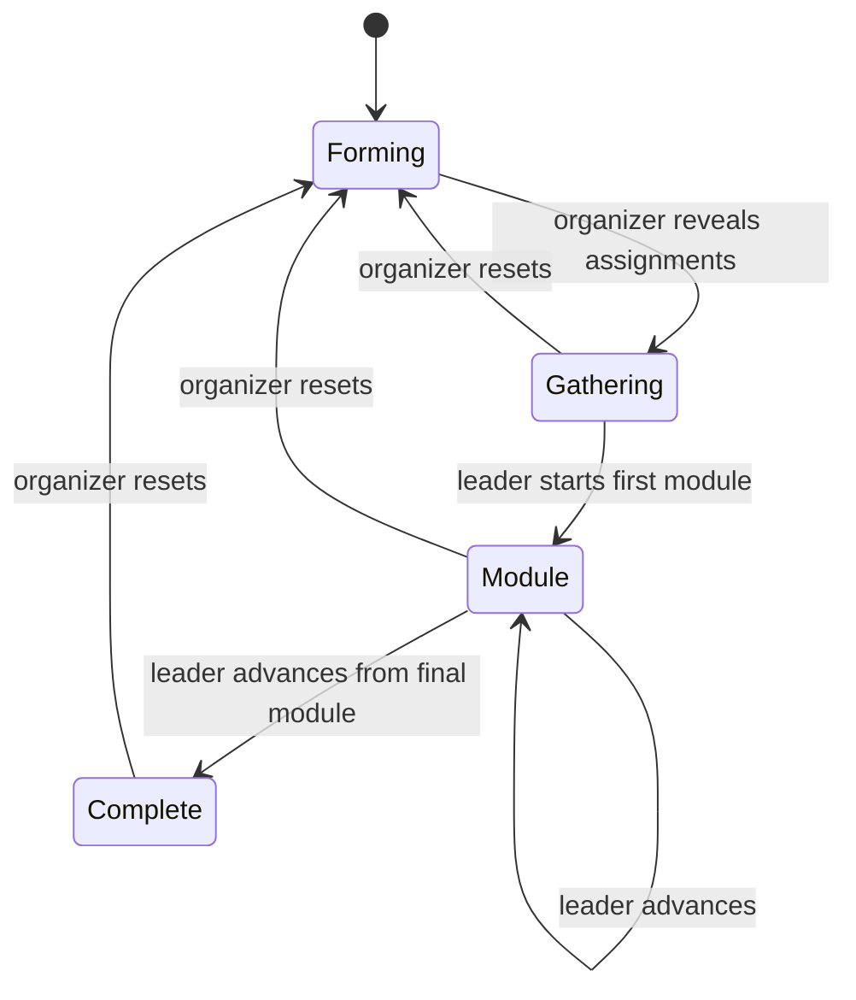
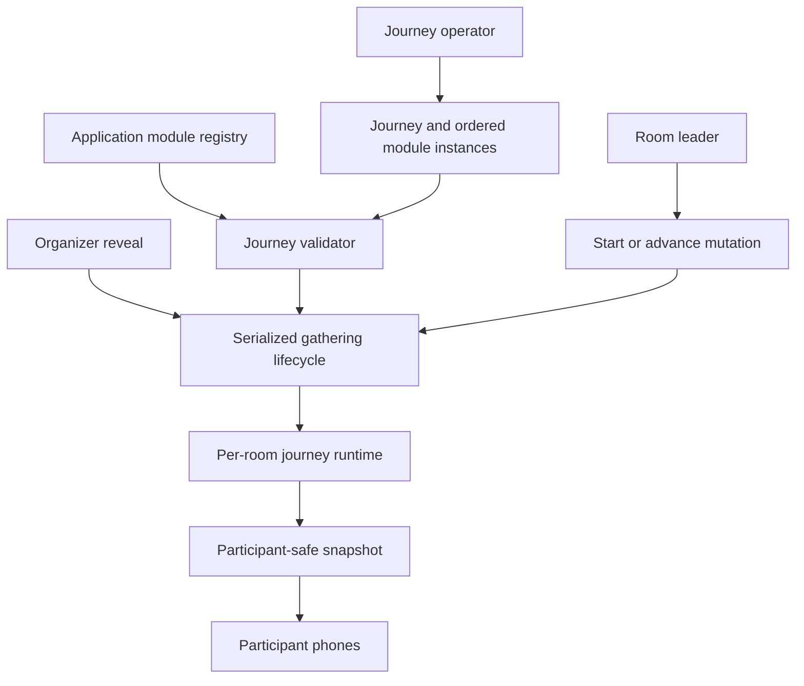
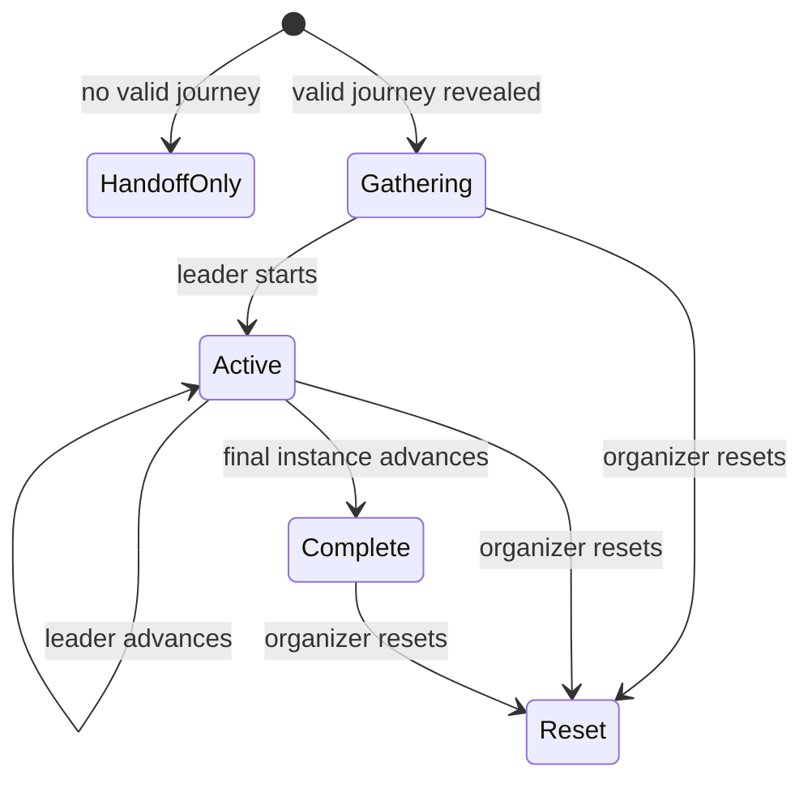

# Room Journey Framework - Plan

## Goal Capsule

- **Objective:** Add the reusable journey framework that carries each room from assignment reveal through a leader-led sequence of synchronized module instances.
- **Product authority:** This plan extends the room handoff defined by `docs/plans/2026-07-25-001-feat-participant-room-handoff-plan.md`; it owns journey composition and runtime progression, while the behavior and content of individual prayer modules remain separate work.
- **Open blockers:** None.
- **Execution profile:** Deep software feature spanning persistent journey composition, transactional room progression, synchronized projections, and participant UI states.
- **Stop conditions:** Stop if implementation requires defining a real prayer module, adds an event-day journey editor, or weakens the existing room-handoff privacy and concurrency boundaries.
- **Tail ownership:** LFG owns implementation, review, browser acceptance, PR creation, and CI follow-through.

---

## Product Contract

### Summary

Create a general-purpose room journey framework in which a database-configured journey contains ordered instances of application-defined modules.
Every room follows the same journey while its leader controls synchronized, forward-only progression for that room.

### Problem Frame

The current Day of Prayer experience ends after participants learn their room, group, and leader.
The next experience will combine several guided prayer activities over 60–90 minutes, but those activities need a dependable shared runtime before their individual behavior is designed.
Rooms must stay internally synchronized without forcing every room to move at the same pace.

### Key Decisions

- **Compose journeys from ordered module instances.** (session-settled: user-approved — chosen over one monolithic room flow: reusable application-defined behaviors should accept journey-specific configuration.) Governs R1–R4.
- **Keep journey configuration database-only for this release.** (session-settled: user-directed — chosen over an organizer-facing editor or builder: a future builder may target the same model without expanding the current event-day interface.) Governs R2, R3, R22.
- **Run the active database configuration directly.** (session-settled: user-directed — chosen over snapshotting or versioning a journey at launch: the team will not edit journey configuration during a live gathering.) Governs R4, R21.
- **Let the room leader control forward-only progression.** (session-settled: user-directed — chosen over automatic transitions, individual progression, or backward navigation: each room should remain together while moving at its own pace.) Governs R8–R13.
- **Use synchronized timers as guidance only.** (session-settled: user-directed — chosen over enforced durations or automatic advancement: the leader may move forward at any time.) Governs R10–R12.
- **Extend the existing reveal into the journey launch.** (session-settled: user-approved — chosen over a second organizer start control: reveal should move rooms into an untimed gathering state before leaders begin.) Governs R5–R7.
- **Complete rooms independently.** (session-settled: user-directed — chosen over an organizer-triggered shared conclusion: each room should reach its own completed closing screen.) Governs R14.
- **Measure framework success by journey completion.** (session-settled: user-directed — chosen over module-specific outcome measures in this work: each configured room journey should be completable in roughly 60–90 minutes.) Governs R20.

<!-- ce-section: work-relationships -->

### How This Work Fits Together

This plan owns journey composition, launch, room-level synchronization, progression, timing, continuity, and completion.
The following areas are related but remain separately plannable:

- **Devotional reflection, ministry prayer, and closing modules**
  - **Depend on** this framework for ordered placement, timing, and synchronized room presentation.
  - **Still to decide:** each module’s prompts, content shape, interactions, and completion behavior.
- **Pairs-and-trios personal prayer module**
  - **Depends on** this framework for room-scoped shared state and synchronized updates.
  - **Carries forward as context:** people form subgroups physically, select their members, and see filtered requests; the detailed module contract is not active scope.
- **Journey builder**
  - **Can build on** the same journey and module-instance model later.
  - **Is deferred:** this release configures journeys directly in the database and adds no editor UI.

### Actors

- A1. **Participant:** Follows the current room module on a personal or shared phone and remains synchronized with the room after reload, reconnect, or late arrival.
- A2. **Room leader:** Starts the first module and advances the room through the journey.
- A3. **Organizer:** Uses the existing assignment reveal to launch the journey shell for every room and can reset the gathering.
- A4. **Journey operator:** Maintains the live journey and module-instance configuration outside the event-day interface.

### Requirements

**Journey composition**

- R1. A journey is an ordered sequence of module instances.
- R2. Each module instance references an application-defined module behavior and supplies its journey-specific configuration.
- R3. A module instance carries its recommended duration, and the same module behavior may appear more than once in a journey.
- R4. Active rooms read the current journey configuration from the database without a launch-time snapshot or version.

**Launch and readiness**

- R5. The existing organizer reveal remains the single gathering-wide launch action.
- R6. Reveal places every assigned room into an untimed gathering state before its first module begins.
- R7. Only the room leader can start the first module once the physical room is ready.

**Room progression and timing**

- R8. Every participant in a room sees the same current module instance.
- R9. Only the current room leader can advance the room to the next module instance.
- R10. Entering a timed module starts one synchronized countdown from that module instance’s recommended duration.
- R11. The countdown never advances the room automatically, and the leader may advance before or after it reaches zero.
- R12. When the countdown reaches zero, the room remains in the current module with a clear indication that the recommended time has elapsed.
- R13. Room progression is forward-only, and each room advances independently of every other room.
- R14. Advancing from the final module places that room on a persistent completed closing screen without requiring organizer action.

**Continuity and shared state**

- R15. Reloading or reconnecting returns a participant to their room’s current gathering, module, timer, or completed state.
- R16. A participant assigned after reveal enters their room’s current state with a brief indication that the journey is already underway.
- R17. A late participant does not restart or otherwise alter the room’s active timer.
- R18. Leader takeover preserves the room’s current module, timer, and module-specific state.
- R19. A module behavior can maintain synchronized state scoped to its room and module instance, and that state stops being active when the room advances.

**Readiness and success**

- R20. A valid configured journey can be completed by a room in roughly 60–90 minutes.
- R21. Journey configuration is treated as live operational data and is not edited while a gathering is running.
- R22. The organizer experience provides no journey, module, ordering, duration, or content editor.
- R23. Reset clears room journey progress and temporary module state together with the existing gathering data.
- R24. When no valid journey is configured, reveal preserves the existing room-handoff-only experience and indicates to the organizer that no guided journey will begin.

### Journey State

### Key Flows

- F1. Launch and start a room journey
  - **Trigger:** The organizer reveals room assignments.
  - **Actors:** A2, A3
  - **Steps:** Reveal moves every assigned room to the gathering state; each leader starts the first module after their room is physically ready.
  - **Outcome:** Every room begins the configured journey without a second organizer launch.
  - **Covers:** R5–R8.

- F2. Advance a room through modules
  - **Trigger:** A leader starts or advances their room.
  - **Actors:** A1, A2
  - **Steps:** All room screens enter the same module and timer; the leader advances when appropriate; other rooms remain unaffected.
  - **Outcome:** The room progresses forward as one group at its own pace.
  - **Covers:** R8–R13, R19.

- F3. Rejoin a journey in progress
  - **Trigger:** A participant reloads, reconnects, or joins after reveal.
  - **Actors:** A1
  - **Steps:** The participant enters the assigned room’s current state without restarting its module or timer.
  - **Outcome:** The participant can immediately rejoin the physical activity.
  - **Covers:** R15–R17.

- F4. Complete or reset a journey
  - **Trigger:** A leader advances from the final module, or the organizer resets the gathering.
  - **Actors:** A1, A2, A3
  - **Steps:** Final advancement completes only that room; reset returns every room and participant to the existing pre-gathering state.
  - **Outcome:** Rooms finish independently, while reset clears the entire reusable gathering.
  - **Covers:** R14, R23.

### Acceptance Examples

- AE1. Reveal does not start a timed prayer activity
  - **Covers:** R5–R7.
  - **Given:** The organizer has participants assigned to configured rooms and a valid journey exists.
  - **When:** The organizer reveals room assignments.
  - **Then:** Every participant sees the untimed gathering state for their room, and no module timer starts until that room’s leader begins.

- AE2. Rooms progress at different speeds
  - **Covers:** R8–R13.
  - **Given:** Two rooms are on the same module instance.
  - **When:** One leader advances before the recommended timer ends.
  - **Then:** Every member of that room enters the next module while the other room remains unchanged.

- AE3. A module exceeds its recommended duration
  - **Covers:** R10–R12.
  - **Given:** A room is in a timed module.
  - **When:** Its countdown reaches zero.
  - **Then:** The room remains synchronized on that module until the leader advances.

- AE4. A participant returns during a module
  - **Covers:** R15.
  - **Given:** A room is partway through a timed module.
  - **When:** A participant reloads or reconnects.
  - **Then:** They return to the current module with the room’s current timer rather than restarting it.

- AE5. A participant joins late
  - **Covers:** R16, R17.
  - **Given:** Assignments have been revealed and a room is partway through its journey.
  - **When:** A new participant is assigned to that room.
  - **Then:** They enter its current state with an in-progress indication, and the room timer remains unchanged.

- AE6. A room finishes before another room
  - **Covers:** R13, R14.
  - **Given:** Two rooms are in the final module.
  - **When:** One leader advances.
  - **Then:** That room sees the completed closing screen while the other remains in the final module.

- AE7. The organizer resets an active journey
  - **Covers:** R23.
  - **Given:** Rooms have current modules, timers, and temporary module state.
  - **When:** The organizer resets the gathering.
  - **Then:** All journey progress and temporary module state are cleared with the existing participant and assignment data.

- AE8. Journey configuration is missing
  - **Covers:** R24.
  - **Given:** No valid ordered module instances exist for the live journey.
  - **When:** The organizer attempts to reveal assignments.
  - **Then:** Assignments are revealed through the existing room handoff, no journey state begins, and the organizer sees that the guided journey is unavailable.

### Success Criteria

- A configured journey can be completed by each room in roughly 60–90 minutes without rooms being forced to progress together.

### Scope Boundaries

- Individual module behavior, content, prompts, and module-specific completion rules are deferred.
- The pairs-and-trios module and its subgroup lifecycle are deferred even though the framework supports room-scoped module state.
- Ministry allocation and coverage rules are deferred to the ministry-prayer module.
- Devotional reflection content and personal prayer-request presentation are deferred to their respective modules.
- A journey or module builder, editor, previewer, and organizer-facing configuration UI are outside this release.
- Journey snapshots, revisions, drafts, publishing, and protection from live database edits are outside this release.
- Backward navigation, participant-controlled advancement, enforced timing, automatic advancement, and organizer-controlled room progression are outside this release.

### Dependencies and Assumptions

- The current room assignment, leader takeover, participant continuity, polling, reveal, and reset behavior remain authoritative.
- A valid journey and its ordered module instances are configured in the database before reveal.
- Journey operators do not change live configuration while a gathering is running.
- Individual modules will define their own configuration and synchronized-state needs without changing the framework’s progression rules.
- An absent or invalid journey uses the compatibility behavior in R24 so this framework can ship before its first real module.

### Sources and Research

- `CONTEXT.md`
- `docs/adr/0002-room-handoff-state.md`
- `docs/plans/2026-07-25-001-feat-participant-room-handoff-plan.md`
- `src/components/organizer/organizer-dashboard.tsx`
- `src/lib/gathering/service.ts`

---

## Planning Contract

**Product Contract preservation:** changed R24 and AE8 to preserve the existing room-handoff-only flow until a real journey is configured; all other Product Contract meaning and IDs are unchanged.

### Key Technical Decisions

- KTD1. **Persist reusable journeys separately from per-room runtime state.** Store journey definitions and ordered module instances as reusable configuration, link the active gathering to a live journey, and keep each room’s current instance, start time, and completion time in a separate runtime record. This supports R1–R4, R8, R10, R13, R14, R19, and R23.
- KTD2. **Use an application registry as the module behavior boundary.** A module instance stores a stable behavior key plus JSON configuration, while application code owns validation and rendering for registered keys. Unknown or invalid module configuration makes the journey unavailable rather than exposing an unusable activity. (session-settled: user-approved — chosen over database-defined executable behavior: module behavior belongs in the application while journey instances belong in the database.) Supports R2, R19, and R24.
- KTD3. **Extend the serialized gathering lifecycle for journey mutations.** Reveal initialization, first-module start, forward advancement, leader takeover, late arrival, and reset use the existing PostgreSQL transaction and gathering-row lock so each room has one authoritative state. Supports R5–R19 and R23.
- KTD4. **Derive countdowns from an authoritative server timestamp.** Persist when the current module began and send that timestamp with the recommended duration; clients calculate the visible countdown without writing every second. (session-settled: user-directed — chosen over persisted countdown ticks or automatic transitions: timers are synchronized guidance and never own progression.) Supports R10–R12, R15, and R17.
- KTD5. **Extend the participant snapshot instead of adding a parallel live channel.** The existing no-store participant projection and visible-page polling carry gathering, active-module, and completed states under the same monotonically increasing gathering revision. This preserves reconnect behavior and avoids new realtime infrastructure for the 50-person target. Supports R6, R8, and R15–R19.
- KTD6. **Keep an unconfigured journey backward compatible.** Reveal always preserves the existing assignment handoff; journey runtime records are created only when the gathering references a valid registered journey. This makes the framework deployable before module work begins. Supports R24.

### High-Level Technical Design

### Assumptions

- The active gathering may reference no journey until real module behaviors and configuration are added; R24 is the required compatibility path.
- A journey with no instances, duplicate ordering, an unknown behavior key, or configuration rejected by its registered behavior is unavailable.
- The framework supplies the registry and rendering seam but no production prayer module or production journey seed in this work.
- The existing one-second polling interval and global gathering revision remain sufficient for room-level progress at the expected event size.
- Direct database configuration is an operational responsibility; the application does not validate hypothetical edits made after a journey has begun beyond normal snapshot reads.

### Sequencing

1. Establish the persistent journey definition and room runtime model.
2. Add registry validation and transactional journey lifecycle behavior.
3. Extend participant and organizer projections plus leader mutations.
4. Add the gathering, module-shell, timer, and completed participant states.
5. Align domain documentation and prove the integrated lifecycle in PostgreSQL and a browser.

### System-Wide Impact

- **Data lifecycle:** Journey definitions survive gathering reset, while room runtime progress and temporary module state reset with participants and assignments.
- **Concurrency:** Leader start and advance join reveal, takeover, late arrival, and reset under the existing serialized mutation boundary.
- **Synchronization:** A room change increments the gathering revision, so every visible participant client converges through the existing polling channel.
- **Compatibility:** Deploying the framework without a valid journey leaves the current reveal and room-handoff experience intact.
- **Extensibility:** Future module PRs add registered behaviors and database instances without changing the framework progression protocol.

### Risks and Dependencies

- **Invalid live configuration:** Registry validation and the R24 compatibility path prevent an unknown or malformed module from breaking reveal.
- **Concurrent leader actions:** PostgreSQL serialization and a current-instance check prevent duplicate requests from skipping a module.
- **Client clock drift:** Server start timestamps and periodic snapshots correct countdown displays without granting clients progression authority.
- **Global revision fan-out:** One room’s progression refreshes all participant clients, which is acceptable at the current 50-person scale but should be revisited before materially larger gatherings.
- **No production module:** Browser acceptance uses a controlled fixture or test-only registered module; no placeholder prayer content is shipped.

### Sources and Research

- Transaction and lifecycle pattern: `src/lib/gathering/service.ts`
- Persistence authority: `prisma/schema.prisma` and `prisma/migrations/20260726000000_room_handoff/migration.sql`
- Participant projection contract: `src/lib/gathering/types.ts`
- Polling and reconnect pattern: `src/lib/use-live-snapshot.ts`
- Participant composition: `src/components/participant/participant-experience.tsx`
- Organizer reveal control: `src/components/organizer/organizer-dashboard.tsx`
- PostgreSQL lifecycle coverage: `src/lib/gathering/service.integration.test.ts`

---

## Implementation Units

### U1. Add journey persistence and registry contracts

**Goal:** Introduce reusable journey definitions, ordered module instances, per-room runtime state, and the application-owned module registry boundary.

**Requirements:** R1–R4, R19, R21, R23, R24; KTD1, KTD2, KTD6

**Dependencies:** None

**Files:** `prisma/schema.prisma`, `prisma/migrations/*/migration.sql`, `src/lib/journey/types.ts`, `src/lib/journey/registry.ts`, `src/lib/journey/registry.test.ts`, `docs/adr/0003-room-journey-runtime.md`

**Approach:**

1. Model reusable journeys and ordered instances with a stable behavior key, JSON configuration, recommended duration, and deterministic order.
2. Link the gathering to an optional live journey and persist one runtime record per room without copying journey instances.
3. Define a registry contract that validates a behavior key and its configuration without implementing any production prayer module.
4. Record the live-configuration, compatibility, runtime-state, and timer decisions in the ADR.

**Execution note:** Apply the migration to PostgreSQL and establish failing registry and persistence tests before domain behavior depends on the new records.

**Patterns to follow:** Preserve the active-gathering relations and database constraints in `prisma/schema.prisma`; follow the accepted-decision format in `docs/adr/0002-room-handoff-state.md`.

**Test scenarios:**

1. A journey can contain multiple ordered instances of the same registered behavior with different durations and configuration.
2. Duplicate instance order within one journey is rejected while the same order in another journey is allowed.
3. A room can hold at most one runtime record for the active gathering.
4. Registry validation accepts a known test behavior and rejects unknown keys or invalid configuration.
5. Deleting reset-scoped runtime data leaves reusable journey definitions and module instances intact.

**Verification:** Prisma validates and generates, the migration applies to PostgreSQL, registry tests pass, and the persisted relationships enforce ordering and room-runtime uniqueness.

### U2. Implement the transactional room journey lifecycle

**Goal:** Add reveal initialization, leader start, forward advancement, independent completion, continuity, and reset to the authoritative gathering service.

**Requirements:** R5–R19, R23, R24; F1–F4; AE1–AE8; KTD3, KTD4, KTD6

**Dependencies:** U1

**Files:** `src/lib/gathering/service.ts`, `src/lib/gathering/service.integration.test.ts`, `src/lib/gathering/errors.ts`, `src/lib/journey/registry.ts`

**Approach:**

1. Validate the live journey during reveal and initialize gathering-state runtime records only when it is valid.
2. Add one leader-authorized forward mutation that starts the first instance, advances to the next current live instance, or marks the room complete; require the caller's expected current state so a replay cannot advance twice.
3. Persist module start time once per transition and derive countdown state from it.
4. Extend takeover, late arrival, and reset around the same room runtime without changing assignment behavior.
5. Make retries and concurrent leader submissions idempotent at the current-instance boundary.

**Execution note:** Implement the lifecycle from failing PostgreSQL integration tests because transaction ordering and reset behavior cannot be proven with mocks.

**Patterns to follow:** Reuse `serializedTransaction`, the gathering row lock, typed `GatheringError` failures, configured room ordering, and global revision increments in `src/lib/gathering/service.ts`.

**Test scenarios:**

1. Covers AE1. Reveal with a valid journey creates an untimed gathering state for every non-empty room and starts no module.
2. Covers AE2. Starting or advancing one room changes only that room while incrementing the authoritative revision.
3. Covers AE3. Passing the recommended end time does not change the current module until the leader advances.
4. Covers AE4. The same participant snapshot after reconnect reports the original module start time.
5. Covers AE5. A late participant enters the assigned room’s current gathering, active, or completed state without changing its timer.
6. Covers AE6. Advancing from the final instance completes one room while another remains active.
7. Covers AE7. Reset removes all room runtime and temporary module state while preserving journey definitions.
8. Covers AE8. Reveal with no valid journey preserves room-handoff-only behavior.
9. A non-leader cannot start or advance a room.
10. Two concurrent advance requests carrying the same expected current state move the room by exactly one instance; the stale replay returns the authoritative state without advancing again.
11. Leader takeover during an active module preserves the current instance and start time.

**Verification:** PostgreSQL integration tests prove forward-only serialized progression, room independence, timer persistence, takeover, late arrival, compatibility, completion, and reset.

### U3. Expose journey state and leader advancement

**Goal:** Carry journey readiness and room runtime through audience-specific snapshots and a same-origin leader mutation.

**Requirements:** R6–R19, R24; F1–F3; AE1–AE6; KTD4, KTD5

**Dependencies:** U2

**Files:** `src/lib/gathering/types.ts`, `src/lib/gathering/http.ts`, `src/app/api/participant/route.ts`, `src/app/api/participant/journey/advance/route.ts`, `src/app/api/organizer/route.ts`, `src/app/api/journey-routes.test.ts`

**Approach:**

1. Extend the participant snapshot with room handoff, untimed gathering, active module, and completed states while retaining room identity, roster, and leader data.
2. Include server module-start time, recommended duration, behavior key, and validated client-safe configuration only for the room’s current active instance.
3. Expose journey availability in the organizer snapshot without exposing module-specific participant state or prayer content.
4. Add a same-origin cookie-authenticated mutation carrying the caller's expected journey state; delegate leader authorization, replay protection, and transition rules to the domain service.

**Execution note:** Start with route contract tests for unauthorized participants, current-state responses, and error projection before wiring the participant client.

**Patterns to follow:** Reuse participant-cookie hashing in `src/app/api/participant/leader/route.ts`, no-store response headers in `src/app/api/participant/route.ts`, and `errorResponse` from `src/lib/gathering/http.ts`.

**Test scenarios:**

1. Participant snapshots expose only the assigned room’s current journey state and validated module configuration.
2. Organizer snapshots report journey availability and room progress without prayer requests or module-private state.
3. A leader advance request returns the updated participant snapshot.
4. A non-member, non-leader, stale, malformed, oversized, or cross-origin request cannot advance the room.
5. A room-handoff-only participant retains the existing snapshot shape when no journey is available.

**Verification:** Route tests and type checking prove the audience boundaries, authorization, error behavior, and backward-compatible response path.

### U4. Build the synchronized participant journey shell

**Goal:** Present the untimed gathering state, registered module shell, advisory countdown, leader controls, late-arrival orientation, and completed screen.

**Requirements:** R6–R20, R24; F1–F4; AE1–AE6; KTD4, KTD5

**Dependencies:** U3

**Files:** `src/components/participant/participant-experience.tsx`, `src/components/participant/room-assignment.tsx`, `src/components/journey/gathering-state.tsx`, `src/components/journey/module-shell.tsx`, `src/components/journey/module-renderer.tsx`, `src/components/journey/completed-state.tsx`, `src/components/journey/countdown.tsx`, `src/lib/journey/countdown.ts`, `src/lib/journey/countdown.test.ts`, `src/lib/use-live-snapshot.ts`

**Approach:**

1. Preserve the current room handoff when no journey is available and add the untimed gathering state when it is.
2. Render shared module chrome from the validated snapshot while delegating activity content to the application registry.
3. Derive a visible advisory countdown from the server start time, show elapsed guidance at zero, and never trigger navigation from the timer.
4. Show start or continue actions only to the current leader and refresh the authoritative snapshot after mutation.
5. Present late-arrival context without interrupting the shared room state, and keep the completed screen stable.

**Execution note:** Protect countdown calculations with deterministic unit tests, then verify cross-device synchronization in a real browser against PostgreSQL. A test-only registry entry may be enabled explicitly for browser acceptance; it must be unreachable in the normal production runtime and absent from production seed data.

**Patterns to follow:** Reuse `ParticipantHeader`, `ActionButton`, the leader takeover affordance in `src/components/participant/room-assignment.tsx`, and `useLiveSnapshot` for convergence and reconnect feedback.

**Test scenarios:**

1. A future start time, active duration, zero boundary, and overtime state produce stable countdown labels.
2. The gathering state gives only the leader a start action while every member sees the same untimed instructions.
3. The active shell gives only the leader a continue action before, at, and after zero.
4. Polling moves every room member to a newly advanced instance without reloading.
5. A late participant sees the current module with an in-progress orientation.
6. The final advance renders the completed closing screen and remains there across refresh.
7. An unsupported module never renders raw configuration or an interactive progression surface.

**Verification:** Unit tests cover timer boundaries, browser acceptance covers leader/member controls and synchronized state, and accessibility checks cover status announcements and action labels.

### U5. Surface journey readiness and align domain authority

**Goal:** Make the organizer aware of journey availability, preserve reveal compatibility, and update the domain documentation for the new lifecycle.

**Requirements:** R5, R20–R24; AE1, AE7, AE8; KTD2, KTD6

**Dependencies:** U3, U4

**Files:** `src/components/organizer/organizer-dashboard.tsx`, `src/lib/gathering/types.ts`, `CONTEXT.md`, `docs/adr/0003-room-journey-runtime.md`

**Approach:**

1. Show whether reveal will start a configured journey or retain the room-handoff-only experience.
2. Keep reveal and reset as the only organizer mutations.
3. Extend canonical vocabulary and lifecycle authority without defining any deferred module behavior.

**Patterns to follow:** Preserve the dashboard’s live-status card, reveal confirmation, reset placement, and privacy copy in `src/components/organizer/organizer-dashboard.tsx`.

**Test scenarios:**

1. A valid journey is identified before reveal without exposing module configuration details.
2. A missing or invalid journey clearly identifies the room-handoff-only compatibility path.
3. Reveal and reset confirmations retain their existing assignment and deletion consequences.
4. No organizer editor, ordering control, duration input, module content, or prayer-request value is rendered.

**Verification:** Organizer browser acceptance covers configured and unconfigured states, and the updated docs match the implemented lifecycle and terminology.

---

## Verification Contract

| Gate                    | Applies to | Done signal                                                                                                                                                                 |
| ----------------------- | ---------- | --------------------------------------------------------------------------------------------------------------------------------------------------------------------------- |
| `pnpm test`             | U1, U3, U4 | Registry, route, countdown, and existing fast tests pass.                                                                                                                   |
| `pnpm test:integration` | U1, U2     | PostgreSQL lifecycle scenarios pass against migrated schema.                                                                                                                |
| `pnpm db:check`         | U1, U2     | Prisma generates and the configured PostgreSQL database accepts the migrated model.                                                                                         |
| `pnpm verify`           | U1–U5      | Formatting, linting, type checking, unit tests, Prisma validation, and production build pass.                                                                               |
| Browser acceptance      | U4, U5     | Organizer reveal, room gathering, leader progression, member synchronization, late arrival, completion, compatibility, and reset are visibly correct on desktop and mobile. |

---

## Definition of Done

- U1 is done when the reusable definition/runtime schema, migration, registry contract, ADR, and tests are complete without a production prayer module.
- U2 is done when PostgreSQL tests prove serialized room progression, advisory timing, independent completion, continuity, takeover, compatibility, and reset.
- U3 is done when participant and organizer contracts expose only their required journey state and the leader mutation enforces membership and same-origin rules.
- U4 is done when the participant shell renders gathering, active, and completed states; leader controls and countdowns synchronize across devices.
- U5 is done when the organizer can see journey readiness, current reveal/reset behavior remains intact, and canonical documentation matches the implementation.
- The complete configured journey can run for roughly 60–90 minutes based on its instance durations while each room advances independently.
- Existing room assignment, prayer-request privacy, leader takeover, late arrival, and reset behavior remain green.
- `pnpm verify`, `pnpm test:integration`, and `pnpm db:check` pass against PostgreSQL.
- Browser acceptance passes on the real participant and `/admin` routes at desktop and mobile viewports.
- No journey builder, real prayer module, placeholder prayer content, snapshot/versioning mechanism, backward navigation, or automatic advancement appears in the diff.
- Abandoned experiments, unused schema fields, temporary fixtures, and dead code are removed before delivery.
