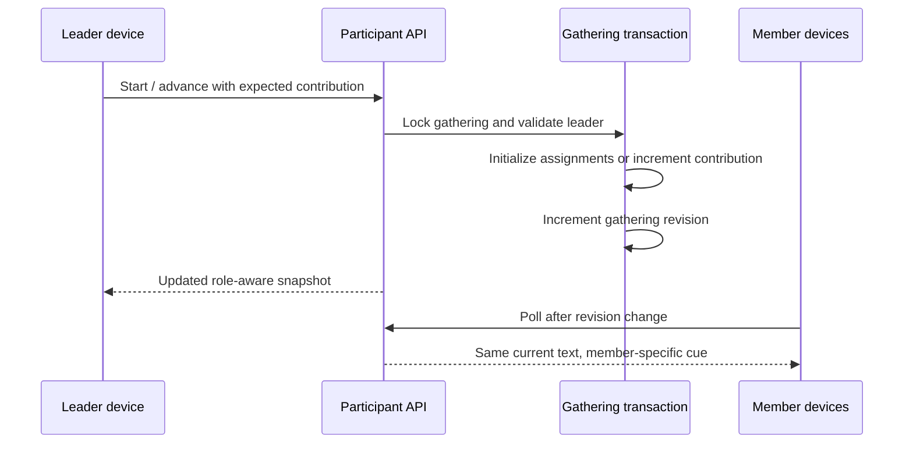

# Add the first production Short Study journey

## Goal Capsule

Ship a production-ready, database-configured Short Study module that a room leader advances one contribution at a time while every participant sees the current content. Seed a real 60–90 minute journey containing the Hebrews 4:14–16 BSB instance, and replace the former “coordinator” term with “leader” across the system.

Authority order: this plan’s session-settled product decisions; `CONTEXT.md`; ADRs 0002 and 0003; existing journey runtime patterns. Stop only for a conflict that makes a settled decision unsafe or impossible. The LFG pipeline owns implementation, review, browser acceptance, PR delivery, green CI, and merge.

---

## Product Contract

### Summary

The Short Study is reusable application behavior. Its content lives in a `JourneyModule` database record, while synchronized position and reader assignments live in the room’s `RoomJourney.moduleState`. The leader drives the activity; all room devices update from the shared snapshot.

### Actors

- **Leader:** starts and advances the journey, invites the named reader, can randomly reassign the current reader, and leads the discussion question.
- **Assigned reader:** sees the same current content as everyone else with a prominent reading cue.
- **Room member:** follows the current content and sees who is reading without receiving controls.
- **Organizer:** sees the leader marked in admin and can seed/reset the active gathering.

### Requirements

- **R1 — Configurable study:** `short-study` configuration stores a passage reference, full Scripture text, translation label, ordered reflection items, and one discussion question. Title and recommended duration remain standard module fields. _(session-settled)_
- **R2 — Standard translation:** Seeded Scripture uses the Berean Standard Bible. The seed stores the complete Hebrews 4:14–16 text and identifies it as BSB. BSB is the journey-wide standard for displayed Scripture. _(user-directed; official public-domain terms verified 2026-07-26)_
- **R3 — One contribution at a time:** The sequence is passage, each reflection, then discussion. Every device shows only the current contribution; leader advancement updates the room snapshot. Advancing the discussion completes this module and enters the next module or closing screen. _(session-settled)_
- **R4 — Reader visibility:** Passage and reflection contributions name an assigned reader. The reader receives a highlighted cue; other members see both the text and reader name. The leader sees the same content plus guidance to invite the reader. The discussion belongs to the leader. _(session-settled)_
- **R5 — Fair assignment:** On module entry, shuffle eligible non-leaders and assign each no more than once before starting another shuffled round. Exclude the leader. With no eligible member, the leader reads without a formal reader assignment. Persist the complete assignment set once. _(session-settled)_
- **R6 — Reassignment:** The leader can randomly reassign only the current reading contribution. Exclude the leader and current reader. Preserve future assignments; allow late arrivals to become candidates. If no alternative exists, return a clear non-destructive result. _(session-settled)_
- **R7 — Takeover:** Leader takeover preserves completed contributions and current position. Remove the new leader from all unfinished reading assignments, fairly refill those assignments from the current eligible pool, and make the former leader eligible. _(session-settled)_
- **R8 — Durable synchronization:** Refresh, reconnect, duplicate advance, and concurrent requests preserve a single contribution position and stable assignments. Participant snapshots never expose unrelated rooms. _(ADR 0003; session-settled)_
- **R9 — Recommended timing:** The overall module countdown starts once on module entry and does not reset per contribution. The leader may advance at any time. _(existing journey contract)_
- **R10 — Leader terminology:** Replace the former room-role term with Leader/leader in visible copy, TypeScript vocabulary, routes, service APIs, Prisma fields/relations, tests, documentation, and error codes. Preserve existing data and deployment compatibility; the legacy physical PostgreSQL column name may remain temporarily behind Prisma `@map` until a later expand-contract cleanup can remove it safely. _(user-directed; safety-constrained implementation detail)_
- **R11 — Production seed:** `pnpm db:seed` idempotently creates/updates the production journey and Short Study instance, attaches it to the active gathering, and keeps the existing room seed. The seeded journey totals 60–90 recommended minutes, even while only the first real module behavior is present. Invalid or missing seed configuration must not silently become live. _(user-directed; existing journey validity contract)_

### Acceptance Examples

- **AE1:** When Ana is leader and Ben and Chi are members, starting the journey generates stable passage/reflection readers drawn from Ben and Chi, never Ana.
- **AE2:** When Ben is current reader, Ben sees “You’re reading”; Ana sees leader controls and “Ask Ben to read”; Chi sees the content and “Ben is reading.”
- **AE3:** Two advance requests with the same expected state move the contribution exactly once.
- **AE4:** Reassigning Ben chooses another eligible non-leader when one exists and changes no future assignment.
- **AE5:** If Chi takes over as leader mid-study, the current index is unchanged, unfinished assignments no longer name Chi, and Ana becomes eligible.
- **AE6:** A refresh returns the same contribution, reader, module start time, and remaining recommendation.
- **AE7:** A fresh production database seeded with `pnpm db:seed` exposes an available journey containing the Hebrews Short Study and assigns it to the active gathering.
- **AE8:** Admin and participant screens label the role “Leader,” and the database stores `leaderId` without losing existing leader identity during migration.

### Scope Boundaries

In scope: one reusable Short Study behavior, one production instance, runtime actions, synchronized UI, seed, global terminology migration, tests, and browser acceptance.

Out of scope: a front-end journey builder, ministry or prayer-request modules, manual reader selection, per-room content editing, per-contribution timers, and translation selection in the UI.

### Sources

- `CONTEXT.md`
- `docs/adr/0002-room-handoff-state.md`
- `docs/adr/0003-room-journey-runtime.md`
- `src/lib/gathering/service.ts`
- `src/lib/journey/registry.ts`
- `src/components/journey/module-shell.tsx`
- Berean Bible official terms: `https://berean.bible/terms.htm`
- Berean Bible official downloads: `https://berean.bible/downloads.htm`

---

## Planning Contract

### Key Technical Decisions

- **KTD1 — Typed behavior state:** Extend the journey behavior registry so each behavior validates configuration and its runtime state. Short Study state is `{ contributionIndex, assignments }`; assignments map contribution IDs to participant IDs or `null`.
- **KTD2 — Mutation tokens:** Every Short Study mutation sends both the contribution-specific expected state (`moduleId:index`) and gathering revision. Takeover sends the expected gathering revision. The serialized transaction compares both before mutation and increments revision on success, so only one action from a rendered snapshot can commit.
- **KTD3 — Initialize at entry:** Starting or entering the module creates assignments inside the same serialized transaction that selects the module. Snapshot reads never mutate state; absent or invalid Short Study state makes the activity unavailable and is covered by operator diagnostics.
- **KTD4 — Dedicated reassign action:** Add a leader-only journey reassign endpoint rather than overloading progression. It uses the same room authorization, serialized transaction, expected contribution token, expected revision, and gathering revision update. A stale reassignment returns the current snapshot without changing either contribution.
- **KTD5 — Deployment-safe vocabulary migration:** Rename the Prisma field/relation to `leaderId`/`RoomLeader` while mapping the field to the existing physical column. This removes the old term from application and product vocabulary without breaking the still-serving release during Railway pre-deploy. A later expand-contract release may rename the physical column after both application versions are compatible.
- **KTD6 — Idempotent deterministic seed:** Use stable journey/module UUIDs and upserts. Seed a single Short Study of 60 minutes so the current journey passes the established 60–90 minute availability constraint without inventing placeholder modules.
- **KTD7 — Role-aware presentation, common content:** Keep the validated module configuration and current contribution in the participant snapshot. Add viewer-specific presentation fields (`reader`, `viewerRole`) derived server-side; do not send future assignment maps to clients.

### High-Level Technical Design

The contribution list is derived deterministically from configuration: `passage`, `reflection-0..n`, `discussion`. Only passage/reflections consume randomized assignments. The discussion uses the current leader.

### System-Wide Impact

- The role rename changes database schema, generated client vocabulary, API route naming, public snapshots, UI labels, tests, and domain documents.
- Existing leader data is retained without a destructive physical-column change.
- The seed changes live configuration intentionally: deployments that run `pnpm db:seed` receive the new journey on the active gathering.
- Module state contains participant IDs; participant deletion/reset already deletes the room runtime, while takeover and late arrival behavior is reconciled in transactional actions.

### Risks and Mitigations

- **Concurrent controls:** serialize on the active gathering row and use expected contribution tokens.
- **Stale assignments after takeover:** reconcile every unfinished assignment in the takeover transaction.
- **Seed drift:** stable IDs plus upsert update the canonical content and attachment.
- **Invalid JSON:** registry validators reject malformed configuration/state; UI reports unavailable instead of crashing.
- **Large terminology diff:** use a complete repository search and migration-focused tests; do not edit generated migration history.

---

## Implementation Units

### U1. Rename the room role to Leader

**Requirements:** R10

**Files:** `prisma/schema.prisma`, `src/lib/gathering/**`, `src/app/api/participant/**`, `src/components/**`, `CONTEXT.md`, `docs/adr/**`, active plans and tests.

**Approach:** Rename the Prisma field/relation with a compatibility mapping, then update generated types and all application vocabulary/copy. Rename the takeover route to `/api/participant/leader`; remove the former route so no former-role vocabulary remains in the current application.

**Test scenarios:** Existing leader is visible before reveal; first room member becomes leader; takeover updates all clients; migration SQL uses rename rather than drop.

**Verification:** a repository search returns the former term only in immutable migration history and the temporary Prisma physical-column mapping.

### U2. Define and validate Short Study configuration/state

**Requirements:** R1, R2, R3, R5, R8

**Files:** `src/lib/journey/types.ts`, `src/lib/journey/registry.ts`, new Short Study domain helper/tests, `src/lib/journey/service.test.ts`.

**Approach:** Add the production behavior key, strict bounded validation, contribution derivation, fair shuffled assignment helper with injectable randomness for tests, and runtime state parser.

**Test scenarios:** valid config; missing/empty/oversized fields; contribution order; leader excluded; no repeat before round exhaustion; solo leader fallback; invalid stored state rejected.

**Verification:** focused Vitest suite for registry and Short Study helper.

### U3. Add synchronized Short Study runtime actions

**Requirements:** R3–R9

**Dependencies:** U1, U2

**Files:** `src/lib/gathering/service.ts`, `src/lib/gathering/service.integration.test.ts`, `src/app/api/participant/journey/advance/**`, new `src/app/api/participant/journey/reassign/**`.

**Approach:** Initialize state when the module starts, expose role-aware current contribution data, advance internally until discussion completion, add current-reader reassign, and reconcile unfinished assignments during takeover. Keep all writes under the gathering lock and increment revision. Takeover remains available only after reveal to a session-authenticated participant assigned to that room; derive the room exclusively from the session, retain same-origin protection, and never accept client room targeting.

**Test scenarios:** start initialization; role-specific snapshots; duplicate advance; concurrent advance versus reassign; each contribution; module completion; persistence after refresh; reassignment alternatives/no alternatives; late-arrival candidate; takeover reconciliation; concurrent stale takeover; takeover denied for missing session, pre-reveal, unassigned, and cross-room attempts.

**Verification:** integration suite against PostgreSQL plus route tests.

### U4. Build the step-focused responsive UI

**Requirements:** R3, R4, R6, R9, R10

**Dependencies:** U3

**Files:** `src/components/journey/module-shell.tsx`, `src/components/journey/module-renderer.tsx`, `src/components/participant/participant-experience.tsx`, participant UI tests.

**Approach:** Render one current contribution, shared content, distinct reader/leader/member cues, leader-only advance and random-reassign controls, and the existing module-level countdown. Use the established shell and live snapshot polling. The contribution type/progress and current text are primary; the reader cue sits beside the text, leader guidance follows, and actions come last. The timer remains secondary. For a solo leader, show “Please read this aloud,” omit the reader-name treatment, hide reassignment, and retain advance.

Both mutation actions keep content visible while pending and disable mutation controls. Success applies the returned snapshot; stale responses refresh the snapshot; other failures remain inline and retryable. With no reassign candidate, keep the reader and show “No other reader is available.”

The current contribution has a programmatic heading. Step and reader changes use a restrained live announcement; the reader cue is textual rather than color-only; controls have descriptive accessible names; countdown ticks do not create continuous assistive-technology announcements.

**Test scenarios:** leader passage view; selected reader highlight; non-reader view; discussion led by leader; solo-leader view; advance and reassign pending/error/stale/no-alternative states; controls hidden from members; accessible live update and labels; mobile layout.

**Verification:** jsdom component tests and live browser acceptance for leader, reader, and non-reader sessions.

### U5. Seed and document the production journey

**Requirements:** R2, R11

**Dependencies:** U2

**Files:** `prisma/seed.ts`, new seed helper/tests as appropriate, `railway.toml`, `.env.example` only if needed, `CONTEXT.md`.

**Approach:** Upsert stable journey and module IDs, exact BSB text, three approved reflections, approved discussion question, and 3,600-second recommendation; attach it to `ACTIVE_GATHERING_ID` while retaining room seeding. Railway pre-deploy runs migration then the idempotent seed. The seed is atomic. On an already-revealed gathering, it may add the missing canonical journey and gathering/room runtimes only when no different journey is active; it never rewrites a running different journey or resets progress.

**Test scenarios:** empty database; repeat seed; existing rooms; already-revealed gathering without a journey receives gathering-state runtimes; a running different journey is preserved and reported; changed canonical content is not rewritten while its journey is running; organizer snapshot reports journey available.

**Verification:** `pnpm db:seed`, `pnpm db:check`, a production-shaped Railway command check, and database query confirming gathering, journey, module, content, and duration.

---

## Verification Contract

- Focused unit/component/route tests during development.
- PostgreSQL integration tests for runtime mutation and seed behavior.
- `pnpm prisma generate` after schema vocabulary changes.
- `pnpm db:check` after migration and seed changes.
- `pnpm verify` before review and again after review fixes.
- Browser acceptance on the real participant and admin routes:
  - Leader starts the journey and advances each contribution.
  - Assigned reader and non-reader receive the synchronized text with distinct cues.
  - Reassign updates every session without moving the contribution.
  - Takeover preserves position and removes the new leader from unfinished readings.
  - Completion reaches the existing closing screen.
  - Admin marks the leader with the star immediately.
  - Check desktop and mobile viewports.
- PR CI must be green before merge.

---

## Definition of Done

- All R1–R11 acceptance behavior is implemented and covered proportionately by automated tests.
- The production seed idempotently installs and activates the exact Hebrews Short Study.
- Existing leader identity survives the Prisma vocabulary migration.
- No current product, code, API, or documentation vocabulary uses the former role term; historical applied migrations and the temporary Prisma physical-column mapping may retain it only for deployment compatibility.
- `pnpm db:check` and `pnpm verify` pass.
- Browser acceptance passes for leader, reader, non-reader, takeover, reassignment, completion, admin, and mobile.
- Review findings are resolved or explicitly documented as residual risk.
- Dead-end/experimental code is removed.
- The PR is green and merged to `main`.
