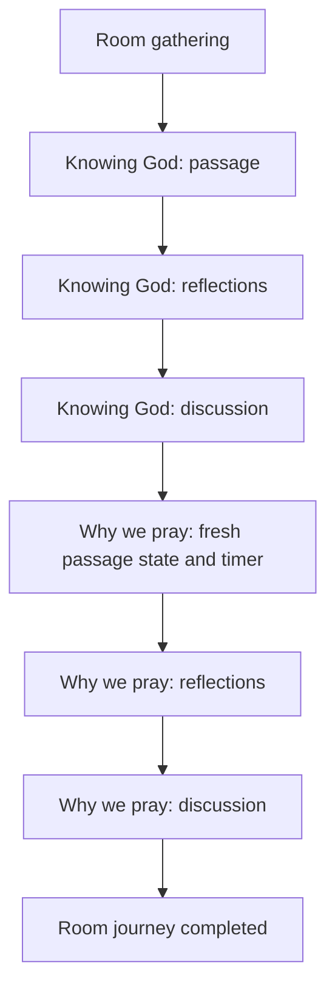

# Devotional Short Study - Plan

## Goal Capsule

Add a 10-minute **Knowing God** Short Study before the existing **Why we pray** Short Study, using Urim's Ephesians 1 devotional as the content authority and the existing synchronized Leader-led interaction as the behavior authority.

Authority order: the session-settled Product Contract below; `CONTEXT.md`; `docs/adr/0003-room-journey-runtime.md`; the existing room-journey and Short Study plans; current repository behavior.

The ministry-prayer module and the rest of the 60–90-minute event journey are surrounding work, not active scope.
Implementation may proceed without another product decision.
Stop only if the source material cannot be represented faithfully within the existing Short Study sequence.

---

## Product Contract

### Summary

The canonical journey will begin with two ordered, 10-minute instances of the reusable Short Study behavior.
**Knowing God** will lead rooms through Ephesians 1:15–23, three concise group reflections adapted from Urim's devotional, and a discussion question before **Why we pray** begins with fresh state and a fresh timer.

### Problem Frame

Urim's devotional currently exists as speaker notes rather than a synchronized room activity.
The canonical journey starts with **Why we pray**, whose stored 60-minute recommendation was a temporary workaround for the journey's 60-minute minimum rather than the agreed activity duration.
Participants need the devotional first so their prayer begins from a fresh awareness of Christ and confident hope.

### Key Decisions

- **Reuse the Short Study behavior for both activities.** (session-settled: user-directed — chosen over a separate devotional behavior: both activities use the same passage, reflections, and discussion sequence.) Governs R1, R5, R6.
- **Use Ephesians 1:15–23 as the single passage.** (session-settled: user-directed — chosen over both Ephesians readings and Ephesians 1:1–14 alone: Paul's prayer leads naturally into Why we pray.) Governs R2.
- **Adapt Urim's notes into shared group language.** (session-settled: user-directed — chosen over preserving first-person wording or mixing quotations with transitions: the activity belongs to every room rather than to one speaker.) Governs R3.
- **Follow Urim's actual emphasis.** (session-settled: user-directed — chosen over equal treatments of hope, inheritance, and power: the source develops knowing Christ, enlightened hearts, and confident hope.) Governs R3.
- **Close by asking how to pray like Paul.** (session-settled: user-directed — chosen over a challenge without discussion: the existing Short Study sequence ends with one room question.) Governs R4.
- **Place Knowing God first and recommend 10 minutes for each study.** (session-settled: user-directed — chosen over a longer devotional, an undisplayed recommendation, or starting with Why we pray: both opening activities should be concise and ordered.) Governs R1, R7.

<!-- ce-section: work-relationships -->

### How This Work Fits Together

This plan owns the devotional instance and the corrected opening-study durations.
The broader journey remains the current understanding rather than a committed roadmap:

- **Ministry prayer**
  - **Depends on** the same ordered journey runtime.
  - **Still to decide:** allocation, content progression, roles, and completion behavior.
- **Member prayer requests and devotional follow-through**
  - **Can proceed independently of** this content-only reuse of Short Study.
  - **Still to decide:** subgroup formation, request visibility, and reflection capture.
- **Full Day of Prayer composition**
  - **Builds on** these first two activities.
  - **Retains** the 60–90-minute gathering target without using false per-module durations to reach it.

### Actors

- A1. **Leader:** Starts the journey, invites assigned readers, advances each contribution and module, can reassign the current reader, and leads each discussion.
- A2. **Assigned reader:** Reads the current passage or reflection with the existing highlighted cue.
- A3. **Room member:** Follows the same current content without Leader controls or the assigned-reader highlight.

### Requirements

**Journey composition**

- R1. The canonical journey contains **Knowing God** first and **Why we pray** second as distinct instances of the existing `short-study` behavior.
- R2. Knowing God displays the complete Berean Standard Bible text of Ephesians 1:15–23 as its single passage contribution.
- R3. Knowing God presents these three approved reflections adapted into shared group language:
  1. **Knowing Christ:** Paul prays that God would give us wisdom and revelation so that we may know Him—not merely know facts about Him, but know Christ personally and be transformed by Him.
  2. **Enlightened hearts:** When God enlightens the eyes of our hearts, we begin to grasp the hope of His calling, the riches of His inheritance, and the surpassing greatness of His power toward those who believe.
  3. **Confident hope:** Christian hope is confident expectation that God will fulfill every promise in Christ. We will receive our inheritance, be united with the Lord, and one day be free from sin, pain, sickness, and struggle.
- R4. Knowing God ends with the exact discussion question, "What would it look like for us to pray like Paul today?"
- R5. Both instances retain the existing passage-to-reflections-to-discussion sequence and role-specific presentation.
- R6. Completing Knowing God enters Why we pray with a fresh contribution position, reader assignments, start time, and 10-minute countdown.
- R7. Both module instances recommend 600 seconds, and reaching zero never advances either activity.

**Journey availability**

- R8. A structurally valid journey is available when its total recommendation is between 20 and 90 minutes, while all per-module, ordering, behavior, and configuration validation remain enforced.
- R9. The 60–90-minute target remains the success criterion for the eventual complete Day of Prayer journey rather than an availability requirement for incremental module delivery.

**Seed behavior**

- R10. The existing production seed directly reconciles the canonical journey to the exact two-instance shape idempotently, with a new stable identity for Knowing God and the existing identity preserved for Why we pray.

**Continuity and privacy**

- R15. Refresh, reconnect, late arrival, reader reassignment, concurrent advance, and Leader takeover continue to preserve the current module and contribution under the existing runtime contract.
- R16. Organizer projections remain aggregate-only and do not expose Short Study content, reader assignments, or participant prayer requests.

### Key Flows

- F1. Fresh two-study journey
  - **Trigger:** A Leader starts an available canonical journey.
  - **Actors:** A1, A2, A3
  - **Steps:** Knowing God initializes, the room advances through its passage, reflections, and discussion, then Why we pray initializes independently and advances through its own contributions.
  - **Outcome:** The room completes both activities in order with separate reader assignments and countdowns.
  - **Covers:** R1–R7, R15

### Acceptance Examples

- AE1. **Covers R1–R7.** A fresh seed creates Knowing God at position 0 and Why we pray at position 1, both at 600 seconds, and repeating the seed produces no duplicates.
- AE2. **Covers R2–R5.** During Knowing God, every device sees the same Ephesians passage, three adapted reflections, and the fixed discussion question while only the selected reader receives the active cue.
- AE3. **Covers R6, R15.** Advancing Knowing God's discussion enters Why we pray at contribution index 0 with a new start time and assignments; refreshing either activity returns the same module-local state.
- AE4. **Covers R8, R9.** The canonical 20-minute partial journey is available, a 19-minute journey is unavailable, and a journey above 90 minutes remains unavailable.
- AE7. **Covers R15.** Leader takeover in Knowing God or Why we pray preserves the active contribution and removes the new Leader from unfinished reader assignments.
- AE8. **Covers R16.** The organizer sees gathering, active, and completed room progress without seeing either study's content or assignments.

### Success Criteria

- Participants enter Why we pray after becoming freshly aware of Christ and carrying confident hope into prayer.
- The two opening activities can be completed in approximately 20 minutes without automatic advancement.
- A cold planner or implementer can trace every content, ordering, duration, and persistence decision without reopening product scope.

### Scope Boundaries

#### Deferred to Follow-Up Work

- Ministry-prayer, member-request, closing, and other journey modules.
- Completion of the full 60–90-minute event composition.
- A front-end journey builder or content editor.

#### Outside This Change

- Ephesians 1:1–14 and Urim's extended adoption material.
- A second Scripture contribution within one Short Study instance.
- New module behavior, routes, schema, controls, or organizer content views.
- Direct mutation of a room that has already started an activity.

### Dependencies and Assumptions

- The Berean Standard Bible remains the journey-wide displayed-Scripture standard.
- Urim's devotional is the content authority, with the session-approved adaptation choices taking precedence over its speaker-note format.
- Product Contract preservation: created from the confirmed brainstorm dialogue; no scope decision was changed during planning.

### Sources and Research

- `CONTEXT.md`
- `docs/adr/0003-room-journey-runtime.md`
- `docs/plans/2026-07-26-001-feat-room-journey-framework-plan.md`
- `docs/plans/2026-07-26-002-feat-short-study-journey-module-plan.md`
- `docs/solutions/conventions/seed-mutable-room-configuration-once.md`
- `docs/solutions/developer-experience/avoid-next-dev-build-cache-collision.md`
- `DoP Devo - Urim.docx` (user-supplied source reviewed on 2026-07-27; the approved adapted text is pinned in R3)
- `src/lib/journey/service.ts`
- `src/lib/journey/short-study.ts`
- `src/lib/journey/seed.ts`
- `src/lib/gathering/service.ts`
- `https://berean.bible/downloads.htm`
- `https://berean.bible/terms.htm`

---

## Planning Contract

### Key Technical Decisions

- KTD1. **Reuse one registered behavior for two stable module identities.** Seed two `JourneyModule` records with `behaviorKey: short-study`; the generic registry, renderer, progression, reader, and takeover paths remain unchanged. Governs R1, R5, R6, R10.
- KTD2. **Allow the currently deliverable partial journey without removing duration bounds.** Set runtime availability to 20–90 minutes while retaining all other validation; R9 remains the eventual event-composition target. Governs R8, R9.
- KTD3. **Preserve the existing Why we pray identity.** Move the existing record to its new position before inserting Knowing God so foreign keys and expected-state tokens remain stable without violating the journey-position uniqueness constraint. Governs R10.
- KTD4. **Reconcile through the existing production seed.** Update the canonical records directly during the normal transactional seed; no separate migration or upgrade command is required. Governs R10.
- KTD5. **Protect behavior with integration-first evidence.** Characterize the one-study seed before changing it, then prove idempotent two-instance persistence and progression against PostgreSQL. Governs R6, R10, R15.

### High-Level Technical Design

The participant flow reuses the existing contribution and module state machine:

### System-Wide Impact

- Runtime validation will allow the current 20-minute composition while retaining lower and upper duration bounds; the organizer's availability indicator therefore reflects the currently deliverable journey rather than full-event completeness.
- The existing production seed reconciles the canonical journey to the approved two-study shape.
- Participant UI receives different database content and order without new UI or API contracts.
- The canonical partial journey will total 20 minutes until later modules are delivered.

### Risks and Mitigations

- **Unique-position collision:** Move the existing stable module before inserting position 0 within one transaction.
- **Content drift from Urim's source:** Pin the approved passage, themes, question, and BSB translation in seed tests.
- **Partial journey mistaken for a complete event:** Document R9 and keep the 90-minute maximum while later modules remain deferred.
- **Misleading local browser failures:** Stop the development server before `pnpm verify`, then restart it for browser acceptance.

### Sequencing

U1 enables the 20-minute composition.
U2 installs and reconciles the canonical content.
Browser acceptance follows both units.

---

## Implementation Units

### U1. Make partial journeys available

**Goal:** Allow the agreed 20-minute canonical journey without weakening module integrity or the duration bounds.

**Requirements:** R8, R9

**Dependencies:** None

**Files:**

- `src/lib/journey/service.ts`
- `src/lib/journey/service.test.ts`
- `docs/adr/0004-partial-journey-availability.md`

**Approach:** Implement KTD2, preserve every existing structural validation, and document why the temporary 20-minute availability floor does not redefine the eventual full-event duration.

**Execution note:** Start with failing boundary tests for the 20-minute valid case and the retained 90-minute maximum.

**Patterns to follow:** `docs/adr/0003-room-journey-runtime.md`; table-driven journey validation in `src/lib/journey/service.test.ts`.

**Test scenarios:**

- Covers AE4. Two valid 600-second Short Study instances at contiguous positions produce an available journey.
- A structurally valid journey totaling 19 minutes remains unavailable.
- A structurally valid journey totaling exactly 90 minutes remains available.
- A structurally valid journey above 90 minutes remains unavailable.
- Non-positive duration, non-contiguous positions, unknown behavior, and invalid configuration remain unavailable.

**Verification:** Unit tests demonstrate the new lower-bound policy without changing other validation outcomes, and the ADR records the superseded duration interpretation.

### U2. Seed the two opening studies

**Goal:** Define the approved Knowing God content and the corrected Why we pray instance as an idempotent canonical journey.

**Requirements:** R1–R7, R10, R15, R16

**Dependencies:** U1

**Files:**

- `src/lib/journey/seed.ts`
- `src/lib/journey/short-study.test.ts`
- `src/lib/gathering/service.integration.test.ts`
- `src/components/participant/participant-journey-ui.test.tsx`

**Approach:**

1. Add a stable Knowing God module identity and configuration from R2–R4.
2. Retain the existing Why we pray identity, move it to position 1, and set both recommendations to 600 seconds per KTD3.
3. Reconcile the canonical journey directly through the existing transactional production seed.
4. Extend the PostgreSQL integration flow through both independent Short Study states before completion.
5. Keep organizer and participant rendering generic; update fixtures only where the canonical values are asserted.

**Execution note:** Capture the existing one-study seed assertions failing against the new contract, then implement the smallest data/configuration change that makes the two-study flow pass.

**Patterns to follow:** `SHORT_STUDY_CONFIGURATION` and `seedProductionJourney` in `src/lib/journey/seed.ts`; role and transition assertions in `src/lib/gathering/service.integration.test.ts`.

**Test scenarios:**

- Covers AE1. A fresh seed creates exactly the two stable modules in order at 600 seconds and remains idempotent on repeat.
- Covers AE2. Knowing God derives one passage, three reflections, and the fixed discussion question with existing role visibility.
- Covers AE3. Finishing Knowing God initializes Why we pray with contribution index 0, new assignments, and a later start timestamp.
- Covers AE7. Takeover during each instance preserves that instance's current contribution and reconciles unfinished readers.
- Covers AE8. Organizer snapshots expose progress without configuration or assignments.
- A different active journey remains attached and unchanged when the canonical seed runs.

**Verification:** Focused unit and PostgreSQL integration suites prove content, order, two-module progression, independent state, and unchanged audience boundaries.

## Verification Contract

- Run focused journey validation, Short Study, participant UI, and gathering integration suites for U1–U2.
- Run `pnpm db:check` against PostgreSQL because the production persistence path changes even though the Prisma schema does not.
- Stop any local development server before running `pnpm verify`.
- Run `pnpm verify` after all implementation units pass their focused suites.
- Restart the application with `PORT=7000 pnpm dev` only after verification completes.
- Browser-test the actual participant and Leader flows on desktop and at 390×844:
  - Knowing God starts first with a 10:00 recommendation.
  - Passage, reflections, reader cues, reassignment, and discussion progress one contribution at a time.
  - Why we pray starts next with a fresh 10:00 recommendation and fresh reader state.
  - Refresh and Leader takeover preserve each active module.
  - The room completes only after Why we pray.
- Browser-test `/admin` to confirm journey availability and generic room progress without content exposure.

---

## Definition of Done

- U1–U2 satisfy their cited requirements and test scenarios.
- The canonical seed contains Knowing God then Why we pray, both at 600 seconds, with stable identities and exact approved content.
- The 20-minute partial journey is available without relaxing structural validation or the 20–90-minute bounds.
- Focused tests, PostgreSQL integration tests, `pnpm db:check`, and `pnpm verify` pass.
- Desktop and 390×844 browser acceptance passes on the actual participant, Leader, and organizer routes.
- The diff contains no abandoned experiments, temporary content, generated QA artifacts, secrets, or unrelated changes.
- The change ships through a reviewed pull request; LFG stops at CI-decided and does not merge automatically.
