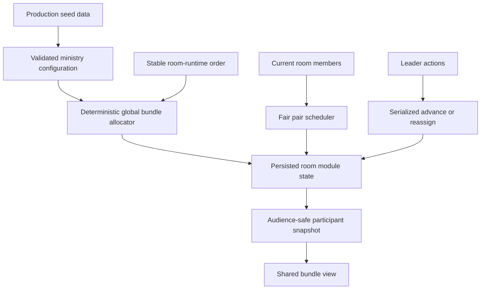
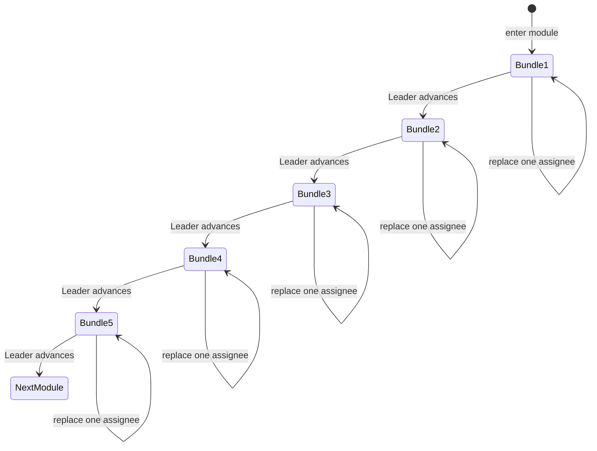

# Ministry Prayer Module - Plan

## Goal Capsule

- **Objective:** Add the 40-minute ministry prayer activity after Short Study so every room receives five balanced prayer bundles and shares the praying through fair two-person assignments.
- **Product authority:** This plan extends `docs/plans/2026-07-26-001-feat-room-journey-framework-plan.md` and follows the role-aware synchronized behavior established by `docs/plans/2026-07-26-002-feat-short-study-journey-module-plan.md`.
- **Open blockers:** None.
- **Execution profile:** Standard behavior change across module validation, deterministic room allocation, persistent runtime state, participant presentation, production seed data, and deployment-safe correction of the Short Study duration.
- **Stop conditions:** Stop if implementation requires an organizer content editor, staff-person prayer requests, automatic timer advancement, changes to personal prayer-request privacy, or rewritten ministry wording.
- **Tail ownership:** LFG owns implementation, review, browser acceptance, PR creation, and CI follow-through.

---

## Product Contract

### Summary

Add a synchronized ministry prayer module where each room prays through five varied bundles over 40 minutes.
Every device shows the same current bundle and the two fairly assigned people, while the Leader controls advancement and individual reassignment.

### Problem Frame

The July ministry report contains substantially different amounts of material for different ministries.
Assigning whole ministries would give rooms unequal workloads, while displaying the complete report would make the activity scroll-heavy and turn phones into room-management tools.
The gathering instead needs collectively broad coverage, manageable room-sized portions, and shared participation that survives refresh, absence, and Leader takeover.

### Key Decisions

- **Balance prayer workload through bundles.** (session-settled: user-directed — chosen over keeping every ministry intact: large ministries contain too many requests for one room.) A bundle contains related wording from one named ministry unit, and large ministries may span rooms. Governs R1-R3.
- **Allocate deterministically across occupied rooms.** (session-settled: user-directed — chosen over random allocation or Leader selection: complete coverage and recovery should not depend on entry order or manual coordination.) Governs R4-R7.
- **Give every room exactly five bundles.** (session-settled: user-directed — chosen over variable counts or extra bundles for complete coverage: the 40-minute activity boundary matters more than absolute coverage when too few rooms are occupied.) Governs R4-R7, R15.
- **Assign two people from the whole room.** (session-settled: user-directed — chosen over excluding the Leader or leaving prayer initiation open: the Leader should participate in the same fair rotation as everyone else.) Everyone sees both names and the pair divides the prayer naturally. Governs R9-R12.
- **Preserve July wording exactly as seed data.** (session-settled: user-directed — chosen over editorial rewriting or a PDF-import feature: the reusable behavior must remain separate from the event content.) Governs R1-R3, R17-R19.
- **Use synchronized overall and per-bundle countdowns.** (session-settled: user-directed — chosen over static guidance or an overall countdown alone: each bundle needs a fresh share of the configured module time.) Both timers are advisory and never advance the room. Governs R13-R16.

### Actors

- A1. **Participant:** Sees the current bundle, assigned pair, progress, and synchronized timers and joins the room in prayer.
- A2. **Assigned participant:** Is one of two visible people invited to pray for the current bundle.
- A3. **Leader:** Invites the assigned pair, replaces one unavailable person, and advances the room.
- A4. **Journey operator:** Deploys the canonical journey and exact July content through the production seed.

### Requirements

**Content and bundle shape**

- R1. The seeded content uses only the ministry prayer and praise sections from pages 4-12 of the July 2026 report, covering National Office through FamilyLife and excluding staff-person sections.
- R2. Seeded ministry headings, subheadings, praise points, and prayer requests preserve the PDF wording exactly, including spelling and punctuation.
- R3. Each bundle contains a coherent subset from one named ministry unit; large units may produce several bundles, and one bundle never mixes ministries.

**Collective allocation**

- R4. Each occupied room receives exactly five bundles.
- R5. Allocation uses a stable room order, covers each unique bundle once before duplicating any bundle, and remains stable regardless of which room reaches the module first.
- R6. Duplicate slots are spread across rooms and maximize ministry variety within each room, avoiding the same bundle twice in one room.
- R7. When five slots per occupied room cannot cover every unique bundle, allocation keeps the five-bundle limit and leaves remaining bundles uncovered.
- R8. A room's allocation persists when the module starts and does not reshuffle on refresh, reconnect, late arrival, concurrent requests, or Leader takeover.

**Prayer assignments and progression**

- R9. Each bundle has two fairly rotated assignees drawn from all room participants, including the Leader.
- R10. Assignment uses each participant before repeating where possible and avoids repeating the same pair where possible.
- R11. Every participant sees the same current bundle and both assigned names; the Leader additionally sees guidance and controls.
- R12. The Leader can replace one unavailable assignee while preserving the other person, the current bundle, and every future assignment.
- R13. The Leader advances one bundle at a time; stale or duplicate actions move the room at most once.

**Timing and completion**

- R14. The module has a synchronized 40-minute overall countdown that begins once on module entry.
- R15. Each bundle has a synchronized countdown derived as configured module duration divided by configured bundles per room; it restarts only when the Leader advances.
- R16. Reaching zero on either timer never advances or completes the activity, and advancing after the fifth bundle enters the next journey module or the existing completed state.

**Configuration, seed, and readiness**

- R17. Reusable module behavior contains no July ministry wording; the production seed stores the exact content and bundle grouping in database configuration.
- R18. The canonical production journey places the ministry prayer module after Short Study with a 2,400-second recommendation.
- R19. The canonical Short Study recommendation changes from 3,600 seconds to the agreed 600 seconds, including a targeted idempotent correction for the existing production row that is otherwise protected as running configuration.
- R20. The partially built canonical journey remains valid at its current 50-minute total while later modules remain deferred.

**Responsive experience**

- R21. The active bundle avoids a report-length scrolling screen, keeps Leader controls reachable, and works on desktop and a 390x844 mobile viewport.
- R22. Reload, polling updates, reassignment, Leader takeover, and module completion preserve one authoritative room state across all devices.

### Key Flows

- F1. Allocate the gathering
  - **Trigger:** The gathering launches with occupied rooms.
  - **Actors:** A4
  - **Steps:** Rooms receive stable positions in the active journey; the allocation rule maps the global bundle sequence into five slots per room without depending on later module-entry order.
  - **Outcome:** Unique bundle coverage is maximized before deterministic duplicates fill remaining slots.
  - **Covers:** R4-R8.

- F2. Start ministry prayer
  - **Trigger:** A Leader advances from Short Study into ministry prayer.
  - **Actors:** A1-A3
  - **Steps:** The room persists its five allocated bundles, pair assignments, first bundle start, and overall module start; all devices present the first bundle and pair.
  - **Outcome:** The room can begin praying without choosing content or roles.
  - **Covers:** R8-R11, R14-R15.

- F3. Pray and advance
  - **Trigger:** The assigned pair has prayed for the current bundle.
  - **Actors:** A1-A3
  - **Steps:** The Leader advances; the room moves once to the next bundle; the per-bundle countdown restarts while the overall countdown continues.
  - **Outcome:** Every device remains on the same bundle until all five are complete.
  - **Covers:** R11, R13-R16, R22.

- F4. Replace an unavailable person
  - **Trigger:** One named assignee is not available to pray.
  - **Actors:** A3
  - **Steps:** The Leader chooses that person for replacement; a fair eligible replacement is selected; the other assignee and all other bundle assignments remain unchanged.
  - **Outcome:** The room continues without reshuffling the activity.
  - **Covers:** R10-R12, R22.

### Acceptance Examples

- AE1. With six occupied rooms and about 25 unique bundles, every unique bundle is assigned before approximately five duplicate slots are added, and each room receives five bundles.
- AE2. With fewer than five occupied rooms and more unique bundles than available slots, every room still receives five bundles and some source bundles remain uncovered.
- AE3. A large ministry can contribute several coherent bundles assigned to different rooms, while no bundle contains wording from two named ministry units.
- AE4. In a five-person room, ten prayer slots rotate fairly across all five people, including the Leader, and avoid repeating the same pair where possible.
- AE5. Every device displays the current bundle and both assignee names; only the Leader receives advance and reassignment controls.
- AE6. Replacing one unavailable assignee changes only that slot in the current pair.
- AE7. Advancing early restarts the derived bundle countdown but leaves the 40-minute overall countdown anchored to module entry.
- AE8. When either countdown reaches zero, the room remains on the current bundle until the Leader advances.
- AE9. Refresh and Leader takeover preserve the same five bundles, current index, pair assignments, and both timer anchors.
- AE10. Replaying the same advance request changes the current bundle once.
- AE11. A solo room shows the one available participant once rather than duplicating their name; a two-person room assigns both people.
- AE12. Production seeding stores the exact July ministry wording, corrects Short Study to 600 seconds, adds ministry prayer at 2,400 seconds, and remains idempotent.

### Success Criteria

- Every occupied room can complete five ministry bundles in the configured 40-minute activity without using phones to select content or negotiate roles.
- Across ordinary six-to-eight-room gatherings, all unique July ministry bundles receive coverage before duplicates are introduced.
- Refresh, reassignment, concurrency, and Leader takeover never reshuffle completed or future work unexpectedly.

### Scope Boundaries

**In scope**

- One reusable ministry prayer behavior, exact July seed content, deterministic room allocation, fair pair assignments, individual reassignment, dual advisory countdowns, synchronized UI, tests, and browser acceptance.
- The prerequisite Short Study duration correction and canonical journey validity adjustment.

**Deferred to later**

- Reflections, participant-submitted prayer requests, closing modules, and future monthly ministry content.

**Out of scope**

- Staff-person requests from page 13 onward, rewriting or summarizing July wording, a PDF parser/importer, an organizer content editor, a journey builder, manual bundle selection, automatic advancement, backward navigation, and per-room content editing.

### Dependencies and Assumptions

- Existing room assignment, Leader takeover, gathering locking, audience-scoped snapshots, polling, and reset behavior remain authoritative.
- The stable `RoomJourney` creation order represents launch-time occupied-room order; a room occupied after launch appends without changing earlier allocations.
- A room with one participant receives one visible assignee; a room with two participants receives both people for every bundle.
- Journey configuration is not edited during a running gathering.
- Product Contract preservation: created from the confirmed brainstorm synthesis; no scope changes were introduced during planning.

### Sources

- `CONTEXT.md`
- `docs/adr/0003-room-journey-runtime.md`
- `docs/plans/2026-07-26-001-feat-room-journey-framework-plan.md`
- `docs/plans/2026-07-26-002-feat-short-study-journey-module-plan.md`
- `src/lib/journey/short-study.ts`
- `src/lib/journey/registry.ts`
- `src/lib/journey/seed.ts`
- `src/lib/gathering/service.ts`
- `src/components/journey/module-renderer.tsx`
- `src/components/journey/module-shell.tsx`
- July 2026 Making Disciples Everywhere report, pages 4-12 (delivery input; not committed)

---

## Planning Contract

### Key Technical Decisions

- KTD1. **Typed configuration and compact state:** Register a production ministry-prayer behavior whose database configuration owns bundle IDs, named ministry labels, exact display sections, bundle count per room, and module duration. Persist only allocated bundle IDs, current index, pair assignments, and the current bundle start timestamp in room state.
- KTD2. **Prefix-stable collective allocation:** Build one deterministic global slot sequence from configured bundles, exhaust unique bundles before duplicates, and slice five consecutive slots per stable room-runtime index. Adding a later room appends another slice without changing earlier rooms.
- KTD3. **Fair pair schedule:** Generate ten assignment slots in shuffled participant rounds, then pair adjacent slots while preferring distinct people and non-repeated pairs. Persist the schedule once; late arrivals affect only explicit reassignment.
- KTD4. **Two timer anchors:** Keep `moduleStartedAt` as the overall countdown anchor and store `bundleStartedAt` in module state. Derive the bundle duration from module recommendation divided by five so configuration remains the single timing authority.
- KTD5. **Behavior-dispatched progression:** Extend the existing serialized advance and expected-state protocol so ministry-prayer advances internal bundle state before transitioning to the next module.
- KTD6. **Targeted reassignment contract:** Extend the existing Leader-only reassign action with a current-assignee target for ministry prayer while retaining Short Study behavior and stale-state protection.
- KTD7. **Seed fixture separated from behavior:** Keep exact July wording in a dedicated seed-data fixture consumed by the production seeder; reusable validation, allocation, runtime, and UI code contain no report content.
- KTD8. **Atomic canonical repair:** Within the existing seed transaction, repair the stable Short Study row to 600 seconds and create the missing ministry module even for a running canonical journey. Preserve an existing ministry module while running, and allow only the exact duration correction plus missing-module creation as targeted exceptions to running-config preservation.
- KTD9. **Temporary 50-minute readiness floor:** Accept the canonical 600-second Short Study plus 2,400-second ministry module as a valid partial journey while the eventual 60-90-minute journey remains unfinished.

### High-Level Technical Design

### System-Wide Impact

- Participant snapshots gain a second role-aware production module presentation without exposing unrelated rooms or source configuration beyond the current bundle.
- Runtime progression, reassignment, takeover, reset, and polling extend their behavior dispatch while retaining one gathering revision and lock.
- Production seed behavior changes the canonical ordered journey and performs a narrowly scoped correction to a row currently protected from ordinary running-config rewrites.
- Journey validity temporarily recognizes the 50-minute partial journey until later modules extend it toward the established 60-90-minute target.

### Risks and Mitigations

- **Seed transcription drift:** Compare seeded headings and paragraphs against rendered PDF pages 4-12 and assert representative exact strings plus structural counts.
- **Allocation reshuffle:** Use prefix-stable room order, persist state on entry, and test late room creation without changes to earlier allocations.
- **Pair unfairness or impossible rooms:** Test one-, two-, odd-, and larger-member rooms with injectable randomness.
- **Dual-timer confusion:** Keep both labels explicit, derive the bundle interval from the module duration, and test early/late advancement and refresh.
- **Concurrent controls:** Reuse gathering serialization, expected state, and revision checks for both advance and targeted reassignment.
- **Unsafe production rewrite:** Restrict running-config exceptions to correcting the canonical Short Study ID from the expected obsolete duration and creating the absent stable ministry module; preserve every existing module configuration.

### Sequencing

1. Define and test configuration, allocation, assignment, and state helpers.
2. Integrate module entry, presentation, progression, targeted reassignment, persistence, and concurrency.
3. Add the responsive shared-bundle interface and dual countdowns.
4. Add exact seed data, canonical duration repair, journey attachment, and production-shaped seed checks.

---

## Implementation Units

### U1. Define ministry prayer configuration and state

- **Goal:** Create the reusable validated behavior, deterministic bundle allocation, fair pair scheduling, state parsing, and timer derivation.
- **Requirements:** R3-R10, R14-R15, R17; KTD1-KTD4.
- **Dependencies:** None.
- **Files:** `src/lib/journey/ministry-prayer.ts`, `src/lib/journey/ministry-prayer.test.ts`, `src/lib/journey/types.ts`, `src/lib/journey/registry.ts`, `src/lib/journey/service.test.ts`.
- **Approach:**
  1. Validate bounded bundle content, unique stable IDs, five bundles per room, and content structure without embedding event wording in behavior code.
  2. Generate a prefix-stable unique-first slot sequence with varied duplicates and deterministic room slices.
  3. Generate and parse five pair assignments across all participants, including graceful one- and two-person behavior.
  4. Derive per-bundle seconds from module duration and configured bundle count.
- **Patterns to follow:** `src/lib/journey/short-study.ts` configuration validation, injectable randomness, compact JSON state, and focused unit tests.
- **Execution note:** Begin with failing unit tests for allocation stability, fairness, and state validation.
- **Test scenarios:**
  - Covers AE1. Six room indexes receive five slots each, all unique bundles appear before a duplicate, and duplicate ministry concentration is avoided where possible.
  - Covers AE2. Four room indexes still receive exactly five slots even when unique bundles remain.
  - Covers AE3. Validation rejects mixed-ministry, duplicate-ID, empty, oversized, and malformed bundles.
  - Covers AE4. Five participants fill ten assignment slots fairly and include the Leader.
  - Covers AE11. One participant appears once per bundle; two participants form the only pair; odd group sizes remain balanced.
  - Adding a later room index does not change slices already produced for earlier indexes.
  - Invalid current indexes, assignment lengths, bundle IDs, or timestamps fail state parsing.
  - A 2,400-second module with five bundles derives a 480-second bundle recommendation.
- **Verification:** Focused unit tests prove configuration bounds, deterministic allocation, assignment fairness, state persistence shape, and timer derivation.

### U2. Integrate synchronized runtime and reassignment

- **Goal:** Make ministry prayer a room-synchronized active module with persistent allocation, pair assignments, forward progression, and single-person replacement.
- **Requirements:** R4-R16, R22; F1-F4; KTD2-KTD6.
- **Dependencies:** U1.
- **Files:** `src/lib/gathering/service.ts`, `src/lib/gathering/service.integration.test.ts`, `src/lib/gathering/types.ts`, `src/app/api/participant/journey/advance/route.ts`, `src/app/api/participant/journey/reassign/route.ts`, route tests adjacent to the changed handlers.
- **Approach:**
  1. Initialize room state on ministry-module entry from stable room-runtime order and current room membership.
  2. Present only the current bundle, pair, progress, derived bundle interval, and timer anchor.
  3. Advance internal state under the gathering lock, reset `bundleStartedAt`, and transition after the fifth bundle.
  4. Dispatch reassignment by active behavior; ministry prayer replaces only the selected current assignee and preserves every other field.
  5. Preserve ministry allocation and assignments unchanged during Leader takeover because Leaders remain eligible assignees.
- **Patterns to follow:** Short Study initialization, role-aware presentation, expected-state tokens, serialized transactions, stale no-ops, audience-scoped snapshots, and takeover reconciliation.
- **Execution note:** Add PostgreSQL integration coverage before changing the shared advance and reassignment paths.
- **Test scenarios:**
  - Covers AE5. Leader, assigned participant, and other member snapshots expose the same bundle and pair while controls remain Leader-only.
  - Covers AE6. Reassigning one selected current assignee preserves the partner, allocation, current index, future pairs, and timer anchors.
  - Covers AE7. Advancing resets only the bundle timestamp and keeps the module timestamp.
  - Covers AE9. Refresh and Leader takeover return identical allocation, index, pairs, and timestamps.
  - Covers AE10. Concurrent or duplicate advance requests move one bundle exactly once.
  - A stale reassignment is a no-op and returns a refreshable result.
  - An unassigned participant, non-Leader, pre-launch caller, or cross-room target cannot mutate state.
  - A late participant can become an explicit replacement candidate but does not reshuffle stored pairs.
  - Advancing from bundle five enters the next module or existing completed state.
- **Verification:** PostgreSQL integration and route tests prove authorization, persistence, state transitions, stale handling, concurrency, refresh, late arrival, and takeover.

### U3. Build the responsive shared-bundle experience

- **Goal:** Present one readable bundle, visible prayer pair, progress, two synchronized countdowns, and focused Leader controls on mobile and desktop.
- **Requirements:** R11-R16, R21-R22; F2-F4; KTD4-KTD6.
- **Dependencies:** U2.
- **Files:** `src/components/journey/module-renderer.tsx`, `src/components/journey/module-shell.tsx`, `src/components/journey/countdown.tsx`, `src/components/journey/countdown.component.test.tsx`, `src/components/participant/participant-journey-ui.test.tsx`.
- **Approach:**
  1. Render the ministry name, exact current bundle sections, both assignee names, and `n of 5` progress without exposing other bundles.
  2. Show the module countdown and a bundle countdown derived from the presented interval and persisted bundle timestamp.
  3. Give the Leader advance plus one replacement action per current assignee; keep controls hidden from other participants.
  4. Keep content visible during mutations, announce bundle/pair changes accessibly, and retain existing takeover affordance.
- **Patterns to follow:** Short Study audience cues, fixed Leader action area, shared content card, restrained live announcements, pending/error handling, and mobile safe-area spacing.
- **Test scenarios:**
  - Covers AE5. Every role sees both names and exact bundle content; only the Leader sees mutation controls.
  - Covers AE6. Selecting one replacement control updates only that displayed name.
  - Covers AE7. Advancing changes progress and resets the bundle countdown while the overall countdown continues.
  - Covers AE8. Zero on either timer shows elapsed guidance without triggering a mutation.
  - Covers AE11. Solo and two-person pair presentation is natural and non-duplicative.
  - Pending, stale, unavailable-replacement, and generic failure states retain the current bundle and remain retryable.
  - Long exact PDF paragraphs remain legible without exposing all five bundles on one screen.
  - Current bundle and assignment changes have programmatic headings and restrained live announcements.
- **Verification:** Component tests cover roles, controls, timers, errors, accessibility, and long content; browser acceptance covers Leader and member sessions at desktop and 390x844.

### U4. Seed exact July content and repair the canonical journey

- **Goal:** Store the July ministry content as production seed data, append the module, correct Short Study timing, and keep deployment behavior idempotent and safe.
- **Requirements:** R1-R3, R17-R20; AE12; KTD7-KTD9.
- **Dependencies:** U1.
- **Files:** `src/lib/journey/ministry-prayer-seed.ts`, `src/lib/journey/seed.ts`, `src/lib/journey/seed.test.ts`, `src/lib/journey/service.ts`, `src/lib/journey/service.test.ts`, `prisma/seed-production.ts`, `CONTEXT.md`.
- **Approach:**
  1. Transcribe pages 4-12 into coherent seed bundles without rewriting any heading or paragraph.
  2. Add a stable ministry module ID at position one with a 2,400-second recommendation.
  3. Correct the stable Short Study row from 3,600 to 600 seconds and create the absent stable ministry module through narrow idempotent exceptions while preserving existing running module configuration.
  4. Recognize the 3,000-second canonical partial journey as valid until later modules extend it.
  5. Keep the seed atomic and repeatable for empty, existing, assigned, and running canonical databases.
- **Patterns to follow:** Stable IDs, transactional upserts, running-canonical preservation, seed tests, and production database checks in `src/lib/journey/seed.ts`.
- **Execution note:** Characterize existing running-canonical seed behavior before adding the targeted correction.
- **Test scenarios:**
  - Covers AE12. A fresh database receives Short Study at 600 seconds followed by ministry prayer at 2,400 seconds with exact configuration.
  - Repeating the seed produces no duplicate journey or module rows.
  - A running canonical journey receives the authorized Short Study duration correction and missing ministry module, while an existing ministry module and unrelated configuration are not rewritten.
  - A running different journey remains attached and unchanged.
  - Seeded configuration validates and makes the 3,000-second canonical journey available.
  - Representative headings and paragraphs from every page 4-12 section match the source exactly.
  - No staff-person section or devotional text appears in the fixture.
- **Verification:** Seed tests, `pnpm db:seed`, and `pnpm db:check` confirm row order, IDs, durations, exact content, idempotency, and running-state safety.

---

## Verification Contract

| Gate                       | Scope                                                                                      | Done signal                                                                                 |
| -------------------------- | ------------------------------------------------------------------------------------------ | ------------------------------------------------------------------------------------------- |
| Focused unit tests         | Allocation, pair fairness, validation, state parsing, countdown derivation                 | All new helper and component scenarios pass                                                 |
| PostgreSQL integration     | Entry, progression, reassignment, concurrency, refresh, late arrival, takeover, completion | Room state remains authoritative under real transactions                                    |
| Production-shaped database | Canonical seed, targeted duration correction, module order, repeatability                  | `pnpm db:check` passes against PostgreSQL                                                   |
| Repository verification    | Formatting, lint, types, unit tests, Prisma validation, production build                   | `pnpm verify` passes                                                                        |
| Browser acceptance         | Actual participant and Leader flows on desktop and 390x844 mobile                          | Five bundles, pairs, replacement, both timers, takeover, and completion behave as specified |
| Delivery                   | Reviewed PR and GitHub checks                                                              | Required CI is green before merge                                                           |

---

## Definition of Done

- R1-R22 and AE1-AE12 are implemented and covered proportionately by automated tests.
- Every occupied room receives five deterministic, ministry-varied bundles; unique coverage precedes duplication.
- Exact July pages 4-12 wording is stored in seed configuration and absent from reusable behavior/UI code.
- Pair assignments include the Leader, remain visible to everyone, and support one-person replacement without reshuffling.
- Overall and per-bundle countdowns remain synchronized, persistent, and advisory.
- Short Study is corrected to 600 seconds, ministry prayer is 2,400 seconds at position one, and the canonical partial journey remains valid.
- Seed behavior is atomic, idempotent, and preserves unrelated running configuration.
- `pnpm db:check` and `pnpm verify` pass.
- Browser acceptance passes on real Leader/member sessions at desktop and 390x844 mobile.
- Review findings are applied or recorded durably, CI reaches a decided green state, and dead-end or experimental code is removed.
