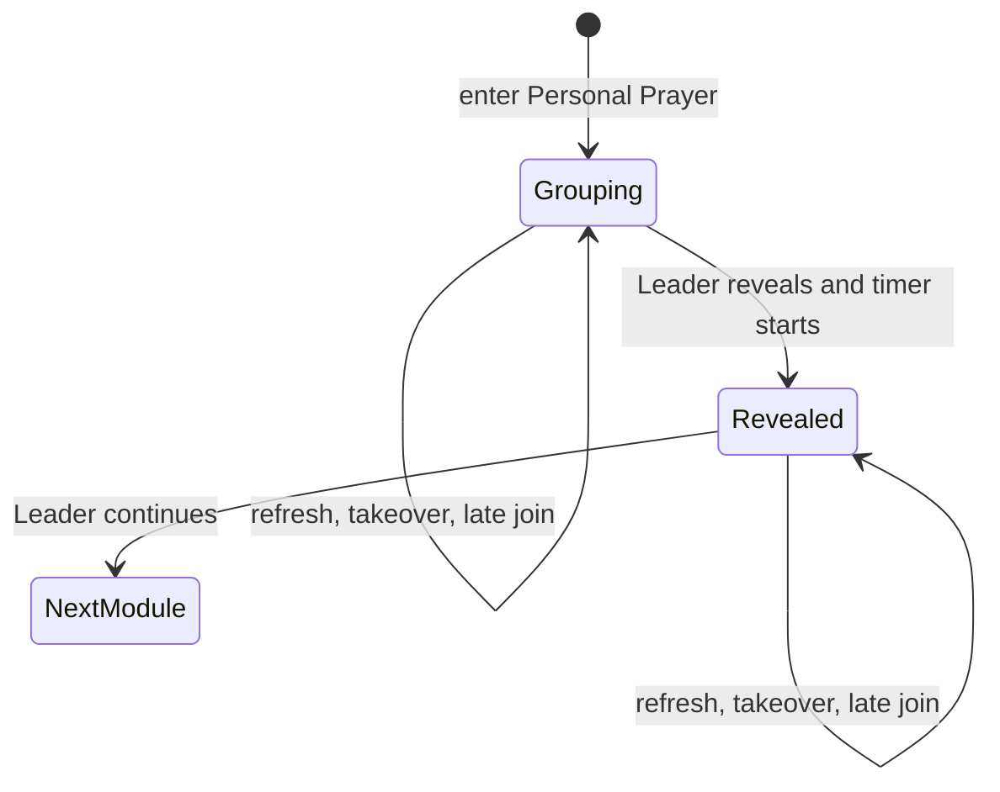
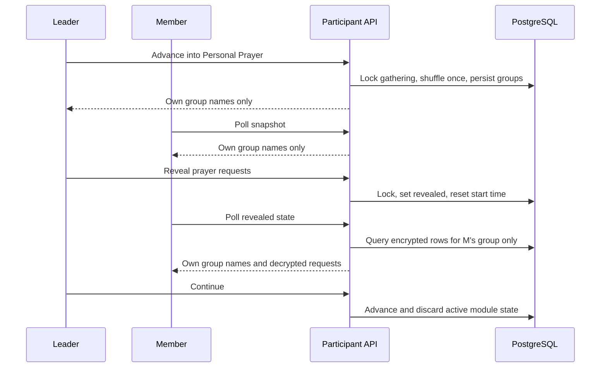

# Personal Prayer Groups - Plan

## Goal Capsule

- **Objective:** Add a synchronized personal-prayer module that assigns each room into private subgroups, reveals only each subgroup's requests when the Leader decides everyone has regrouped, and gives them a recommended 10 minutes to pray.
- **Product authority:** The session-settled Product Contract below; `CONTEXT.md`; `docs/adr/0002-room-handoff-state.md`; `docs/adr/0003-room-journey-runtime.md`; the existing room-handoff and journey plans; current repository behavior.
- **Open blockers:** None.
- **Execution profile:** Deep privacy-sensitive feature spanning required join input, encrypted projection, persisted subgroup state, Leader-controlled progression, late-arrival reconciliation, participant UI, and production seed configuration.
- **Stop conditions:** Stop if implementation would expose a request outside its assigned subgroup, place request content in organizer output or logs, reshuffle established groups, or require production mutation outside the reviewed seed/deployment path.
- **Tail ownership:** LFG owns implementation, review, browser acceptance, PR creation, and CI follow-through.

---

## Product Contract

### Summary

Every participant will submit a personal prayer request before joining.
When a room enters Personal Prayer, the system privately assigns its members to small prayer groups, tells each person whom to gather with, and waits for the Leader to reveal requests.
After reveal, each participant sees only their prayer group's names and requests for a recommended 10-minute prayer period.

### Problem Frame

The gathering already collects encrypted personal prayer requests but intentionally excludes them from participant journey and organizer projections.
Rooms need a safe, low-coordination way to move from one room-wide journey into small-group prayer without asking phones or the Leader to manage the prayer itself.
The product must reveal enough information for a prayer group to care for its members while preventing room-wide or organizer access.

### Key Decisions

- **Reveal a request only within its assigned prayer group.** (session-settled: user-directed — chosen over room-wide sharing: personal requests belong only to the people praying together.) Governs R6, R9, R15.
- **Let the system assign prayer groups.** (session-settled: user-directed — chosen over self-selected pairs or trios: participants should receive a clear group and physically move without negotiating membership.) Governs R3–R5.
- **Prefer trios while preventing a singleton.** (session-settled: user-directed — chosen over balanced groups of up to four or keeping five people together: a room of four stays together, five becomes three plus two, and larger rooms use trios with pairs only when needed.) Governs R4.
- **Persist one random assignment.** (session-settled: user-directed — chosen over join-order or role-based grouping: membership must feel mixed but remain stable through reveal, refresh, reconnect, and takeover.) Governs R3, R10.
- **Make reveal a Leader-controlled boundary.** (session-settled: user-directed — chosen over a countdown or subgroup readiness controls: requests must stay hidden until everyone has physically regrouped.) Governs R6–R8.
- **Include the Leader as an ordinary prayer-group member.** (session-settled: user-directed — chosen over keeping the Leader free or using them only to prevent a singleton: the Leader stops facilitating once requests are revealed.) Governs R3, R8.
- **Add late arrivals without reshuffling.** (session-settled: user-directed — chosen over recalculating groups or placing late arrivals with the Leader: a late participant joins the smallest group and only that group gains access to their request.) Governs R11.
- **Keep absent members and their requests assigned.** (session-settled: user-directed — chosen over marking them absent or hiding their request: the remaining group can still pray for them.) Governs R12.
- **Recommend 10 minutes and hide requests on advancement.** (session-settled: user-directed — chosen over 15 minutes or time-based visibility: timing remains advisory, while leaving the module immediately closes participant access.) Governs R13–R15.

<!-- ce-section: work-relationships -->

### How This Work Fits Together

This plan owns required personal-request capture, system-assigned prayer groups, subgroup-only disclosure, and the Personal Prayer journey behavior.
Related work remains separately plannable:

- **Devotional and ministry-prayer modules**
  - **Can proceed independently** using the shared journey runtime.
  - **May change canonical ordering before this PR lands;** this module must retain a stable identity and move to the next approved contiguous position without duplicating or overwriting parallel module records.
- **Prayer-request editing and follow-up**
  - **Are deferred:** this module uses the request submitted at join and provides no edit, history, export, or post-module access.

### Actors

- A1. **Participant:** Submits a request, moves to the assigned prayer group, sees only that group's requests after reveal, and prays with the group.
- A2. **Leader:** Is assigned like any participant, reveals requests after physical regrouping, and advances the room when prayer is complete.
- A3. **Late participant:** Joins the smallest established prayer group without changing anyone else's assignment.
- A4. **Organizer:** Sees only existing aggregate request counts and room journey progress.

### Requirements

**Required request capture**

- R1. A new participant must provide a non-blank personal prayer request before joining the gathering.
- R2. The request remains bounded by the existing input limit, encrypted before persistence, absent from URLs and logs, and invisible to the organizer.

**Assignment and regrouping**

- R3. Entering Personal Prayer randomly assigns every current room member, including the Leader, exactly once and persists the complete assignment before any request is exposed.
- R4. A room of one to four stays together; a room of five or more uses groups of two or three, maximizes trios, and never creates a singleton.
- R5. Before reveal, each participant sees their own prayer-group members and a clear instruction to move together, but no prayer-request content.

**Reveal and prayer**

- R6. Only the current room Leader can reveal requests, and one reveal updates every device in the room without changing group membership.
- R7. After reveal, each participant sees the names and plaintext requests of only their own prayer group.
- R8. The Leader receives no facilitation controls beyond the normal room progression control once requests are revealed.
- R9. The organizer and members of other prayer groups never receive request plaintext or subgroup membership in their projections.
- R10. Refresh, reconnect, duplicate reveal, concurrent reveal, and Leader takeover preserve the current phase and assignments.

**Late, absent, and legacy participants**

- R11. A participant who joins while Personal Prayer is active is added to the smallest existing prayer group without moving anyone else; if requests are already revealed, only that group immediately gains access to the late participant's request.
- R12. An absent participant remains assigned, and their prayer group continues to see their submitted request after reveal.
- R13. A legacy participant without stored request content remains visible by name with the prompt, "Ask them what they'd like prayer for."

**Timing and closure**

- R14. Reveal starts a synchronized 10-minute recommendation; reaching zero never advances the room, and the Leader may advance at any time.
- R15. Advancing out of Personal Prayer immediately removes request plaintext and subgroup membership from subsequent participant snapshots while encrypted requests remain stored until gathering reset.

**Journey delivery**

- R16. Personal Prayer is a registered production behavior with database-backed configuration and one stable module identity in the canonical journey.
- R17. Reset clears Personal Prayer assignment and reveal state together with participants and encrypted requests.

### Key Flows

- F1. Form prayer groups
  - **Trigger:** The Leader advances the room into Personal Prayer.
  - **Actors:** A1, A2
  - **Steps:** The system shuffles current room members once, persists valid group sizes, and shows each participant only their assigned names.
  - **Outcome:** Everyone can move into place without any request being disclosed.
  - **Covers:** R3–R5.

- F2. Reveal and pray
  - **Trigger:** The Leader sees that everyone has regrouped and selects “Reveal prayer requests.”
  - **Actors:** A1, A2
  - **Steps:** One serialized mutation changes the module to revealed, starts the recommendation, and updates all room devices with viewer-filtered content.
  - **Outcome:** Each prayer group prays from its private list while the Leader participates normally.
  - **Covers:** R6–R10, R14.

- F3. Join late
  - **Trigger:** A participant joins after Personal Prayer assignments exist.
  - **Actors:** A3
  - **Steps:** The join transaction adds the participant to the smallest group, preserves every existing assignment, and updates only the affected group's filtered request view.
  - **Outcome:** The late participant joins the current prayer activity without disrupting the room.
  - **Covers:** R11.

- F4. Leave the module
  - **Trigger:** The Leader advances when the room is ready.
  - **Actors:** A1, A2
  - **Steps:** The room enters the next module and Personal Prayer state stops being projected.
  - **Outcome:** No participant can retrieve subgroup request content through the active journey.
  - **Covers:** R14, R15, R17.

### Acceptance Examples

- AE1. **Covers R1, R2.** A blank or whitespace-only request prevents join in both the browser and server contract, while a valid request is encrypted and the organizer receives only the aggregate count.
- AE2. **Covers R3–R5.** A five-person room receives one trio and one pair, an eight-person room receives two trios and one pair, and a ten-person room receives two trios and two pairs; every participant appears exactly once.
- AE3. **Covers R3, R4.** A four-person room remains one group, including its Leader.
- AE4. **Covers R5–R9.** Before reveal no snapshot contains request plaintext; after reveal Ana sees only her own group's names and requests while another group and the organizer cannot see them.
- AE5. **Covers R10, R14.** Repeated or concurrent reveal converges on one revealed phase, stable assignments, and one shared recommendation start time.
- AE6. **Covers R10.** Leader takeover before or after reveal changes control only; it does not remove the new Leader from their group or regenerate assignments.
- AE7. **Covers R11.** A late participant fills an existing pair first; when all groups are the same size, the stable group order breaks the tie, and nobody already assigned moves.
- AE8. **Covers R12, R13.** An absent member remains on the group's revealed list, while a legacy member with no ciphertext shows the verbal-request prompt instead of fabricated content.
- AE9. **Covers R15.** After the Leader advances, polling and refresh return the next journey state with no Personal Prayer names, grouping, or plaintext request payload.

### Success Criteria

- Every current and late participant belongs to exactly one stable prayer group.
- Request plaintext is available only to authenticated participants assigned to the same prayer group and only while the module is revealed.
- A room can regroup, reveal, pray, and continue without the Leader managing individual turns or subgroup readiness.
- Desktop and 390×844 mobile sessions converge across Leader, member, late-arrival, refresh, and takeover flows.

### Scope Boundaries

#### Deferred to Follow-Up Work

- Editing a stored request during the gathering.
- Request history, export, notifications, analytics, or follow-up after the gathering.
- Manual subgroup editing, member readiness, assigned prayer order, or per-person timers.

#### Outside This Change

- Ministry prayer/praise allocation and devotional reflection content.
- Organizer access to subgroup membership or request plaintext.
- Backward navigation or request access after the room leaves Personal Prayer.
- Replacing the existing encryption scheme or participant session model.

### Dependencies and Assumptions

- Existing participants with nullable encrypted request fields remain readable for compatibility, even though new joins require a request.
- A late arrival may make a persisted trio a group of four; stability takes precedence over reshuffling.
- The current branch starts from `origin/main`; active parallel journey-module work may require a seed-only rebase before delivery.
- Product Contract preservation: this plan records the confirmed brainstorm and the later directive that personal prayer requests are not optional; no other scope decision was changed during planning.

### Sources and Research

- `CONTEXT.md`
- `docs/adr/0002-room-handoff-state.md`
- `docs/adr/0003-room-journey-runtime.md`
- `docs/plans/2026-07-25-001-feat-participant-room-handoff-plan.md`
- `docs/plans/2026-07-26-001-feat-room-journey-framework-plan.md`
- `docs/plans/2026-07-26-002-feat-short-study-journey-module-plan.md`
- `prisma/schema.prisma`
- `src/lib/gathering/service.ts`
- `src/lib/gathering/prayer-request-crypto.ts`
- `src/lib/journey/short-study.ts`
- `src/lib/journey/registry.ts`
- `src/lib/journey/seed.ts`
- `src/components/journey/module-shell.tsx`
- `src/components/journey/module-renderer.tsx`

---

## Planning Contract

### Key Technical Decisions

- KTD1. **Model Personal Prayer as a two-phase module state.** Persist `grouping` and `revealed` phases plus ordered arrays of participant IDs in `RoomJourney.moduleState`; the state owns group stability, while encrypted request records remain the source of content. Governs R3–R7, R10, R15.
- KTD2. **Use a testable shuffle plus deterministic group-size derivation.** Generate sizes from the room count, shuffle participant IDs with injectable randomness, then slice once and persist; stable array order also breaks smallest-group ties for late arrivals. Governs R3, R4, R10, R11.
- KTD3. **Reuse the journey advance mutation for both reveal and module completion.** When Personal Prayer is grouping, advance performs the reveal transition and resets `moduleStartedAt`; when it is revealed, advance leaves the module through the existing forward-only protocol. Governs R6, R10, R14, R15.
- KTD4. **Build request content as a viewer-specific server projection.** Parse the viewer's persisted group first, query only those participant IDs for encrypted fields, decrypt on the server after reveal, and return no future or other-group assignments. Any decryption failure makes the activity unavailable without logging ciphertext or plaintext. Governs R2, R5, R7, R9, R13, R15.
- KTD5. **Reconcile late arrivals inside the serialized join transaction.** When the assigned room is currently in Personal Prayer, append the new participant ID to the smallest persisted group and increment the gathering revision in the same transaction. Governs R10, R11.
- KTD6. **Enforce required request content in UI and domain service, not the nullable legacy schema.** Preserve existing encrypted rows and null compatibility while rejecting every new blank request before participant creation. Governs R1, R2, R13.
- KTD7. **Keep the production module stable across parallel journey composition.** Add one stable Personal Prayer module ID and reconcile it at the next contiguous canonical position on the delivery base without deleting other known module IDs; preserve a running canonical journey under the existing seed safety rule. Governs R16.
- KTD8. **Keep all request-bearing state out of generic room and organizer payloads.** Extend only the active Personal Prayer presentation union; do not add request content to `ParticipantMember`, `OrganizerSnapshot`, admin tester metadata, expected-state tokens, URLs, or client logs. Governs R2, R7, R9, R15.

### High-Level Technical Design

### System-Wide Impact

- Join behavior changes from optional to required prayer-request capture, including the participant tester and integration fixtures.
- The participant snapshot becomes conditionally request-bearing only inside one active viewer-filtered presentation.
- The journey runtime gains one two-phase behavior and one late-arrival reconciliation path without a database migration.
- The canonical seed gains a stable module instance; its exact position must reconcile with parallel devotional and ministry work at rebase time.
- Reset remains the only persistent request-deletion lifecycle.

### Risks and Mitigations

- **Cross-group disclosure:** Derive the authorized group from server-owned state and viewer session; never accept group or room IDs from the client.
- **Plaintext leakage:** Decrypt only during the revealed snapshot projection, keep errors generic, and assert serialized participant and organizer payloads exclude other-group content.
- **Late-arrival races:** Reuse the gathering lock so joins cannot race reveal or advancement into contradictory membership.
- **Random assignment flakiness:** Inject randomness in domain tests and assert invariants separately from exact production order.
- **Parallel seed conflicts:** Rebase before delivery, preserve stable module IDs, and verify the complete ordered canonical journey rather than overwriting the seed wholesale.
- **Existing blank requests:** Retain the verbal-request fallback for pre-change rows while requiring content for all new joins.

### Sequencing

U1 establishes the required encrypted input contract.
U2 defines the module's validated state and assignment invariants.
U3 integrates secure projection and serialized transitions.
U4 renders the grouping and revealed experiences.
U5 adds the production instance and proves the end-to-end journey.

---

## Implementation Units

### U1. Require a personal prayer request

- **Goal:** Make every new participant supply valid request content while preserving encryption and legacy records.
- **Requirements:** R1, R2, R13
- **Dependencies:** None
- **Files:** `src/components/participant/join-form.tsx`, `src/components/participant/join-form.test.tsx`, `src/components/organizer/participant-tester.tsx`, `src/components/organizer/participant-tester.test.tsx`, `src/lib/gathering/service.ts`, `src/lib/gathering/service.integration.test.ts`, `src/app/api/participant/route.test.ts`, `src/app/admin/tester/participant/[slot]/page.tsx`
- **Approach:** Add request-specific accessible validation and required copy in the form, reject blank normalized content in `joinParticipant`, and update tester/test fixtures to submit meaningful private requests.
- **Execution note:** Capture a failing service or integration test for blank request rejection before changing the join implementation.
- **Patterns to follow:** Existing name validation in `src/components/participant/join-form.tsx`; `GatheringError` handling in `src/lib/gathering/service.ts`; encryption tests in `src/lib/gathering/prayer-request-crypto.test.ts`.
- **Test scenarios:**
  1. Covers AE1. Empty and whitespace-only requests are rejected before participant creation and room assignment.
  2. A valid 2,000-character request is accepted, encrypted, and counted without plaintext in organizer output.
  3. The form identifies the request as required, focuses or describes the correct field error, and sends no request until both name and request are valid.
  4. Existing participant continuity remains idempotent when the same remembered session posts again.
- **Verification:** Join UI, route, and PostgreSQL integration tests prove the required boundary and existing encryption lifecycle.

### U2. Define Personal Prayer assignment state

- **Goal:** Add validated Personal Prayer configuration, grouping algorithms, runtime state, and viewer presentation types.
- **Requirements:** R3–R5, R10–R13, R16
- **Dependencies:** U1
- **Files:** `src/lib/journey/personal-prayer.ts`, `src/lib/journey/personal-prayer.test.ts`, `src/lib/journey/types.ts`, `src/lib/journey/registry.ts`, `src/lib/journey/registry.test.ts`
- **Approach:** Implement strict configuration/state validation, group-size derivation, injected-random shuffle, stable assignment creation, smallest-group append, and state parsing as a dedicated domain helper.
- **Execution note:** Implement the assignment invariants test-first; exact random order is secondary to completeness, group sizes, and persistence.
- **Patterns to follow:** `src/lib/journey/short-study.ts` and `src/lib/journey/short-study.test.ts`.
- **Test scenarios:**
  1. Covers AE2 / AE3. Counts 1–12 produce the required whole-room, trio, pair, and no-singleton shapes.
  2. Every supplied participant ID appears exactly once and the Leader receives no special treatment.
  3. Injected randomness changes initial membership but parsing and subsequent reads never reshuffle.
  4. Covers AE7. A late arrival fills the first smallest group and leaves all existing group arrays unchanged.
  5. Invalid phase, duplicate IDs, empty groups, unknown participant values, oversized configuration, and malformed state are rejected.
  6. The production registry accepts only the client-safe Personal Prayer configuration.
- **Verification:** Focused domain and registry tests prove all state invariants without a database.

### U3. Integrate private reveal and continuity

- **Goal:** Persist groups, reveal requests securely, reconcile late arrivals, and preserve state across concurrency and takeover.
- **Requirements:** R2–R17
- **Dependencies:** U2
- **Files:** `src/lib/gathering/service.ts`, `src/lib/gathering/types.ts`, `src/lib/gathering/service.integration.test.ts`, `src/app/api/participant/journey/advance/route.test.ts`
- **Approach:**
  1. Initialize Personal Prayer state when the module becomes current.
  2. Present grouping state with names only and a phase-specific expected-state token.
  3. Transition grouping to revealed through the existing Leader-authorized advance path and reset the recommendation start time.
  4. Resolve the viewer's group server-side, query only its encrypted records, decrypt them, and build a transient presentation.
  5. Append late arrivals to the smallest group inside join and preserve state unchanged during Leader takeover.
  6. Advance from revealed state using the existing next-module cleanup path.
- **Execution note:** Start with PostgreSQL integration tests for pre-reveal non-disclosure, post-reveal filtering, and late-join concurrency.
- **Patterns to follow:** Short Study initialization/presentation/expected-state handling and the existing serialized gathering transaction in `src/lib/gathering/service.ts`.
- **Test scenarios:**
  1. Covers AE4. Grouping snapshots for Leader and members contain names but no plaintext or encrypted request fields.
  2. Covers AE4. Revealed snapshots contain only the authenticated viewer's group and never serialize the full assignment set.
  3. Organizer snapshots before, during, and after reveal contain aggregate count and progress only.
  4. Covers AE5. Duplicate and concurrent reveal calls converge on one revealed state and one recommendation start time.
  5. Covers AE6. Takeover before and after reveal preserves phase, assignments, and request filtering.
  6. Covers AE7. Late join before and after reveal updates one smallest group without moving existing IDs.
  7. Covers AE8. An absent member remains visible; a legacy null request returns the verbal prompt.
  8. Invalid state or decryption failure produces an unavailable activity without emitting request material.
  9. Covers AE9. Advancement, reset, and subsequent refresh remove Personal Prayer projection content.
- **Verification:** PostgreSQL integration and route tests demonstrate authorization, privacy, persistence, concurrency, and lifecycle cleanup.

### U4. Build the subgroup prayer experience

- **Goal:** Give every participant a clear mobile-first regrouping screen and a private revealed-request screen with appropriate Leader controls.
- **Requirements:** R5–R10, R13–R15
- **Dependencies:** U3
- **Files:** `src/components/journey/module-renderer.tsx`, `src/components/journey/module-shell.tsx`, `src/components/participant/participant-experience.tsx`, `src/components/participant/participant-journey-ui.test.tsx`
- **Approach:** Render assigned names prominently before reveal, label the Leader action “Reveal prayer requests,” hide the countdown until reveal, then show concise member request cards and the synchronized 10-minute countdown. Keep takeover available, show normal Continue after reveal, and avoid scroll-heavy duplicated guidance.
- **Patterns to follow:** Role-aware Short Study rendering in `src/components/journey/module-renderer.tsx`; sticky Leader controls and pending/error behavior in `src/components/journey/module-shell.tsx`; shared countdown in `src/components/participant/participant-experience.tsx`.
- **Test scenarios:**
  1. Grouping view tells each participant exactly whom to find and contains no request text.
  2. Only the Leader sees “Reveal prayer requests”; members retain the takeover affordance.
  3. Revealed view shows one card per group member, including the exact verbal prompt for missing legacy content.
  4. The countdown is absent during regrouping, appears at reveal, and reaching zero leaves the screen active.
  5. Pending, stale, network-error, disconnected, takeover, and late-arrival updates retain visible context and accessible status messaging.
  6. Request cards, headings, actions, and live updates are accessible without color-only meaning at desktop and 390×844.
- **Verification:** Component tests plus real browser acceptance cover Leader, ordinary member, separate subgroup, and late-arrival sessions.

### U5. Seed and verify the production module

- **Goal:** Add Personal Prayer to the canonical journey with stable configuration and safe idempotent delivery.
- **Requirements:** R14, R16, R17
- **Dependencies:** U2, U3, U4
- **Files:** `src/lib/journey/seed.ts`, `src/lib/gathering/service.integration.test.ts`, `src/lib/journey/service.test.ts`, `CONTEXT.md`
- **Approach:** Add a stable module identity with a 600-second recommendation, reconcile it at the next contiguous canonical position on the delivery base, preserve running configuration, and document the explicit subgroup privacy projection.
- **Patterns to follow:** `seedProductionJourney` in `src/lib/journey/seed.ts`; production seed integration coverage in `src/lib/gathering/service.integration.test.ts`.
- **Test scenarios:**
  1. Fresh and repeated seeds create exactly one Personal Prayer record with the correct behavior, title, duration, configuration, and contiguous position.
  2. A running canonical journey remains unchanged, while a safe non-running journey receives the new instance.
  3. A different active journey remains preserved.
  4. Existing stable module IDs and parallel canonical modules survive reconciliation.
  5. The complete seeded partial journey validates and progresses into and out of Personal Prayer.
  6. Reset removes runtime groups and encrypted requests but preserves reusable module configuration.
- **Verification:** Seed/database checks, full integration progression, `pnpm db:check`, and browser acceptance prove a production-shaped module.

---

## Verification Contract

| Gate                    | Scope      | Done signal                                                                                                                                                                   |
| ----------------------- | ---------- | ----------------------------------------------------------------------------------------------------------------------------------------------------------------------------- |
| Focused unit tests      | U1, U2, U4 | Join validation, group invariants, registry validation, and UI states pass.                                                                                                   |
| PostgreSQL integration  | U1, U3, U5 | Encryption, filtered projection, concurrency, late arrival, takeover, seed behavior, progression, and reset pass against PostgreSQL.                                          |
| Database check          | U5         | `pnpm db:check` passes with the existing schema and updated seed.                                                                                                             |
| Repository verification | All        | `pnpm verify` passes after implementation and after review fixes.                                                                                                             |
| Browser acceptance      | U4, U5     | Real Leader/member sessions verify separate subgroups, reveal, 10-minute countdown, late join, takeover, advancement, and no organizer leakage on desktop and 390×844 mobile. |
| Delivery                | All        | PR CI is green and review findings are resolved or durably recorded.                                                                                                          |

Browser acceptance must use distinct sessions for at least five participants so one trio and one pair can be inspected.
Inspect participant network payloads or serialized snapshots during grouping, reveal, and after advancement to confirm the privacy boundary rather than relying only on visible text.

---

## Definition of Done

- All R1–R17 behavior and AE1–AE9 examples are implemented and covered proportionately.
- New joins require an encrypted personal prayer request, while legacy null rows remain safe and intelligible.
- Persisted random groups satisfy the exact size rules and never reshuffle through reveal, refresh, reconnect, takeover, absence, or late arrival.
- Request plaintext appears only in the current authenticated viewer's revealed prayer-group presentation and nowhere in organizer, other-group, URL, log, or post-module state.
- The production seed idempotently installs one stable 600-second Personal Prayer instance without deleting parallel canonical modules or rewriting a running journey.
- `pnpm db:check` and `pnpm verify` pass.
- Browser acceptance passes on desktop and 390×844 mobile for Leader, member, another group, and late arrival.
- Review findings are fixed or recorded through the LFG residual path.
- Dead-end, experimental, and superseded code is removed.
- The branch is committed, pushed, opened as a reviewed PR, and CI is decided.
